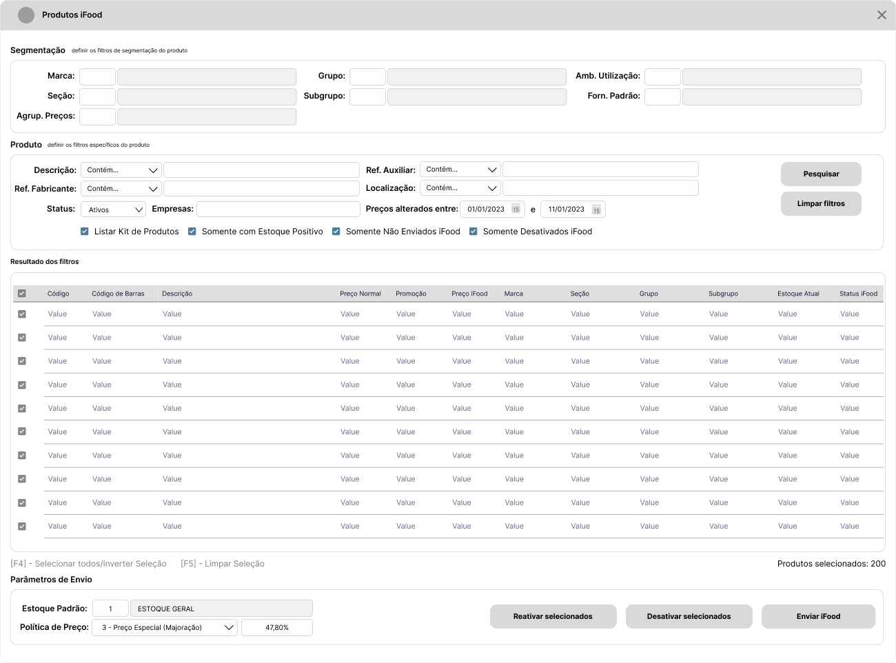

# Introdução :wave:

O presente documento objetiva descrever os requisitos básicos para implementação de um Recurso de Gerenciamento de Produtos a enviar para a API iFood. São descritos os métodos, regras de negócio e exemplos de tela para que a implementação desta integração, no ambito do Sistema Ganso.

# Roadmap :rocket:

1. Implementar [Parâmetros](#parâmetros-gear) e Alterações no [Cadastro de Produtos](#cadastro-de-produtos-label).
2. Criar uma [Tela Nova](#nova-tela---produtos-ifood-package) para comportar filtros e funções de envio de produtos.
3. Implementar recursos para gravação da [Lista de Produtos](#tabela-de-dados-para-ifood-abacus) a sincronizar.
4. Implementar recursos para gravação de [Logs](#logs-de-envio-passport_control) de Envio.
5. Realizar Testes Unitários de acordo com a Etapa de [Simulações](#simulações-test_tube) para Homologar o Recurso.

# Requisitos

## Parâmetros :gear:

Na Tela Principal de Parâmetros do Sistema Ganso, criar uma aba **Integrações** e uma sub-aba **iFood** para organizar os Parâmetros descritos na tabela a seguir.

| Parâmetro                     | Descritivo                                                                                      | Regra de Negócio                                                                                                                                                                                                                                                                                                  |
| :---------------------------- | :---------------------------------------------------------------------------------------------- | :---------------------------------------------------------------------------------------------------------------------------------------------------------------------------------------------------------------------------------------------------------------------------------------------------------------- |
| Ativar Integração iFood       | Opção para Ativar Integração iFood                                                              | Ativa a Integração pelo _GansoAgent_, habilita os Campos do [Cadastro de Produtos](#cadastro-de-produtos-label) e a [Tela de Produtos iFood](#nova-tela---produtos-ifood-package).                                                                                                                                |
| Política de Preço             | Opção para definir a Política de Preço de Venda no iFood.                                       | Deve existir três opções:   1 - Preço Fixo (Preço de Venda Normal, sempre)   2 - Preço Variável (Preço de Venda Normal ou da Promoção, quando ativa)   3 - Preço Especial (Percentual de Majoração sobre o Variável)    Quando opção 3, solicitar que o usuário informe o Percentual.              |
| Estoque Padrão de Envio iFood | Campo para definir o Código do Estoque Padrão a considerar para envio das Quantidades ao iFood. | Deve aceitar apenas códigos de estoque cadastrados em Arquivos > Almoxarifados, que correspondam a Filial configurada.                                                                                                                                                                                            |
| Tipo de Estoque               | Campo para definir qual tipo de Estoque a considerar para envio das Quantidades ao iFood.       | Deve ser permitido definir valores entre "Físico" ou "Presumido". Se "Físico", considerar a Quantidade Fisica total do Produto. Se "Presumido", considerar o Cálculo Estoque Físico - Estoque Reservado - Estoque A Retirar (se ativado parâmetro). Sempre enviar o valor resultante, mesmo que zero ou negativo. |

**:bulb: Nota:** Conforme documentação do iFood, o envio de atualizações deve obedecer o Rate Limit de 60 minutos, não permitindo um intervalo menor que este.

## Cadastro de Produtos :label:

No Cadastro de Produtos são necessários recursos para controlar os Produtos que podem ser enviados, se já foram enviados e qual a situação do mesmo na Plataforma iFood.

| Tipo      | Descrição           | Regra de Negócio                                                                                                                                                                                              |
| :-------- | :------------------ | :------------------------------------------------------------------------------------------------------------------------------------------------------------------------------------------------------------ |
| Parâmetro | Não Vender no iFood | Parâmetro do Produto que restinge o Envio do mesmo ao Integrador iFood. Ativando este parâmetro, o Produto não deve listado na Tela de Envio, nem mesmo ser enviado ao iFood por outros meios.                |
| Campo     | Enviado para iFood  | Campo para identificar se o Produto foi enviado para iFood na carga Inicial. Esta informação deve ser exibida em local de fácil visualização. Também será utilizado como filtro na Tela de Envio de Produtos. |
| Campo     | Status iFood        | Campo para identificar se o Produto está Ativo ou Inativo na Plataforma iFood. Também será utilizado como filtro na Tela de Envio de Produtos.                                                                |

**:bulb: Nota:** Os campos acima só devem ser exibidos no Cadastro de Produtos se o Parâmetro **"Ativar Integração iFood"** estiver ativado.

## Nova Tela - Produtos iFood :package:

Para que o Usuário obtenha facilidade de controle de Produtos que deseja vender no iFood, é necessário a criação de uma Tela de Gerenciamento. Dentre os principais recursos, deve ser possível listar vários produtos através de filtros, obedecendo às Regras de Negócio especificadas.

### Filtros :mag:

Os filtros necessários foram classificados em dois grupos para melhor experiência do usuário e clareza de informações em tela.

| Grupo       | Descritivo                                       | Campos do Grupo                                                                                                                                                                                                                                                                                                                                                               |
| :---------- | :----------------------------------------------- | :---------------------------------------------------------------------------------------------------------------------------------------------------------------------------------------------------------------------------------------------------------------------------------------------------------------------------------------------------------------------------- |
| Segmentação | Grupo de Filtros para Segmentação do Produto     | Marca, Seção, Grupo, Subgrupo, Ambiente de Utilização, Fornecedor Padrão, Agrupador de Preços                                                                                                                                                                                                                                                                                 |
| Produto     | Grupo de Filtros para Características do Produto | Com critérios (Contém, Começa Com, Termina Com, Igual a): Descrição, Referência Fabricante, Referência Auxiliar e Localização.    Sem critérios: Status do Produto, Empresas.  Período de Data: Alteração de Preços (Log Preços).    Checkbox: Listar Kit de Produtos, Somente com Estoque Positivo, Somente não Enviados ao iFood, Somente Desativados iFood. |

Além dos Grupos de Filtros, são necessárias duas Ações principais para os Filtros:

1.  **Pesquisar** - Envolve todos os filtros informados, que inclusive deve ser permitido combiná-los.
2.  **Limpar Filtros** - Facilita recomeçar pesquisas.

### Grid de Exibição de Dados :open_file_folder:

Incluir uma _Grid_ que deve exibir os Produtos resultantes dos filtros aplicados. As colunas e elementos necessários para exibição e controle são:

| Campo/Função                             | Descritivo                                                              | Regra de Negócio                                                                                        |
| :--------------------------------------- | :---------------------------------------------------------------------- | :------------------------------------------------------------------------------------------------------ |
| Caixa de Seleção                         | Caixa de Seleção do Item para indicar que o mesmo deve ser enviado      | Selecionado, Não Selecionado                                                                            |
| Código Interno                           | Código Interno do Produto                                               | -                                                                                                       |
| Código de Barras                         | Código de Barras Padrão do Produto                                      | -                                                                                                       |
| Descrição                                | Descrição Completa do Produto                                           | -                                                                                                       |
| Preço Normal                             | Preço de Venda Normal do Cadastro                                       | -                                                                                                       |
| Preço Promoção                           | Preço de Venda na Promoção quando ativa                                 | Considerar apenas Promoções da Modalidade Unitário                                                      |
| Preço iFood                              | Preço de Venda para o iFood                                             | Considerar parametrização da Política de Preço                                                          |
| Marca, Seção, Grupo, Subgrupo            | Segmentação do Produto                                                  | -                                                                                                       |
| Estoque Atual                            | Estoque Atual do Produto a enviar                                       | Considerar parametrização do Tipo de Estoque (Físico ou Presumido)                                      |
| Status iFood                             | Situação do Produto na Plataforma iFood (Ativo/Inativo)                 | Regra de Negócio da Plataforma. Se Estoque zerado, o Produto é considerado indisponível automaticamente |
| [F4] - Selecionar Todos/Inverter Seleção | Função para Selecionar todos os itens da _Grid_ de Dados                | -                                                                                                       |
| [F5] - Limpar Seleção                    | Função para limpar a seleção da _Grid_ de Dados                         | -                                                                                                       |
| Contagem de Produtos selecionados        | Texto informativo sobre a quantidade de Produtos selecionados na _Grid_ | Exibir abaixo da _Grid_                                                                                 |

### Ações da Tela :pushpin:

| Botão/Função              | Descritivo                                                                                                                           | Regra de Negócio                                                                                                                                           |
| :------------------------ | :----------------------------------------------------------------------------------------------------------------------------------- | :--------------------------------------------------------------------------------------------------------------------------------------------------------- |
| Alterar Estoque de Envio  | Campo que exibe o Estoque Padrão de Envio, com permissão de edição.                                                                  | Reprocessar as Quantidades na _Grid_ conforme o Código de Estoque informado.                                                                               |
| Alterar Política de Preço | Campo que exibe a Política de Preço, com permissão de edição.                                                                        | Reprocessar Preços iFood na _Grid_ conforme alteração da Política.   Se Política igual a 3 - Preço Especial, considerar alteração do Percentual padrão. |
| Reativar Selecionados     | Botão de Ação para Reativar Produtos selecionados da Base do iFood, quando Status igual a "Inativo" e o Usuário desejar reativá-los. | Somente Produtos uma vez enviados para iFood que esteja "Inativos".                                                                                        |
| Desativar Selecionados    | Botão de Ação para Desativar Produtos selecionados da Base do iFood, quando Status igual a "Ativo"                                   | Somente Produtos uma vez enviados para iFood que esteja "Ativos".                                                                                          |
| Enviar para iFood         | Botão de Ação para Enviar Produtos selecionados para o iFood                                                                         | Gravar Dados na Tabela de Envio para iFood. Consultar [Tabela de Dados](#tabela-de-dados-para-ifood)                                                       |

### Regras de Negócio :lock:

| Regra | Descrição                                                                  | Tratativa                                                                                                     |
| :---- | :------------------------------------------------------------------------- | :------------------------------------------------------------------------------------------------------------ |
| RN01  | Não listar Produtos parametrizados como "Aplicação de Direta"              | Verificar o Parâmetro "Aplicação Direta" do Cadastro de Produtos                                              |
| RN02  | Não listar Produtos do Tipo "Fracionável" ou "Matéria Prima"               | Verificar o campo Tipo do Produto do Cadastro de Produtos                                                     |
| RN03  | Não Permitir enviar mais que 10.000 Produtos em um único pacote de envio.  | Se a seleção do usuário ultrapassar 10.000 Produtos, gerar um novo pacote e informar ao Usuário sobre a ação. |
| RN04  | Calcular Preço de Venda Total do Kit ao Listar Kit de Produtos para Envio. | Se usuário selecionar a Opção "Listar Kit de Produtos", calcular o Preço de Venda Total do Kit.               |

### Mensagens ao Usuário :incoming_envelope:

| Ação                                                    | Mensagem                                                                                                                                             | Tratativa                                                               |
| :------------------------------------------------------ | :--------------------------------------------------------------------------------------------------------------------------------------------------- | :---------------------------------------------------------------------- |
| Clicar no Botão "Desativar Selecionados"                | Mensagem de Confirmação: "Os Produtos Selecionados serão Desativados na Plataforma iFood. Deseja continuar ?"                                        | Enviar Desativação para a Plataforma através do comando correspondente. |
| Clicar no Botão "Reativar Selecionados"                 | Mensagem de Confirmação: "Os Produtos Selecionados serão Reativados na Plataforma iFood. Deseja continuar ?"                                         | Enviar Reativação para a Plataforma através do comando correspondente.  |
| Clicar no Botão "Enviar para iFood"                     | Mensagem de Confirmação: "Os Produtos Selecionados serão Enviados para a Plataforma iFood. Deseja continuar ?"                                       | Enviar Produtos selecionados na Lista                                   |
| Selecionar e Enviar mais que 10.000 Produtos em um Lote | Mensagem de Aviso: "A iFood recomenda que sejam enviados apenas 10.000 itens por Pacote. O Sistema irá gerar um novo pacote a cada limite atingido." | Gerar um novo pacote a cada 10.000 Produtos selecionados para envio.    |

### Protótipo de Tela :desktop_computer:

### Tabela de Dados para iFood :abacus:

Ao acionar do comando **Enviar para iFood** na Tela descrita anteriormente, é necessário gravar as informações dos Produtos selecionados na Tabela relacionada a seguir.

| Campo                     |  Tipo e Tamanho   | Descritivo                                                | Preenchimento                                                                                                                                                                                                      | Regra de Negócio                                                                                                           |
| :------------------------ | :---------------: | :-------------------------------------------------------- | :----------------------------------------------------------------------------------------------------------------------------------------------------------------------------------------------------------------- | :------------------------------------------------------------------------------------------------------------------------- |
| `idLoja`                  |     `Inteiro`     | Código da Filial                                          | Utilizar o Código da Filial logada que gerou o comando.                                                                                                                                                            | Preenchimento Obrigatório.                                                                                                 |
| `departamento`            |   `Texto (100)`   | Departamento do Produto                                   | Utilizar a Descrição da **Seção** do Produto.                                                                                                                                                                      | Preenchimento Obrigatório. Se **Seção** não existir, informar o texto 'GERAL'.                                             |
| `categoria`               |   `Texto (100)`   | Categoria do Produto                                      | Utilizar a Descrição do **Grupo** do Produto.                                                                                                                                                                      | Preenchimento Obrigatório. Se **Grupo** não existir, informar o texto 'GERAL'.                                             |
| `subCategoria`            |   `Texto (100)`   | SubCategoria do Produto                                   | Utilizar a Descrição do **Subgrupo** do Produto.                                                                                                                                                                   | Preenchimento Não Obrigatório. Se **Subgrupo** não existir, informar vazio ''.                                             |
| `marca`                   |   `Texto (100)`   | Marca do Produto                                          | Utilizar a Descrição da **Marca** do Produto.                                                                                                                                                                      | Preenchimento Não Obrigatório. Se **Marca** não existir, informar vazio ''.                                                |
| `unidade`                 |   `Texto (100)`   | Unidade de Medida de Venda do Produto                     | Utilizar a Sigla vinculada ao Código da Medida de Venda do Produto.                                                                                                                                                | Preenchimento Não Obrigatório. Se não existir, informar vazio ''.                                                          |
| `volume`                  |   `Texto (100)`   | Volume em Unidade de Venda do Produto                     | Utilizar a Fração da Unidade de Venda vinculada ao Código da Medida de Venda do Produto concatenado com a Sigla da Unidade de Venda. Ex.: "1KG", "1UN"                                                             | Preenchimento Não Obrigatório. Se não existir, informar vazio ''.                                                          |
| `codigoBarra`             |   `Texto (15)`    | Código de Barras do Produto                               | Utilizar o Código de Barras padrão do Produto.                                                                                                                                                                     | Preenchimento Obrigatório.                                                                                                 |
| `nome`                    |   `Texto (150)`   | Descrição do Produto                                      | Utilizar a Descrição padrão do Produto.                                                                                                                                                                            | Preenchimento Obrigatório.                                                                                                 |
| `valor`                   | `Numérico (10,4)` | Preço de Venda do Produto                                 | Utilizar o campo Preço de Venda do Produto.                                                                                                                                                                        | Preenchimento Obrigatório.                                                                                                 |
| `valorPromocao`           | `Numérico (10,4)` | Preço de Promoção do Produto                              | Utilizar o Preço de Venda da Promoção quando existir uma Promoção da Modalidade "Unitário". Se Promoção do tipo Percentual, calcular o Preço de Venda da Promoção aplicando o Percentual a uma unidade do Produto. | Preenchimento Não Obrigatório. Se não existir Promoção Ativa, informar vazio ''.                                           |
| `valorAtacado`            | `Numérico (10,4)` | Preço de Venda no Atacado do Produto                      | Enviar vazio 0.                                                                                                                                                                                                    | Preenchimento Não Obrigatório.                                                                                             |
| `valorCompra`             | `Numérico (10,4)` | Custo do Produto                                          | Utilizar o Custo PMZ do Produto.                                                                                                                                                                                   | Preenchimento Não Obrigatório. Verificar Parâmetro "Enviar Custo", se inativo, enviar 0.                                   |
| `quantidadeEstoqueAtual`  | `Numérico (10,4)` | Estoque Atual do Produto (Físico ou Presumido)            | Utilizar o Valor do Estoque definido no Parâmetro "Tipo de Estoque" (Físico ou Presumido).                                                                                                                         | Preenchimento Obrigatório.                                                                                                 |
| `quantidadeEstoqueMinimo` | `Numérico (10,4)` | Estoque Mínimo do Produto                                 | Enviar 0.                                                                                                                                                                                                          | Preenchimento Não Obrigatório.                                                                                             |
| `quantidadeAtacado`       | `Numérico (10,4)` | Quantidade de Estoque para Venda no Atacado do Produto    | Enviar 0.                                                                                                                                                                                                          | Preenchimento Não Obrigatório.                                                                                             |
| `descricao`               |  `Texto (8000)`   | Descrição detalhada das Características do Produto        | Utilizar a Referência do Fabricante. Se não existir, enviar vazio ''.                                                                                                                                              | Preenchimento Não Obrigatório.                                                                                             |
| `ativo`                   |    `Booleano`     | Situação (Status) do Produto                              | `true` para 'Ativo' e `false` para 'Inativo'.                                                                                                                                                                      | Preenchimento Obrigatório. Se campo 'Status iFood' do Cadastro de Produtos for igual a 'A' então 'Ativo', senão 'Inativo'. |
| `plu`                     |     `Inteiro`     | Código Interno do Produto                                 | Utilizar o Código do Produto                                                                                                                                                                                       | Preenchimento Não Obrigatório.                                                                                             |
| `validadeProxima`         |    `Booleano`     | Produto Próximo do Vencimento                             | `true` para 'Sim' e `false` para 'Não'. Enviar `false`.                                                                                                                                                            | Preenchimento Não Obrigatório.                                                                                             |
| `imageURL`                |   `Texto (150)`   | URL de Imagem de Produto.                                 | Enviar vazio ''.                                                                                                                                                                                                   | Preenchimento Não Obrigatório.                                                                                             |
| `multiploEanOriginal`     |   `Texto (15)`    | Código de Barras do Produto de Fabricação Própria.        | Enviar vazio ''.                                                                                                                                                                                                   | Preenchimento Não Obrigatório.                                                                                             |
| `multiploQtd`             | `Numérico (10,4)` | Quantidade do Produto na Embalagem de Fabricação Própria. | Enviar 0.                                                                                                                                                                                                          | Preenchimento Não Obrigatório.                                                                                             |

# Logs de Envio :passport_control:

# Simulações :test_tube:

| Cenário de Homologação                              | Resultado esperado                                                                                        |
| :-------------------------------------------------- | :-------------------------------------------------------------------------------------------------------- |
| Carga de Produtos do tipo EAN                       | Recebimento dos produtos                                                                                  |
| Atualização de Status do Produto do tipo EAN        | Recebimento de produtos com alteração de status (Ativo / Inativo)                                         |
| Atualização de Preços do Produto do tipo EAN        | Atualização de preço de produtos saindo de A para B                                                       |
| Atualização de Preços De / Por do tipo EAN          | Atualização de preço de produtos saindo de A para B tendo o DE/POR                                        |
| Atualização de Estoque do tipo EAN                  | Atualização do valor de estoque de A para B                                                               |
| Atualização da descrição do produto do tipo EAN     | Atualização do nome do produto saindo de A para B                                                         |
| Carga de Produtos do tipo PRÓPRIO                   | Recebimento dos produtos                                                                                  |
| Atualização de Status do Produto do tipo PRÓPRIO    | Recebimento de produtos com alteração de status (Ativo / Inativo)                                         |
| Atualização de Preços do Produto do tipo PRÓPRIO    | Atualização de preço de produtos saindo de A para B                                                       |
| Atualização de Preços De / Por do tipo PRÓPRIO      | Atualização de preço de produtos saindo de A para B tendo o DE/POR                                        |
| Atualização de Estoque do tipo PRÓPRIO              | Atualização do valor de estoque de A para B                                                               |
| Atualização da descrição do produto do tipo PRÓPRIO | Atualização do nome do produto saindo de A para B                                                         |
| Atualização geral dos itens                         | Recebimento da atualização somente dos itens que houve alteração do lado do ERP ao invés da base completa |
| Tempo de Atualização                                | Validação da atualização da base (Com update) com tempo de 120 minutos                                    |
