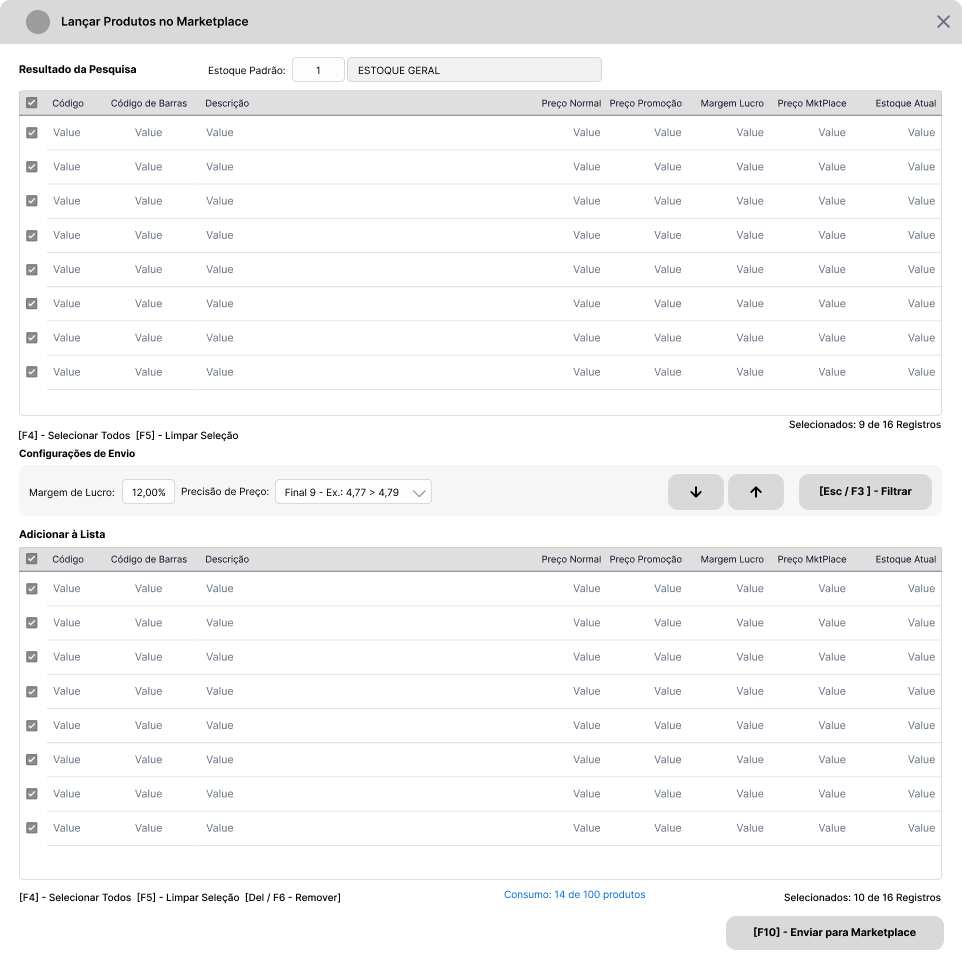
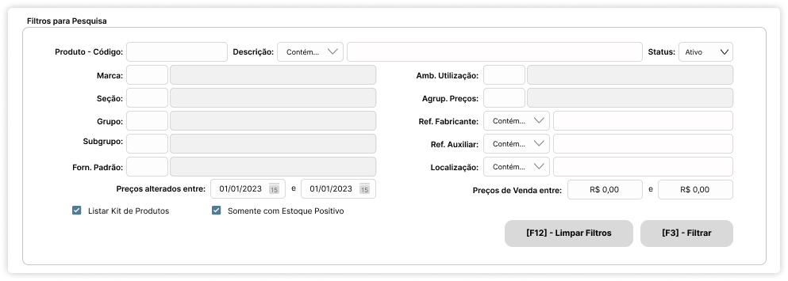

# Introdução :wave:

O presente documento objetiva descrever os requisitos básicos para implementação de um Recurso de Gerenciamento de Produtos a enviar para a API iFood. São descritos os métodos, regras de negócio e exemplos de tela para implementação desta integração no Sistema Ganso.

# Roadmap :rocket:

1. Implementar [Parâmetros](#parâmetros-gear) e Alterações no [Cadastro de Produtos](#cadastro-de-produtos-label).
2. Criar uma [Tela Nova](#nova-tela---produtos-ifood-package) para exibir os Produtos integrados com funções de gerenciamento.
3. Implementar recursos para gravação da [Lista de Produtos](#dados-requeridos-pelo-ifood-abacus) a sincronizar.
4. Implementar recursos para gravação de [Logs](#logs-de-envio-passport_control) de Envio.
5. Realizar Testes Unitários de acordo com a Etapa de [Simulações](#simulações-test_tube) para Homologar o Recurso.

# Requisitos

## Parâmetros :gear:

Na Tela Principal de Parâmetros do Sistema Ganso, criar uma aba **Integrações** e uma sub-aba **iFood** para organizar os Parâmetros descritos na tabela a seguir.

| Parâmetro                     | Descritivo                                                                                                           | Regra de Negócio                                                                                                                                                                                                                                                                                                                                         |
| :---------------------------- | :------------------------------------------------------------------------------------------------------------------- | :------------------------------------------------------------------------------------------------------------------------------------------------------------------------------------------------------------------------------------------------------------------------------------------------------------------------------------------------------- |
| Ativar Integração iFood       | Opção para Ativar Integração iFood                                                                                   | Ativa a Integração pelo _GansoAgent_, habilita os Campos do [Cadastro de Produtos](#cadastro-de-produtos-label) e a [Tela de Nova de Gerenciamento](#nova-tela---produtos-ifood-package).                                                                                                                                                                |
| Margem de Lucro               | Campo para definir o Percentual de Margem de Lucro aplicável sobre o Preço de Venda do Produto no iFood.             | O Percentual deve ser obrigatório, e deve ser aplicado ao Preço de Venda Normal e sobre o Preço de Promoção, se o Usuário optar por Enviar o Preço de Promoção do Produto. Este percentual deve ser gravado no Produto quando enviado para a Lista.                                                                                                      |
| Enviar Promoção               | Opção para sinalizar se o Preço de Promoção será enviado, caso uma Promoção Unitária estiver ativada para o Produto. | Enviar o Preço da Promoção, se parâmetro ativo e o Produto possuir uma Promoção na Modalidade "Unitário" Ativa.                                                                                                                                                                                                                                          |
| Estoque Padrão de Envio iFood | Campo para definir o Código do Estoque Padrão a considerar para envio das Quantidades ao iFood.                      | Deve aceitar apenas códigos de estoque cadastrados em Arquivos > Almoxarifados, que correspondam à Filial configurada.                                                                                                                                                                                                                                   |
| Tipo de Estoque               | Campo para definir qual tipo de Estoque a considerar para envio das Quantidades ao iFood.                            | Deve ser permitido escolher uma opção entre "Físico" ou "Presumido".    Se "Físico", considerar a Quantidade Física Total do Produto.  Se "Presumido", considerar o Cálculo (Estoque Físico - Estoque Reservado - Estoque A Retirar (se ativado parâmetro do Estoque à Retirar)). Sempre enviar o valor resultante, mesmo que zero ou negativo. |

**:bulb: Nota:** Conforme documentação do iFood, o envio de atualizações deve obedecer o Rate Limit de 60 minutos, não permitindo um intervalo menor que este. Deste modo não é necessário existir um Parâmetro para configurar um "Tempo Limite" ou "Tempo de Resposta".

[Voltar ao Roadmap](#roadmap-rocket) | [Voltar ao Início](#introdução-wave)

## Cadastro de Produtos :label:

Nesta Seção são descritos os recursos necessários a implementar no Cadastro de Produtos para controle.

| Elemento  | Descrição           | Regra de Negócio                                                                                                                                                                                                                                                                                                                                                        |
| :-------- | :------------------ | :---------------------------------------------------------------------------------------------------------------------------------------------------------------------------------------------------------------------------------------------------------------------------------------------------------------------------------------------------------------------- |
| Parâmetro | Não Vender no iFood | Parâmetro do Produto que restinge o Envio do mesmo ao Integrador iFood. Ativando este parâmetro, o Produto não deve ser listado na Tela de Envio/Gerenciamento por padrão, e não deve ser enviado por outros meios. Se por decisão do usuário, o produto precisar ser enviado, é necessário desativar este parâmetro ou gerar o envio através da Tela de Gerenciamento. |
| Campo     | Enviado para iFood  | Campo para identificar se o Produto pertence à Lista de Produtos iFood. Esta informação deve ser exibida em local de fácil visualização, e será utilizada como filtro na Tela de Envio/Gerenciamento de Produtos.                                                                                                                                                       |
| Campo     | Status iFood        | Campo para identificar se o Produto está Ativo ou Inativo na Plataforma iFood. Esta informação deve ser exibida em local de fácil visualização, e será utilizada como filtro na Tela de Envio/Gerenciamento de Produtos.                                                                                                                                                |

**:bulb: Nota:** Como Regra de Negócio, os campos acima só devem ser exibidos e gerenciados se o Parâmetro **"Ativar Integração iFood"** estiver ativado.

[Voltar ao Roadmap](#roadmap-rocket) | [Voltar ao Início](#introdução-wave)

## Nova Tela - Produtos iFood :package:

Para que o Usuário obtenha melhor experiência de controle dos Produtos que deseja vender no iFood, é necessário a criação de uma Tela de Gerenciamento.
Esta Tela de Gerenciamento, deve ser semelhante a Tela de Agrupamento de Promoções Individuais, cuja principal função é compor uma **Lista de Produtos**, com possibilidade de utilizar Filtros.

### Recursos da Tela Principal :desktop_computer:

A Tela Inicial deve exibir a Lista de Produtos já enviados ao iFood para permitir que o Usuário faça a Gestão através de determinadas ações. Deve conter os elementos descritos a seguir.

1. Incluir uma _Grid_ nomeada de **Produtos Vendidos no iFood** que deve exibir os Produtos já contidos na Lista com os seguintes dados:

| Campo                         | Descritivo                                              | Regra de Negócio                                                                                                               |
| :---------------------------- | :------------------------------------------------------ | :----------------------------------------------------------------------------------------------------------------------------- |
| Caixa de Seleção              | Caixa de Seleção do Item                                | Selecionado, Não Selecionado                                                                                                   |
| Código Interno                | Código Interno do Produto                               | -                                                                                                                              |
| Código de Barras              | Código de Barras Padrão do Produto                      | -                                                                                                                              |
| Descrição                     | Descrição Completa do Produto                           | -                                                                                                                              |
| Preço Normal                  | Preço de Venda Normal                                   | Preço de Venda Normal do Produto.                                                                                              |
| Preço Promoção                | Preço de Venda de Promoção                              | Preço de Promoção enviado, se houve promoção durante o envio.                                                                  |
| Margem de Lucro %             | Margem de Lucro do Produto                              | Margem de Lucro enviada. Permitir digitação na própria colunas. Solicitar [Chave de Acesso Restrito AR04](#acessos-restritos). |
| Preço iFood                   | Preço de Venda para o iFood                             | Preço de Venda enviado conforme o calculado pela Margem e que está atualmente na Plataforma.                                   |
| Estoque Atual                 | Estoque Atual do Produto                                | Quantidade em Estoque enviada.                                                                                                 |
| Status iFood                  | Situação do Produto na Plataforma iFood (Ativo/Inativo) | Status Atual do Produto na Plataforma iFood.                                                                                   |
| Marca, Seção, Grupo, Subgrupo | Segmentação do Produto                                  | Dados Recomendados, mas não são obrigatórios.                                                                                  |

2. Acima da _Grid_, incluir um campo para **Inserção Rápida** de Produto com as funcionalidades:

   - Atalho de Teclado para ativar a Função, por exemplo: **[F1] - Inserção Rápida**.
   - Digitação e adição do Produto ao teclar <Enter>.
   - Opção de troca de filtro entre "Código" e "Código de Barras" através da tecla [Espaço].
   - Permitir utilização da Consulta [F2] padrão do Sistema.
   - O Produto digitado deve ser inserido na lista com as Configurações de Estoque e Margem de Lucro padrões dos Parâmetros.

3. Abaixo da _Grid_, incluir legenda para as ações que podem ser executadas nos itens:

| Elemento                       | Descritivo da Ação                                      | Regra de Negócio                                                            |
| :----------------------------- | :------------------------------------------------------ | :-------------------------------------------------------------------------- |
| Atalho [F3] - Pesquisar        | Acionar a Pesquisa na coluna selecionada                | Exibir um diálogo com um campo para usuário digitar o critério de pesquisa. |
| Atalho [F4] - Selecionar Todos | Inverter a Seleção ou Selecionar todos os itens da Grid | -                                                                           |
| Atalho [F5] - Limpar Seleção   | Limpar a Seleção da Grid                                | -                                                                           |
| Atalho [F6] - Excluir          | Excluir os Itens Selecionados na Grid                   | Solicitar Confirmação e [Chave de Acesso Restrito AR01](#acessos-restritos) |
| Atalho [F7] - Ativar/Desativar | Ativar ou Desativar Itens Selecionados na Grid          | Solicitar Confirmação e [Chave de Acesso Restrito AR02](#acessos-restritos) |
| Caixa de Seleção               | Aplicar alteração as demais selecionados \*             | Solicitar Confirmação e [Chave de Acesso Restrito AR06](#acessos-restritos) |
| Texto                          | Exibição do Número de Itens selecionados do Total       | Exibir no formato x de y registros. Ex.: Selecionados: 10 de 18 registros.  |

1. No rodapé da Tela, incluir um grupo de funções para **Reprocessar Estoque e Preços** dos Itens da Grid, e ações padrão que são:

| Elemento            | Descritivo              | Regra de Negócio                                                                                                                                                                                                                                                                   |
| :------------------ | :---------------------- | :--------------------------------------------------------------------------------------------------------------------------------------------------------------------------------------------------------------------------------------------------------------------------------- |
| Campo               | Estoque Padrão          | Campo para permitir alterar o Estoque aplicado aos itens                                                                                                                                                                                                                           |
| Campo               | Margem de Lucro         | Campo para permitir alterar a Margem aplicada aos itens                                                                                                                                                                                                                            |
| Caixa de Combinação | Precisão de Preço       | Opções para configurar a Precisão do Preço de Venda iFood, como por exemplo, arredondamento de casas decimais. Disponibilizar opções como:  Final 9 - Ex.: 4,77 > 4,79  Final 0 - Ex.: 4,77 > 4,70  Próx. Inteiro - Ex.: 4,77 > 5,00  Valor Inteiro - Ex.: 4,77 > 4,00 |
| Botão de Ação       | Aplicar                 | Botão para Aplicar as configurações de Estoque, Margem de Lucro e Precisão de Preço aos itens **selecionados** na Grid.                                                                                                                                                            |
| Botão de Ação       | Editar/Gravar           | Botão para Editar e Gravar alterações na Lista de Produtos.                                                                                                                                                                                                                        |
| Botão de Ação       | [F10] - Lançar Produtos | Botão para Acionar a Tela de Lançamento de Produtos.                                                                                                                                                                                                                               |

Ao final da implementação dos recursos, o resultado será semelhante a imagem abaixo:

### Recursos da Tela de Lançamento de Produtos :mag_right:

A Tela de Lançamento de Produtos deve ser ativada quando o Usuário clicar no Botão de Ação **[F10] - Lançar Produtos**. Esta tela deve funcionar como uma "Montagem de Lista" e deve conter os elementos abaixo:

1. Uma _Grid_ chamada "**Resultado dos Filtros**" que deve exibir o resultado dos filtros.
2. Os filtros devem ser exibidos quando o Usuário acessar a primeira vez a Tela ou quando acionar a função **[Esc / F3] - Filtrar**. Estes [Filtros](#filtros-painel-pop-up-mag) devem ser exibidos como um Pop-up sobre a _Grid_ de **Resultados**.
3. Abaixo do **Resultado dos Filtros** deve existir um grupo de funções chamado **Configurações de Envio** contendo os campos de **Margem de Lucro** e **Precisão de Preço**, funções básicas para **Adicionar e Remover** item da Lista, e um Botão Principal de Ação para acesso ao Pop-up de Filtro (**[Esc / F3] - Filtrar**).
4. Abaixo de **Configurações de Envio** deve existir uma _Grid_ chamada **"Itens a Enviar"** que deve exibir os Produtos que foram selecionados para compor a **Lista de Produtos Vendidos no iFood**.
5. Por fim, deve existir uma ação de **"Enviar para Lista"** todos os Produtos selecionados na _Grid_ **Itens a Enviar**.

Após implementações dos recursos, o resultado final deve ser semelhante a imagem abaixo.

Na sequencia, o detalhamento dos recursos.

### Filtros (Painel Pop-up) :mag:

Quando o usuário acessar a Tela de Lançamento pela primeira vez, os filtros devem ser exibidos sobre a Grid de Resultado. Uma vez realizado filtros, o Pop-up deve ser ocultado e exibido somente se o Usuário acionar a função **[Esc / F3] - Filtrar**. Os filtros necessários são:

| Filtro                                         | Descritivo                                                                                                   | Regras de Negócio                                                                                                                                                                                   |
| :--------------------------------------------- | :----------------------------------------------------------------------------------------------------------- | :-------------------------------------------------------------------------------------------------------------------------------------------------------------------------------------------------- |
| Produto - Código / Código de Barras            | Filtro por Código Interno ou Código de Barras do Produto.                                                    | Disponibilizar a Consulta [F2] e a função de alterar o critério entre "Código" e "Código de Barras" através da tecla [Espaço]                                                                       |
| Descrição do Produto                           | Filtro por Descrição do Produto com Critérios.                                                               | Disponibilizar os Critérios Contém, Começa Com, Termina Com e Igual a.                                                                                                                              |
| Status do Produto                              | Filtro por Status do Produto no Sistema.                                                                     | Opções: Ativo ou Inativo                                                                                                                                                                            |
| Segmentação (Vários)                           | Filtro por Segmentação dos Produtos.                                                                         | Campos: Marca, Seção, Grupo, Subgrupo, Fornecedor Padrão, Estoque, Ambiente de Utilização, Agrupamento de Preços.                                                                                   |
| Referência do Fabricante e Referência Auxiliar | Filtro por Referências com Critérios.                                                                        | Disponibilizar os Critérios Contém, Começa Com, Termina Com e Igual a.                                                                                                                              |
| Localização                                    | Filtro por Localização com Critérios.                                                                        | Disponibilizar os Critérios Contém, Começa Com, Termina Com e Igual a.                                                                                                                              |
| Preços alterados entre                         | Filtro por Período de Alterações de Preços de Venda.                                                         | Disponibilizar dois campos de Data para formar o período. Consultar alterações de Preço para a Filial Logada através do Log de Preços.                                                              |
| Preços de Venda entre                          | Filtro por Faixa de Preços de Venda.                                                                         | Disponibilizar dois campos de Data para formar a faixa.                                                                                                                                             |
| Opção Listar Kit de Produtos                   | Opção para permitir Listar Produtos do Tipo "KIT".                                                           | Caixa de Seleção.                                                                                                                                                                                   |
| Opção Somente com Estoque Positivo             | Opção para permitir Listar Produtos com Estoque Positivo                                                     | Caixa de Seleção. Considerar Produtos com Estoque Padrão parametrizado para envio ou Estoque Informado no Filtro seja maior que zero.                                                               |
| Opção Listar Não Vendidos no iFood             | Opção para permitir Listar Produtos com parâmetro [Não vender no iFood](#cadastro-de-produtos-label) marcado | Caixa de Seleção. Se um Produto nesta condição for marcado e enviado para Lista, considerar que o mesmo agora pode ser enviado ao iFood, e desmarcar o parâmetro "Não vender no iFood" no Cadastro. |
| Botões de Ação Filtrar e Limpar Filtros        | Ações para acionar o Filtro e Limpar os Filtros                                                              | **[F3] - Filtrar** - Aciona a Pesquisa envolvendo todos os filtros informados permitindo combinações.  **[F12] - Limpar Filtros** - Permite o reinício de uma pesquisa.                          |

:bulb: **Nota:** Após usuário acionar a função **[F3] - Filtrar** o "Pop-up" de filtros deve ser ocultado, e somente deve ser exibido se o Usuário acionar novamente a função **[Esc / F3] - Filtrar** presente ao centro da Tela.

Após implementação dos Filtros Pop-Up, o resultado final deve ser semelhante a imagem abaixo.

[Voltar ao Roadmap](#roadmap-rocket) | [Voltar ao Início](#introdução-wave)

### Resultado dos Filtros :open_file_folder:

Após usuário acionar a função **[F3] - Filtrar**, o Pop-up de filtros deve ser ocultado, e a _Grid_ de resultados deve exibir as seguintes informações dos Produtos:

| Campo             | Descritivo                                                         | Regra de Negócio                                                                                               |
| :---------------- | :----------------------------------------------------------------- | :------------------------------------------------------------------------------------------------------------- |
| Caixa de Seleção  | Caixa de Seleção do Item para indicar que o mesmo deve ser enviado | Selecionado, Não Selecionado                                                                                   |
| Código Interno    | Código Interno do Produto                                          | -                                                                                                              |
| Código de Barras  | Código de Barras Padrão do Produto                                 | -                                                                                                              |
| Descrição         | Descrição Completa do Produto                                      | -                                                                                                              |
| Preço Normal      | Preço de Venda Normal do Cadastro                                  | Preço de Venda Atual                                                                                           |
| Preço Promoção    | Preço de Venda na Promoção se ativa no momento                     | Considerar apenas Promoções da Modalidade Unitário. Se não existir promoção, exibir 0,00.                      |
| Margem de Lucro % | Margem de Lucro do Produto                                         | Exibir a Margem Padrão do Parâmetro                                                                            |
| Preço iFood       | Preço de Venda para o iFood                                        | Preço calculado conforme a Margem de Lucro parametrizada em [Margem de Lucro nos Parâmetros](#parâmetros-gear) |
| Estoque Atual     | Estoque Atual do Produto a enviar                                  | Estoque Conforme parametrização do [Estoque Padrão e Tipo de Estoque](#parâmetros-gear) (Físico ou Presumido)  |

Abaixo desta _Grid_ de Dados, incluir legenda para as ações que podem ser executadas para itens:

| Elemento                                 | Descritivo                                                                       | Regra de Negócio                                |
| :--------------------------------------- | :------------------------------------------------------------------------------- | :---------------------------------------------- |
| [F4] - Selecionar Todos/Inverter Seleção | Função para Selecionar todos os itens da _Grid_ de Dados                         | -                                               |
| [F5] - Limpar Seleção                    | Função para limpar a seleção da _Grid_ de Dados                                  | -                                               |
| Contagem de Produtos selecionados        | Texto informativo sobre a quantidade de Produtos selecionados do total na _Grid_ | Exibir uma Contagem [x] de [y] abaixo da _Grid_ |

[Voltar ao Roadmap](#roadmap-rocket) | [Voltar ao Início](#introdução-wave)

### Configurações de Envio

Após a _Grid_ dos itens resultantes dos filtros, incluir o grupo **Configurações de Envio** contendo funções para alterar a Margem de Lucro e Precisão de Preço, e botões de ação para Adicionar ou Remover Itens da Lista.
As configurações objetivam a alteração individual ou de uma seleção de produtos. Devem existir os elementos;

| Elemento                   | Descritivo                                                                               | Regra de Negócio                                                                                                                                                    |
| :------------------------- | :--------------------------------------------------------------------------------------- | :------------------------------------------------------------------------------------------------------------------------------------------------------------------ |
| Campo                      | Margem de Lucro                                                                          | Margem de Lucro parametrizada com permissão de edição. Solicitar [Acesso Restrito AR04](#acessos-restritos)                                                         |
| Combo                      | Precisão de Preço. Método para determinar o "arredondamento" do Preço de Venda no iFood. | Disponibilizar opções como:  Final 9 - Ex.: 4,77 > 4,79  Final 0 - Ex.: 4,77 > 4,70  Próx. Inteiro - Ex.: 4,77 > 5,00  Valor Inteiro - Ex.: 4,77 > 4,00 |
| Botão Adicionar e Remover  | Adicionar ou Remover item da Lista de Itens a Enviar                                     | -                                                                                                                                                                   |
| Botão [Esc / F3] - Filtrar | Acionar o Pop-up de Filtros                                                              | -                                                                                                                                                                   |

### Itens a Enviar :dart:

Incluir uma _Grid_ nomeada de **Itens a Enviar** que deve exibir os Produtos adicionados na Lista Prévia com os seguintes dados:

| Campo             | Descritivo                         | Regra de Negócio                                                                     |
| :---------------- | :--------------------------------- | :----------------------------------------------------------------------------------- |
| Caixa de Seleção  | Caixa de Seleção do Item           | Selecionado, Não Selecionado                                                         |
| Código Interno    | Código Interno do Produto          | -                                                                                    |
| Código de Barras  | Código de Barras Padrão do Produto | -                                                                                    |
| Descrição         | Descrição Completa do Produto      | -                                                                                    |
| Preço Normal      | Preço de Venda Normal              | Preço de Venda Normal do Produto.                                                    |
| Preço Promoção    | Preço de Venda de Promoção         | Preço de Promoção se parametrizado para envio e se houve promoção durante a seleção. |
| Margem de Lucro % | Margem de Lucro do Produto         | Margem de Lucro definida.                                                            |
| Preço iFood       | Preço de Venda para o iFood        | Preço de Venda calculado pela Margem de Lucro configurada e com a precisão definida. |
| Estoque Atual     | Estoque Atual do Produto           | Quantidade em Estoque do Estoque definido.                                           |

Abaixo desta _Grid_ de Dados, no rodapé da tela, incluir legenda para as ações que podem ser executadas para itens e ação final:

| Elemento                                 | Descritivo                                                                                                | Regra de Negócio                                |
| :--------------------------------------- | :-------------------------------------------------------------------------------------------------------- | :---------------------------------------------- |
| [F4] - Selecionar Todos/Inverter Seleção | Função para Selecionar todos os itens da _Grid_                                                           | -                                               |
| [F5] - Limpar Seleção                    | Função para limpar a seleção da _Grid_                                                                    | -                                               |
| [Del / F6] - Remover                     | Função para remover itens selecionados na _Grid_                                                          | -                                               |
| Contagem de Produtos selecionados        | Texto informativo sobre a quantidade de Produtos selecionados do total na _Grid_                          | Exibir uma Contagem [x] de [y] abaixo da _Grid_ |
| Botão de Ação [F10] - Enviar para Lista  | Função para adicionar à Lista de Produtos iFood, todos os Itens selecionados na _Grid_ de Itens a Enviar. | Solicitar Confirmação.                          |

[Voltar ao Roadmap](#roadmap-rocket) | [Voltar ao Início](#introdução-wave)

### Regras de Negócio Geral :lock:

| Regra | Descrição                                                                  | Tratativa                                                                                                                                                |
| :---- | :------------------------------------------------------------------------- | :------------------------------------------------------------------------------------------------------------------------------------------------------- |
| RN01  | Não listar Produtos "Aplicação de Direta"                                  | Considerar o Parâmetro "Aplicação Direta" do Cadastro de Produtos                                                                                        |
| RN02  | Não listar Produtos do Tipo "Fracionável" ou "Matéria Prima"               | Considerar o campo "Tipo do Produto" do Cadastro de Produtos                                                                                             |
| RN03  | Não Permitir enviar mais que 10.000 Produtos em um único pacote de envio.  | Se a seleção do usuário ultrapassar 10.000 Produtos, gerar um novo pacote e informar ao Usuário sobre a ação.                                            |
| RN04  | Calcular Preço de Venda Total do Kit ao Listar Kit de Produtos para Envio. | Se usuário selecionar a Opção "Listar Kit de Produtos", calcular o Preço de Venda Total do Kit, utilizando as configurações e produtos incluídos no Kit. |
| RN05  | Aualizar Preço de Venda e Quantidade do Produto.                           | Se houver atualizações de Preço de Venda e Estoque do Produto, atualizar periódicamente a Lista.                                                         |

[Voltar ao Roadmap](#roadmap-rocket) | [Voltar ao Início](#introdução-wave)

### Mensagens ao Usuário :incoming_envelope:

| Ação                                                                                      | Mensagem                                                                                                                 | Tratativa                                    |
| :---------------------------------------------------------------------------------------- | :----------------------------------------------------------------------------------------------------------------------- | :------------------------------------------- |
| Clicar no Botão **Aplicar** do Grupo "Reprocessar Estoque e Preços" da Tela Principal     | Mensagem de Confirmação: "Aplicar novo Estoque e Preços ao itens selecionados/todos os itens ?"                          | Reprocessar os Produtos listados na _Grid_   |
| Utilizar a função **[F7] - Ativar / Desativar** para itens selecionados na Tela Principal | Mensagem de Confirmação: "Os Produtos Selecionados serão Ativados / Desativados na Plataforma iFood. Deseja continuar ?" | Atualizar o Status iFood dos Itens da Lista. |
| Clicar no Botão **[F10] - Enviar para Lista** na tela de Lançamento de Itens              | Mensagem de Confirmação: "Os Produtos Selecionados serão enviados para a Lista de Vendidos no iFood. Deseja continuar ?" | Enviar Produtos selecionados para Lista      |

[Voltar ao Roadmap](#roadmap-rocket) | [Voltar ao Início](#introdução-wave)

### Acessos Restritos

| #    | Grupo    | Descritivo                                                               | Regra de Negócio                                                                                                   |
| :--- | :------- | :----------------------------------------------------------------------- | :----------------------------------------------------------------------------------------------------------------- |
| AR01 | Produtos | Remover Item da Lista de Vendidos no iFood                               | Eliminar o Item da Lista                                                                                           |
| AR02 | Produtos | Ativar / Desativar Item selecionado na Lista de Vendidos no iFood        | Manter o Item na Lista e alterar o Status                                                                          |
| AR03 | Produtos | Reprocessar Estoque e Preços da Lista de Vendidos no iFood               | Aplicar apenas aos itens selecionados conforme parâmetros definidos nos campos                                     |
| AR04 | Produtos | Permitir alteração da Margem de Lucro do Item                            | Permitir edição da coluna Margem de Lucro no Item                                                                  |
| AR05 | Produtos | Ativar/Desativar parâmetro "Não Vender no iFood" no Cadastro de Produtos | Se Produto parametrizado para "Não Vender no iFood" enviado para Lista, alterar o parâmetro no Cadastro do Produto |
| AR06 | Produtos | Aplicar Alteração aos demais itens                                       | Se marcada a opção "Aplicar aos demais itens", processar alterações para os itens selecionados                     |

[Voltar ao Roadmap](#roadmap-rocket) | [Voltar ao Início](#introdução-wave)

### Dados requeridos pelo iFood :abacus:

Segundo a [Documentação do iFood](https://developermercado.ifood.com.br/docs/produtos-api#produto---integra%C3%A7%C3%A3o-utilizando-o-m%C3%A9todo-post), existem 2 métodos de Envio de Dados para API, o Método **POST** e **PATCH**.
O Método **POST** deve ser utilizado para envio de uma **Carga Inicial de Dados**. O Método **PATCH** deve ser utilizado para atualizações de dados. De modo a compreender todas as informações necessárias para integração, abaixo estão relacionados os dados extraídos da documentação.

| Campo                     | Tipo e Tamanho  | Descritivo                                                           | Preenchimento                                                                                                                                                                                                      | Regra de Negócio                                                                                                           |
| :------------------------ | :-------------: | :------------------------------------------------------------------- | :----------------------------------------------------------------------------------------------------------------------------------------------------------------------------------------------------------------- | :------------------------------------------------------------------------------------------------------------------------- |
| `idLoja`                  |     Inteiro     | Código da Filial                                                     | Utilizar o Código da Filial logada que gerou o comando.                                                                                                                                                            | Preenchimento Obrigatório.                                                                                                 |
| `departamento`            |   Texto (100)   | Departamento do Produto                                              | Utilizar a Descrição da **Seção** do Produto.                                                                                                                                                                      | Preenchimento Obrigatório. Se **Seção** não existir, informar o texto 'GERAL'.                                             |
| `categoria`               |   Texto (100)   | Categoria do Produto                                                 | Utilizar a Descrição do **Grupo** do Produto.                                                                                                                                                                      | Preenchimento Obrigatório. Se **Grupo** não existir, informar o texto 'GERAL'.                                             |
| `subCategoria`            |   Texto (100)   | SubCategoria do Produto                                              | Utilizar a Descrição do **Subgrupo** do Produto.                                                                                                                                                                   | Preenchimento Não Obrigatório. Se **Subgrupo** não existir, informar vazio ''.                                             |
| `marca`                   |   Texto (100)   | Marca do Produto                                                     | Utilizar a Descrição da **Marca** do Produto.                                                                                                                                                                      | Preenchimento Não Obrigatório. Se **Marca** não existir, informar vazio ''.                                                |
| `unidade`                 |   Texto (100)   | Unidade de Medida de Venda do Produto                                | Utilizar a Sigla vinculada ao Código da Medida de Venda do Produto.                                                                                                                                                | Preenchimento Não Obrigatório. Se não existir, informar vazio ''.                                                          |
| `volume`                  |   Texto (100)   | Volume em Unidade de Venda do Produto                                | Utilizar a Fração da Unidade de Venda vinculada ao Código da Medida de Venda do Produto concatenado com a Sigla da Unidade de Venda. Ex.: "1KG", "1UN"                                                             | Preenchimento Não Obrigatório. Se não existir, informar vazio ''.                                                          |
| `codigoBarra`             |   Texto (15)    | Código de Barras do Produto                                          | Utilizar o Código de Barras padrão do Produto.                                                                                                                                                                     | Preenchimento Obrigatório.                                                                                                 |
| `nome`                    |   Texto (150)   | Descrição do Produto                                                 | Utilizar a Descrição padrão do Produto.                                                                                                                                                                            | Preenchimento Obrigatório.                                                                                                 |
| `valor`                   | Numérico (10,4) | Preço de Venda do Produto                                            | Utilizar o campo Preço de Venda do Produto.                                                                                                                                                                        | Preenchimento Obrigatório.                                                                                                 |
| `valorPromocao`           | Numérico (10,4) | Preço de Promoção do Produto                                         | Utilizar o Preço de Venda da Promoção quando existir uma Promoção da Modalidade "Unitário". Se Promoção do tipo Percentual, calcular o Preço de Venda da Promoção aplicando o Percentual a uma unidade do Produto. | Preenchimento Não Obrigatório. Se não existir Promoção Ativa, informar vazio ''.                                           |
| `valorAtacado`            | Numérico (10,4) | Preço de Venda no Atacado do Produto                                 | Enviar 0.                                                                                                                                                                                                          | Preenchimento Não Obrigatório.                                                                                             |
| `valorCompra`             | Numérico (10,4) | Custo do Produto                                                     | Utilizar o Custo PMZ do Produto.                                                                                                                                                                                   | Preenchimento Não Obrigatório. Verificar Parâmetro "Enviar Custo", se inativo, enviar 0.                                   |
| `quantidadeEstoqueAtual`  | Numérico (10,4) | Estoque Atual do Produto (Físico ou Presumido)                       | Utilizar o Valor do Estoque definido no Parâmetro "Tipo de Estoque" (Físico ou Presumido).                                                                                                                         | Preenchimento Obrigatório.                                                                                                 |
| `quantidadeEstoqueMinimo` | Numérico (10,4) | Estoque Mínimo do Produto                                            | Enviar 0.                                                                                                                                                                                                          | Preenchimento Não Obrigatório.                                                                                             |
| `quantidadeAtacado`       | Numérico (10,4) | Quantidade de Estoque para Venda no Atacado do Produto               | Enviar 0.                                                                                                                                                                                                          | Preenchimento Não Obrigatório.                                                                                             |
| `descricao`               |  Texto (8000)   | Descrição detalhada das Características do Produto                   | Utilizar a Referência do Fabricante. Se não existir, enviar vazio.                                                                                                                                                 | Preenchimento Não Obrigatório.                                                                                             |
| `ativo`                   |    Booleano     | Situação (Status) do Produto                                         | `true` para 'Ativo' e `false` para 'Inativo'.                                                                                                                                                                      | Preenchimento Obrigatório. Se campo 'Status iFood' do Cadastro de Produtos for igual a 'A' então 'Ativo', senão 'Inativo'. |
| `plu`                     |     Inteiro     | Código Interno do Produto                                            | Utilizar o Código do Produto. Se Produto é do Tipo Kit que contenha apenas um único Produto, concatenar ao Código um _underline_ e quantidade do item do Kit. Ex.: 102030_12 ou 78978978945613_12                  | Preenchimento Não Obrigatório.                                                                                             |
| `validadeProxima`         |    Booleano     | Produto Próximo do Vencimento                                        | `true` para 'Sim' e `false` para 'Não'. Enviar `false`.                                                                                                                                                            | Preenchimento Não Obrigatório.                                                                                             |
| `imageURL`                |   Texto (150)   | URL de Imagem de Produto.                                            | Enviar vazio.                                                                                                                                                                                                      | Preenchimento Não Obrigatório.                                                                                             |
| `multiploEanOriginal`     |   Texto (15)    | Código de Barras do Produto de Fabricação Própria ou Item de um Kit. | Utilizar o Código de Barras do Item do Kit.                                                                                                                                                                        | Preenchimento Não Obrigatório.                                                                                             |
| `multiploQtd`             | Numérico (10,4) | Quantidade do Produto na Embalagem de Fabricação Própria ou Kit.     | Utilizar a Quantidade do Produto original informada no Kit.                                                                                                                                                        | Preenchimento Não Obrigatório.                                                                                             |

Além das informações requeridas pelo iFood, campos para controle devem ser criados. Abaixo exemplos de possíveis informações.

| Campo          | Descritivo                                                | Preenchimento                                                                                                                                               |
| :------------- | :-------------------------------------------------------- | :---------------------------------------------------------------------------------------------------------------------------------------------------------- |
| CODIGO_FILIAL  | Código da Filial que enviou o Produto para Lista do iFood | Código da Filial com a Integração Ativada que estava logada no momento da criação da lista.                                                                 |
| CODIGO_ESTOQUE | Código do Estoque enviado do Produto                      | Código do Estoque definido em parâmetro ou definido no reprocessamento. A informação é importante para manter os dados atualizados do local correto.        |
| MARGEM_LUCRO   | Margem de Lucro enviada do Produto                        | Margem de Lucro definida em parâmetro, no reprocessamento ou na digitação do item. A informação é importante para manter os dados atualizados corretamente. |
| SINCRONIZADO   | Sinalização de Sincronização                              | Sim ou Não. Indica se o Produto está "atualizado" no iFood.                                                                                                 |
| DATA_HORA_SINC | Data e Hora da última Sincronização                       | Data e Hora da última sincronização ocorrida.                                                                                                               |

[Voltar ao Roadmap](#roadmap-rocket) | [Voltar ao Início](#introdução-wave)

:bulb: **Nota:** Para Atualizações dos Produtos já enviados, é necessário utilizar outro método na API do iFood. Quando o produto já existe na Base iFood, **não é necessário** enviar todos os dados, apenas as informações que sofreram alterações como **Estoque e Preço de Venda**.
Os campos _chave_ para envio das informações são: `idLoja` e `codigoBarra`, complementados com as informações do Preço ou Estoque. Se a alteração for de Preço de Venda, os campos `valor` e `valorPromocao` devem ser enviados. Se a alteração for de Estoque, o campo `quantidadeEstoqueAtual` deve ser enviado.

# Automatizações

Durante análise da funcionalidade simulada no Sistema Ganso, foram identificados possíveis automatismos para melhor gestão do recurso. A seguir a tabela de automatizações iniciais.

| #   | Descritivo                             | Condições                                                                                                                                                                                                                                                                                         |
| :-- | :------------------------------------- | :------------------------------------------------------------------------------------------------------------------------------------------------------------------------------------------------------------------------------------------------------------------------------------------------ |
| A01 | Inclusão de Produto na Lista iFood     | Se Usuário Cadastrar um Novo Produto e a Integração iFood ativada, sugerir inclusão do mesmo na Lista do iFood através do Próprio Cadastro de Produtos. Sugerir apenas se houver um Preço de Venda maior que zero informado no Cadastro, e o Parâmetro "Não Vender no iFood" não for selecionado. |
| A02 | Atualização de Preço de Venda          | Se Usuário atualizar o Preço de Venda de um Produto que está contido na Lista do iFood, atualizar o Preço de Venda obedecendo a Parametrização da [Margem de Lucro](#parâmetros-gear) utilizada.                                                                                                  |
| A03 | Atualizar Estoque de Produtos da Lista | Se Usuário atualizar o Estoque de um Produto que está contido na Lista do iFood, atualizar o Estoque Atual obedecendo a Parametrização do [Local de Estoque e Tipo de Estoque](#parâmetros-gear).                                                                                                 |

# Logs de Envio :passport_control:

Como medida de segurança e auxílio de suporte, é importante que o Sistema Ganso efetue a gravação de Logs dos Processos ocorridos. Os dados necessários para Logs são:

- Data e Hora do Envio
- Usuário que acionou o envio
- Número de Produtos selecionados
- Número de Produtos Ativados
- Número de Produtos Desativados
- Percentual de Majoração Aplicado
- Estoque Enviado

[Voltar ao Roadmap](#roadmap-rocket) | [Voltar ao Início](#introdução-wave)

# Simulações :test_tube:

| Cenário de Homologação                              | Resultado esperado                                                                                                                |
| :-------------------------------------------------- | :-------------------------------------------------------------------------------------------------------------------------------- |
| Carga de Produtos do tipo EAN                       | Recebimento dos produtos na Base iFood                                                                                            |
| Atualização de Status do Produto do tipo EAN        | Recebimento de produtos com alteração de status (Ativo / Inativo)                                                                 |
| Atualização de Preços do Produto do tipo EAN        | Atualização de preço de produtos saindo de A para B                                                                               |
| Atualização de Preços De / Por do tipo EAN          | Atualização de preço de produtos saindo de A para B tendo o DE/POR (Envio de Preço da Promoção)                                   |
| Atualização de Estoque do tipo EAN                  | Atualização do valor de estoque de A para B (Atualizações Automáticas ou Manuais)                                                 |
| Atualização da descrição do produto do tipo EAN     | Atualização do nome/descrição do produto saindo de A para B                                                                       |
| Carga de Produtos do tipo PRÓPRIO                   | Recebimento dos produtos do tipo Kit ou Produzido                                                                                 |
| Atualização de Status do Produto do tipo PRÓPRIO    | Recebimento de produtos com alteração de status (Ativo / Inativo)                                                                 |
| Atualização de Preços do Produto do tipo PRÓPRIO    | Atualização de preço de produtos saindo de A para B                                                                               |
| Atualização de Preços De / Por do tipo PRÓPRIO      | Atualização de preço de produtos saindo de A para B tendo o DE/POR (Envio de Preço da Promoção)                                   |
| Atualização de Estoque do tipo PRÓPRIO              | Atualização do valor de estoque de A para B                                                                                       |
| Atualização da descrição do produto do tipo PRÓPRIO | Atualização do nome do produto saindo de A para B                                                                                 |
| Atualização geral dos itens                         | Recebimento da atualização somente dos itens que houve alteração do lado do ERP ao invés da base completa. (Atualização em massa) |
| Tempo de Atualização                                | Validação da atualização da base (com update) com tempo de 120 minutos                                                            |

# Referências :key:

- [Developers iFood](https://developermercado.ifood.com.br/docs/produtos-api)
- [Nota Técnica - NF-e](https://developermercado.ifood.com.br/page/nt-2020006)
- [Tiny ERP](https://ajuda.tiny.com.br/hc/pt-br/articles/8289956453268-Integra%C3%A7%C3%A3o-Tiny-com-o-iFood-Mercado)
- [Consumer ERP](https://ajuda.programaconsumer.com.br/como-integrar-o-programa-consumer-ao-ifood/)
- [Linx - Site Mercado Integração](https://share.linx.com.br/pages/viewpage.action?pageId=262389984)

[Voltar ao Início](#introdução-wave)
