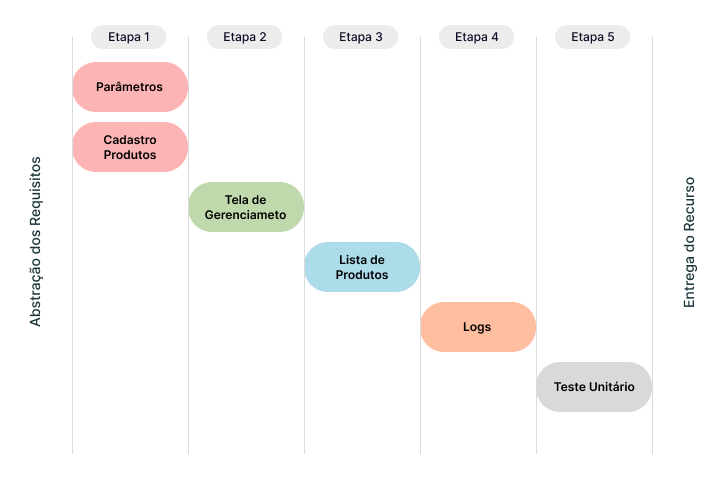

# Introdução :wave:

O presente documento objetiva descrever os requisitos básicos para implementação de um Recurso de Gerenciamento de Produtos a enviar para a API iFood. São descritos os métodos, regras de negócio e exemplos de tela para implementação desta integração no Sistema Ganso.

# Roadmap :rocket:

1. Implementar [Parâmetros](#parâmetros-gear) e Alterações no [Cadastro de Produtos](#cadastro-de-produtos-label).
2. Criar uma [Tela Nova](#nova-tela---produtos-ifood-package) para comportar filtros e funções de envio de produtos.
3. Implementar recursos para gravação da [Lista de Produtos](#tabela-de-dados-para-ifood-abacus) a sincronizar.
4. Implementar recursos para gravação de [Logs](#logs-de-envio-passport_control) de Envio.
5. Realizar Testes Unitários de acordo com a Etapa de [Simulações](#simulações-test_tube) para Homologar o Recurso.

# Requisitos

## Parâmetros :gear:

Na Tela Principal de Parâmetros do Sistema Ganso, criar uma aba **Integrações** e uma sub-aba **iFood** para organizar os Parâmetros descritos na tabela a seguir.

| Parâmetro                     | Descritivo                                                                                                           | Regra de Negócio                                                                                                                                                                                                                                                                                                                               |
| :---------------------------- | :------------------------------------------------------------------------------------------------------------------- | :--------------------------------------------------------------------------------------------------------------------------------------------------------------------------------------------------------------------------------------------------------------------------------------------------------------------------------------------- |
| Ativar Integração iFood       | Opção para Ativar Integração iFood                                                                                   | Ativa a Integração pelo _GansoAgent_, habilita os Campos do [Cadastro de Produtos](#cadastro-de-produtos-label) e a [Tela de Nova de Gerenciamento](#nova-tela---produtos-ifood-package).                                                                                                                                                      |
| Margem de Lucro               | Campo para definir o Percentual de Margem de Lucro aplicável sobre o Preço de Venda do Produto no iFood.             | O Percentual deve ser obrigatório, e deve ser aplicado ao Preço de Venda Normal e sobre o Preço de Promoção, se o Usuário optar por Enviar o Preço de Promoção do Produto. Este percentual deve ser gravado no Produto quando enviado para a Lista.                                                                                            |
| Enviar Promoção               | Opção para sinalizar se o Preço de Promoção será enviado, caso uma Promoção Unitária estiver ativada para o Produto. | Se Usuário selecionar esta opção, e o Produto possuir uma Promoção na Modalidade "Unitário" Ativa, enviar o Preço no respectivo campo de `valorPromocao` identificado na Documentação.                                                                                                                                                         |
| Estoque Padrão de Envio iFood | Campo para definir o Código do Estoque Padrão a considerar para envio das Quantidades ao iFood.                      | Deve aceitar apenas códigos de estoque cadastrados em Arquivos > Almoxarifados, que correspondam à Filial configurada.                                                                                                                                                                                                                         |
| Tipo de Estoque               | Campo para definir qual tipo de Estoque a considerar para envio das Quantidades ao iFood.                            | Deve ser permitido escolher uma opção entre "Físico" ou "Presumido".    Se "Físico", considerar a Quantidade Física Total do Produto.  Se "Presumido", considerar o Cálculo (Estoque Físico - Estoque Reservado - Estoque A Retirar (se ativado parâmetro específico)). Sempre enviar o valor resultante, mesmo que zero ou negativo. |

**:bulb: Nota:** Conforme documentação do iFood, o envio de atualizações deve obedecer o Rate Limit de 60 minutos, não permitindo um intervalo menor que este. Deste modo não é necessário existir um Parâmetro para configurar um "Tempo Limite" ou "Tempo de Resposta".

[Voltar ao Roadmap](#roadmap-rocket) | [Voltar ao Início](#introdução-wave)

## Cadastro de Produtos :label:

A seguir são descritos os recursos necessários a implementar no Cadastro de Produtos para controle quais podem ser enviados, se houve envio e a situação dos mesmos na Plataforma iFood.

| Tipo      | Descrição           | Regra de Negócio                                                                                                                                                                                                         |
| :-------- | :------------------ | :----------------------------------------------------------------------------------------------------------------------------------------------------------------------------------------------------------------------- |
| Parâmetro | Não Vender no iFood | Parâmetro do Produto que restinge o Envio do mesmo ao Integrador iFood. Ativando este parâmetro, o Produto não deve ser listado na Tela de Envio/Gerenciamento, e não deve ser enviado por outros meios.                 |
| Campo     | Enviado para iFood  | Campo para identificar se o Produto foi enviado para iFood na carga Inicial. Esta informação deve ser exibida em local de fácil visualização, e será utilizada como filtro na Tela de Envio/Gerenciamento de Produtos.   |
| Campo     | Status iFood        | Campo para identificar se o Produto está Ativo ou Inativo na Plataforma iFood. Esta informação deve ser exibida em local de fácil visualização, e será utilizada como filtro na Tela de Envio/Gerenciamento de Produtos. |

**:bulb: Nota:** Como Regra de Negócio, os campos acima só devem ser exibidos e gerenciados se o Parâmetro **"Ativar Integração iFood"** estiver ativado.

[Voltar ao Roadmap](#roadmap-rocket) | [Voltar ao Início](#introdução-wave)

## Nova Tela - Produtos iFood :package:

Para que o Usuário obtenha melhor experiência de controle dos Produtos que deseja vender no iFood, é necessário a criação de uma Tela de Gerenciamento.
Esta Tela de Gerenciamento, deve ser semelhante a Tela de Agrupamento de Promoções Individuais, cuja principal função é compor uma **Lista de Produtos**, com possibilidade de utilizar Filtros.
Dentre os principais recursos, deve ser possível listar vários produtos obedecendo Regras de Negócio especificas.

### Protótipo de Tela :desktop_computer:

A Tela Inicial deve exibir a Lista de Produtos já enviados ao iFood para permitir que o Usuário faça a Gestão através de determinadas ações. A seguir um exemplo.

### Filtros :mag:

Os filtros necessários estão classificados em dois Grupos para melhor experiência do usuário e clareza de informações em tela.

| Grupo       | Descritivo                                       | Campos do Grupo                                                                                                                                                                                                                                                                                                                                                               |
| :---------- | :----------------------------------------------- | :---------------------------------------------------------------------------------------------------------------------------------------------------------------------------------------------------------------------------------------------------------------------------------------------------------------------------------------------------------------------------- |
| Segmentação | Grupo de Filtros para Segmentação do Produto     | Marca, Seção, Grupo, Subgrupo, Ambiente de Utilização, Fornecedor Padrão, Agrupador de Preços                                                                                                                                                                                                                                                                                 |
| Produto     | Grupo de Filtros para Características do Produto | Com critérios (Contém, Começa Com, Termina Com, Igual a): Descrição, Referência Fabricante, Referência Auxiliar e Localização.    Sem critérios: Status do Produto, Empresas.  Período de Data: Alteração de Preços (Log Preços).    Checkbox: Listar Kit de Produtos, Somente com Estoque Positivo, Somente não Enviados ao iFood, Somente Desativados iFood. |

Além dos Grupos de Filtros, são necessárias duas Ações principais para os Filtros:

1.  **Pesquisar** - Aciona a Pesquisa envolvendo todos os filtros informados permitindo combinações.
2.  **Limpar Filtros** - Permite o reinício de uma pesquisa.

[Voltar ao Roadmap](#roadmap-rocket) | [Voltar ao Início](#introdução-wave)

### Resultado dos Filtros :open_file_folder:

Incluir uma _Grid_ que deve exibir os Produtos resultantes dos filtros aplicados. As colunas e elementos necessários para exibição e controle são:

| Campo                         | Descritivo                                                         | Regra de Negócio                                                                                |
| :---------------------------- | :----------------------------------------------------------------- | :---------------------------------------------------------------------------------------------- |
| Caixa de Seleção              | Caixa de Seleção do Item para indicar que o mesmo deve ser enviado | Selecionado, Não Selecionado                                                                    |
| Código Interno                | Código Interno do Produto                                          | -                                                                                               |
| Código de Barras              | Código de Barras Padrão do Produto                                 | -                                                                                               |
| Descrição                     | Descrição Completa do Produto                                      | -                                                                                               |
| Preço Normal                  | Preço de Venda Normal do Cadastro                                  | -                                                                                               |
| Preço Promoção                | Preço de Venda na Promoção quando ativa                            | Considerar apenas Promoções da Modalidade Unitário                                              |
| Margem de Lucro %             | Margem de Lucro do Produto                                         | Exibir a Margem Padrão do Parâmetro                                                             |
| Preço iFood                   | Preço de Venda para o iFood                                        | Considerar Margem Adicional parametrizada em [Margem de Lucro nos Parâmetros](#parâmetros-gear) |
| Estoque Atual                 | Estoque Atual do Produto a enviar                                  | Considerar parametrização do [Tipo de Estoque](#parâmetros-gear) (Físico ou Presumido)          |
| Status iFood                  | Situação do Produto na Plataforma iFood (Ativo/Inativo)            | Regra de Negócio da Plataforma.                                                                 |
| Marca, Seção, Grupo, Subgrupo | Segmentação do Produto                                             | -                                                                                               |

### Funções da Grid de Filtros

| Função                                   | Descritivo                                                                       | Regra de Negócio                                |
| :--------------------------------------- | :------------------------------------------------------------------------------- | :---------------------------------------------- |
| [F4] - Selecionar Todos/Inverter Seleção | Função para Selecionar todos os itens da _Grid_ de Dados                         | -                                               |
| [F5] - Limpar Seleção                    | Função para limpar a seleção da _Grid_ de Dados                                  | -                                               |
| Contagem de Produtos selecionados        | Texto informativo sobre a quantidade de Produtos selecionados do total na _Grid_ | Exibir uma Contagem [x] de [y] abaixo da _Grid_ |

[Voltar ao Roadmap](#roadmap-rocket) | [Voltar ao Início](#introdução-wave)

### Ações da Tela :pushpin:

Assim como ocorre com o recurso de **Enviar para Promoção**, entre a Grid de Filtros e Lista de Produtos, incluir as ações abaixo.

| Botão/Função              | Descritivo                                                                                                                           | Regra de Negócio                                                                                                                                                                 |
| :------------------------ | :----------------------------------------------------------------------------------------------------------------------------------- | :------------------------------------------------------------------------------------------------------------------------------------------------------------------------------- |
| Alterar Estoque de Envio  | Campo que exibe o Estoque Padrão de Envio, com permissão de edição.\*                                                                | Reprocessar as Quantidades na _Grid_ conforme o Código de Estoque informado.                                                                                                     |
| Alterar Política de Preço | Campo que exibe a Política de Preço, com permissão de edição.\*                                                                      | Reprocessar Preços iFood na _Grid_ conforme alteração da Política.   Se Política igual a 3 - Preço Especial, considerar alteração do Percentual padrão.                       |
| Precisão de Preço         | Campo para configurar a Precisão das Casas Decimais do Preço iFood.                                                                  | Reprocessar Preços iFood na _Grid_ conforme alteração da Precisão.   Oferecer as opções para arredondamento para o dígito 9, arredondar para próximo inteiro acima ou abaixo. |
| Aplicar                   | Botão de Ação para Aplicar Estoque e Política de Preço aos Produtos exibidos na _Grid_.                                              | Todos os Produtos. Se seleção ativa, sugerir aplicar apenas à seleção.                                                                                                           |
| Reativar Selecionados     | Botão de Ação para Reativar Produtos selecionados da Base do iFood, quando Status igual a "Inativo" e o Usuário desejar reativá-los. | Somente Produtos uma vez enviados para iFood que estejam "Inativos".                                                                                                             |
| Desativar Selecionados    | Botão de Ação para Desativar Produtos selecionados da Base do iFood, quando Status igual a "Ativo"                                   | Somente Produtos uma vez enviados para iFood que estejam "Ativos".                                                                                                               |
| Enviar para iFood         | Botão de Ação para Enviar Produtos selecionados para o iFood                                                                         | Gravar Dados na Tabela de Envio para iFood. Consultar [Tabela de Dados](#tabela-de-dados-para-ifood)                                                                             |

[Voltar ao Roadmap](#roadmap-rocket) | [Voltar ao Início](#introdução-wave)

### Regras de Negócio :lock:

| Regra | Descrição                                                                  | Tratativa                                                                                                                                                |
| :---- | :------------------------------------------------------------------------- | :------------------------------------------------------------------------------------------------------------------------------------------------------- |
| RN01  | Não listar Produtos "Aplicação de Direta"                                  | Verificar o Parâmetro "Aplicação Direta" do Cadastro de Produtos                                                                                         |
| RN02  | Não listar Produtos do Tipo "Fracionável" ou "Matéria Prima"               | Verificar o campo "Tipo do Produto" do Cadastro de Produtos                                                                                              |
| RN03  | Não Permitir enviar mais que 10.000 Produtos em um único pacote de envio.  | Se a seleção do usuário ultrapassar 10.000 Produtos, gerar um novo pacote e informar ao Usuário sobre a ação.                                            |
| RN04  | Calcular Preço de Venda Total do Kit ao Listar Kit de Produtos para Envio. | Se usuário selecionar a Opção "Listar Kit de Produtos", calcular o Preço de Venda Total do Kit, utilizando as configurações e produtos incluídos no Kit. |
| RN05  | Aualizar Preço de Venda e Quantidade do Produto.                           | Se usuário selecionar a Opção "Listar Kit de Produtos", calcular o Preço de Venda Total do Kit, utilizando as configurações e produtos incluídos no Kit. |

[Voltar ao Roadmap](#roadmap-rocket) | [Voltar ao Início](#introdução-wave)

### Mensagens ao Usuário :incoming_envelope:

| Ação                                                    | Mensagem                                                                                                                                             | Tratativa                                                               |
| :------------------------------------------------------ | :--------------------------------------------------------------------------------------------------------------------------------------------------- | :---------------------------------------------------------------------- |
| Clicar no Botão "Aplicar"                               | Mensagem de Confirmação: "Aplicar Novo Estoque e Política de Preços ao itens selecionados/todos os itens ?"                                          | Reprocessar os Produtos listados na _Grid_                              |
| Clicar no Botão "Desativar" Selecionados                | Mensagem de Confirmação: "Os Produtos Selecionados serão Desativados na Plataforma iFood. Deseja continuar ?"                                        | Enviar Desativação para a Plataforma através do comando correspondente. |
| Clicar no Botão "Ativar" Selecionados                   | Mensagem de Confirmação: "Os Produtos Selecionados serão Reativados na Plataforma iFood. Deseja continuar ?"                                         | Enviar Reativação para a Plataforma através do comando correspondente.  |
| Clicar no Botão "Enviar para iFood"                     | Mensagem de Confirmação: "Os Produtos Selecionados serão Enviados para a Plataforma iFood. Deseja continuar ?"                                       | Enviar Produtos selecionados na Lista                                   |
| Selecionar e Enviar mais que 10.000 Produtos em um Lote | Mensagem de Aviso: "A iFood recomenda que sejam enviados apenas 10.000 itens por Pacote. O Sistema irá gerar um novo pacote a cada limite atingido." | Gerar um novo pacote a cada 10.000 Produtos selecionados para envio.    |

[Voltar ao Roadmap](#roadmap-rocket) | [Voltar ao Início](#introdução-wave)

### Tabela de Dados para iFood :abacus:

Segundo a [Documentação do iFood](https://developermercado.ifood.com.br/docs/produtos-api#produto---integra%C3%A7%C3%A3o-utilizando-o-m%C3%A9todo-post), existem 2 métodos de Envio de Dados para API, o Método **POST** e **PATCH**. O Método **POST** deve ser utilizado para envio de uma **Carga Inicial de Dados**. O Método **PATCH** deve ser utilizado para atualizações de dados.

Ao acionar do comando **Enviar para iFood** na Tela descrita anteriormente, é necessário gravar as informações dos Produtos selecionados em uma Tabela de Carga Inicial. Quando o Produto ainda não foi enviado ao iFood ([Campo Enviado para iFood = 'N'](#cadastro-de-produtos-label)) deverá compor a Lista do Método **POST**, se Produto já enviado uma vez, deverá compor a Lista do Método **PATCH**. As informações descritas na tabela abaixo serão utilizadas tanto pelo _GansoAgent_ quanto pelo Software _SMI - Site Mercado Integrador_.

| Campo                     | Tipo e Tamanho  | Descritivo                                                           | Preenchimento                                                                                                                                                                                                      | Regra de Negócio                                                                                                           |
| :------------------------ | :-------------: | :------------------------------------------------------------------- | :----------------------------------------------------------------------------------------------------------------------------------------------------------------------------------------------------------------- | :------------------------------------------------------------------------------------------------------------------------- |
| `idLoja`                  |     Inteiro     | Código da Filial                                                     | Utilizar o Código da Filial logada que gerou o comando.                                                                                                                                                            | Preenchimento Obrigatório.                                                                                                 |
| `departamento`            |   Texto (100)   | Departamento do Produto                                              | Utilizar a Descrição da **Seção** do Produto.                                                                                                                                                                      | Preenchimento Obrigatório. Se **Seção** não existir, informar o texto 'GERAL'.                                             |
| `categoria`               |   Texto (100)   | Categoria do Produto                                                 | Utilizar a Descrição do **Grupo** do Produto.                                                                                                                                                                      | Preenchimento Obrigatório. Se **Grupo** não existir, informar o texto 'GERAL'.                                             |
| `subCategoria`            |   Texto (100)   | SubCategoria do Produto                                              | Utilizar a Descrição do **Subgrupo** do Produto.                                                                                                                                                                   | Preenchimento Não Obrigatório. Se **Subgrupo** não existir, informar vazio ''.                                             |
| `marca`                   |   Texto (100)   | Marca do Produto                                                     | Utilizar a Descrição da **Marca** do Produto.                                                                                                                                                                      | Preenchimento Não Obrigatório. Se **Marca** não existir, informar vazio ''.                                                |
| `unidade`                 |   Texto (100)   | Unidade de Medida de Venda do Produto                                | Utilizar a Sigla vinculada ao Código da Medida de Venda do Produto.                                                                                                                                                | Preenchimento Não Obrigatório. Se não existir, informar vazio ''.                                                          |
| `volume`                  |   Texto (100)   | Volume em Unidade de Venda do Produto                                | Utilizar a Fração da Unidade de Venda vinculada ao Código da Medida de Venda do Produto concatenado com a Sigla da Unidade de Venda. Ex.: "1KG", "1UN"                                                             | Preenchimento Não Obrigatório. Se não existir, informar vazio ''.                                                          |
| `codigoBarra`             |   Texto (15)    | Código de Barras do Produto                                          | Utilizar o Código de Barras padrão do Produto.                                                                                                                                                                     | Preenchimento Obrigatório.                                                                                                 |
| `nome`                    |   Texto (150)   | Descrição do Produto                                                 | Utilizar a Descrição padrão do Produto.                                                                                                                                                                            | Preenchimento Obrigatório.                                                                                                 |
| `valor`                   | Numérico (10,4) | Preço de Venda do Produto                                            | Utilizar o campo Preço de Venda do Produto.                                                                                                                                                                        | Preenchimento Obrigatório.                                                                                                 |
| `valorPromocao`           | Numérico (10,4) | Preço de Promoção do Produto                                         | Utilizar o Preço de Venda da Promoção quando existir uma Promoção da Modalidade "Unitário". Se Promoção do tipo Percentual, calcular o Preço de Venda da Promoção aplicando o Percentual a uma unidade do Produto. | Preenchimento Não Obrigatório. Se não existir Promoção Ativa, informar vazio ''.                                           |
| `valorAtacado`            | Numérico (10,4) | Preço de Venda no Atacado do Produto                                 | Enviar 0.                                                                                                                                                                                                          | Preenchimento Não Obrigatório.                                                                                             |
| `valorCompra`             | Numérico (10,4) | Custo do Produto                                                     | Utilizar o Custo PMZ do Produto.                                                                                                                                                                                   | Preenchimento Não Obrigatório. Verificar Parâmetro "Enviar Custo", se inativo, enviar 0.                                   |
| `quantidadeEstoqueAtual`  | Numérico (10,4) | Estoque Atual do Produto (Físico ou Presumido)                       | Utilizar o Valor do Estoque definido no Parâmetro "Tipo de Estoque" (Físico ou Presumido).                                                                                                                         | Preenchimento Obrigatório.                                                                                                 |
| `quantidadeEstoqueMinimo` | Numérico (10,4) | Estoque Mínimo do Produto                                            | Enviar 0.                                                                                                                                                                                                          | Preenchimento Não Obrigatório.                                                                                             |
| `quantidadeAtacado`       | Numérico (10,4) | Quantidade de Estoque para Venda no Atacado do Produto               | Enviar 0.                                                                                                                                                                                                          | Preenchimento Não Obrigatório.                                                                                             |
| `descricao`               |  Texto (8000)   | Descrição detalhada das Características do Produto                   | Utilizar a Referência do Fabricante. Se não existir, enviar vazio.                                                                                                                                                 | Preenchimento Não Obrigatório.                                                                                             |
| `ativo`                   |    Booleano     | Situação (Status) do Produto                                         | `true` para 'Ativo' e `false` para 'Inativo'.                                                                                                                                                                      | Preenchimento Obrigatório. Se campo 'Status iFood' do Cadastro de Produtos for igual a 'A' então 'Ativo', senão 'Inativo'. |
| `plu`                     |     Inteiro     | Código Interno do Produto                                            | Utilizar o Código do Produto. Se Produto é do Tipo Kit que contenha apenas um único Produto, concatenar ao Código um _underline_ e quantidade do item do Kit. Ex.: 102030_12 ou 78978978945613_12                  | Preenchimento Não Obrigatório.                                                                                             |
| `validadeProxima`         |    Booleano     | Produto Próximo do Vencimento                                        | `true` para 'Sim' e `false` para 'Não'. Enviar `false`.                                                                                                                                                            | Preenchimento Não Obrigatório.                                                                                             |
| `imageURL`                |   Texto (150)   | URL de Imagem de Produto.                                            | Enviar vazio.                                                                                                                                                                                                      | Preenchimento Não Obrigatório.                                                                                             |
| `multiploEanOriginal`     |   Texto (15)    | Código de Barras do Produto de Fabricação Própria ou Item de um Kit. | Utilizar o Código de Barras do Item do Kit.                                                                                                                                                                        | Preenchimento Não Obrigatório.                                                                                             |
| `multiploQtd`             | Numérico (10,4) | Quantidade do Produto na Embalagem de Fabricação Própria ou Kit.     | Utilizar a Quantidade do Produto original informada no Kit.                                                                                                                                                        | Preenchimento Não Obrigatório.                                                                                             |

[Voltar ao Roadmap](#roadmap-rocket) | [Voltar ao Início](#introdução-wave)

:bulb: **Nota:** Para Atualizações dos Produtos já enviados, é necessário utilizar outro método na API do iFood. Quando o produto já existe na Base iFood, **não é necessário** enviar todos os dados, apenas as informações que sofreram alterações como **Estoque e Preço de Venda**.
Os campos _chave_ para envio das informações são: `idLoja` e `codigoBarra`, complementados com as informações do Preço ou Estoque. Se a alteração for de Preço de Venda, os campos `valor` e `valorPromocao` devem ser enviados. Se a alteração for de Estoque, o campo `quantidadeEstoqueAtual` deve ser enviado.

# Automatizações

Durante análise da funcionalidade simulada no Sistema Ganso, foram identificados possíveis automatismos para melhor gestão do recurso. A seguir a tabela de automatizações iniciais.

| #   | Descritivo                             | Condições                                                                                                                                                                                                                                                          |
| :-- | :------------------------------------- | :----------------------------------------------------------------------------------------------------------------------------------------------------------------------------------------------------------------------------------------------------------------- |
| A01 | Inclusão de Produto na Lista iFood     | Se Usuário Cadastrar um Novo Produto e Ativar o Parâmetro "Vender no iFood", incluir automaticamente na Lista de Carga de Produtos iFood.                                                                                                                          |
| A02 | Atualização de Preço de Venda          | Se Usuário atualizar o Preço de Venda de um Produto com parâmetro "Vender no iFood" ativado, verificar se o Produto existe na Lista de Produtos iFood e atualizar o Preço de Venda obedecendo a Parametrização da [Política de Preço](#parâmetros-gear) utilizada. |
| A03 | Atualizar Estoque de Produtos da Lista | Se Usuário atualizar o Preço de Venda de um Produto com parâmetro "Vender no iFood" ativado, verificar se o Produto existe na Lista de Produtos iFood e atualizar o Preço de Venda obedecendo a Parametrização da [Política de Preço](#parâmetros-gear) utilizada. |

# Logs de Envio :passport_control:

Como medida de segurança e auxílio de suporte, é importante que o Sistema Ganso efetue a gravação de Logs dos Processos ocorridos. Os dados necessários para Logs são:

- Data e Hora do Envio
- Usuário que acionou o envio
- Número de Produtos selecionados
- Número de Produtos Ativados
- Número de Produtos Desativados
- Percentual de Majoração Aplicado
- Estoque Enviado

[Voltar ao Roadmap](#roadmap-rocket) | [Voltar ao Início](#introdução-wave)

# Simulações :test_tube:

| Cenário de Homologação                              | Resultado esperado                                                                                                                |
| :-------------------------------------------------- | :-------------------------------------------------------------------------------------------------------------------------------- |
| Carga de Produtos do tipo EAN                       | Recebimento dos produtos na Base iFood                                                                                            |
| Atualização de Status do Produto do tipo EAN        | Recebimento de produtos com alteração de status (Ativo / Inativo)                                                                 |
| Atualização de Preços do Produto do tipo EAN        | Atualização de preço de produtos saindo de A para B                                                                               |
| Atualização de Preços De / Por do tipo EAN          | Atualização de preço de produtos saindo de A para B tendo o DE/POR (Envio de Preço da Promoção)                                   |
| Atualização de Estoque do tipo EAN                  | Atualização do valor de estoque de A para B (Atualizações Automáticas ou Manuais)                                                 |
| Atualização da descrição do produto do tipo EAN     | Atualização do nome/descrição do produto saindo de A para B                                                                       |
| Carga de Produtos do tipo PRÓPRIO                   | Recebimento dos produtos do tipo Kit ou Produzido                                                                                 |
| Atualização de Status do Produto do tipo PRÓPRIO    | Recebimento de produtos com alteração de status (Ativo / Inativo)                                                                 |
| Atualização de Preços do Produto do tipo PRÓPRIO    | Atualização de preço de produtos saindo de A para B                                                                               |
| Atualização de Preços De / Por do tipo PRÓPRIO      | Atualização de preço de produtos saindo de A para B tendo o DE/POR (Envio de Preço da Promoção)                                   |
| Atualização de Estoque do tipo PRÓPRIO              | Atualização do valor de estoque de A para B                                                                                       |
| Atualização da descrição do produto do tipo PRÓPRIO | Atualização do nome do produto saindo de A para B                                                                                 |
| Atualização geral dos itens                         | Recebimento da atualização somente dos itens que houve alteração do lado do ERP ao invés da base completa. (Atualização em massa) |
| Tempo de Atualização                                | Validação da atualização da base (com update) com tempo de 120 minutos                                                            |

# Referências :key:

- [Developers iFood](https://developermercado.ifood.com.br/docs/produtos-api)
- [Nota Técnica - NF-e](https://developermercado.ifood.com.br/page/nt-2020006)
- [Tiny ERP](https://ajuda.tiny.com.br/hc/pt-br/articles/8289956453268-Integra%C3%A7%C3%A3o-Tiny-com-o-iFood-Mercado)
- [Consumer ERP](https://ajuda.programaconsumer.com.br/como-integrar-o-programa-consumer-ao-ifood/)
- [Linx - Site Mercado Integração](https://share.linx.com.br/pages/viewpage.action?pageId=262389984)

[Voltar ao Início](#introdução-wave)
