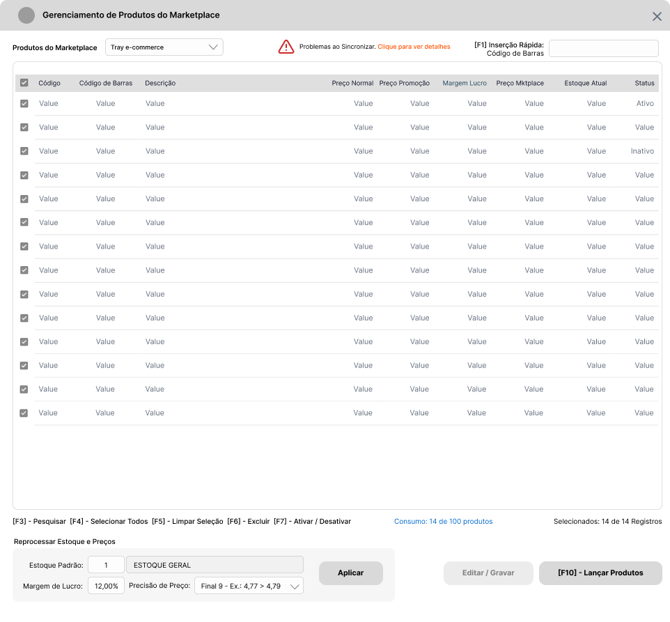

# Introdução :wave:

O presente documento objetiva descrever os requisitos básicos para implementação de Recursos para Gerenciamento de Produtos a enviar para Marketplaces. Inicialmente, o recurso atenderá a maioria das integrações e os requisitos são genéricos de preparação do Sistema Ganso.

# Requisitos

## Parâmetros :gear:

Na Tela Principal de Parâmetros do Sistema Ganso, criar uma aba **Integrações** e uma sub-aba **Marketplaces** para organizar os Parâmetros iniciais descritos na tabela a seguir.

| Parâmetro                         | Descritivo                                                                                                                   | Regra de Negócio                                                                                                                                                                                                                                                                                                                                                         |
| :-------------------------------- | :--------------------------------------------------------------------------------------------------------------------------- | :----------------------------------------------------------------------------------------------------------------------------------------------------------------------------------------------------------------------------------------------------------------------------------------------------------------------------------------------------------------------- |
| Ativar Integração com Marketplace | Opção para Ativar Integração com Marketplace                                                                                 | Ativa a Integração pelo _GansoAgent_, habilita a Aba **Marketplaces** do [Cadastro de Produtos](#cadastro-de-produtos-label) e a [Tela de Nova de Gerenciamento](#nova-tela---gerenciamentos-de-produtos-do-marketplace-package).                                                                                                                                        |
| Margem de Lucro                   | Campo para definir o Percentual de Margem de Lucro padrão aplicável sobre o **Preço de Venda** do Produto no Marketplace.    | O Percentual deve ser aplicado ao Preço de Venda Normal e sobre o Preço de Promoção, se o Usuário optar por Enviar o Preço de Promoção do Produto. Este percentual deve ser gravado no Produto quando enviado para a Lista.                                                                                                                                              |
| Enviar Promoção                   | Opção para sinalizar se o **Preço de Promoção** será enviado, caso uma **Promoção Unitária estiver ativada para o Produto**. | Enviar o Preço da Promoção, se parâmetro ativo e o Produto possuir uma Promoção na Modalidade **"Unitário"** Ativa.                                                                                                                                                                                                                                                      |
| Estoque Padrão de Envio           | Campo para definir o Código do Estoque Padrão a considerar para envio das Quantidades ao Marketplace                         | Deve aceitar apenas códigos de estoque cadastrados em `Arquivos > Almoxarifados`, que correspondam à Filial configurada. Incluir consulta `<F2>`.                                                                                                                                                                                                                        |
| Tipo de Estoque                   | Campo para definir qual tipo de Estoque a considerar para envio das Quantidades ao Marketplace.                              | Deve ser permitido escolher uma opção entre **"Físico"** ou **"Presumido"**.    Se **"Físico"**, considerar a Quantidade Física Total do Produto.  Se **"Presumido"**, considerar o Cálculo (Estoque Físico - Estoque Reservado - Estoque A Retirar (se ativado parâmetro do Estoque à Retirar)). Sempre enviar o valor resultante, mesmo que zero ou negativo. |

## Cadastro de Produtos :label:

Nesta Seção são descritos os recursos necessários a implementar no **Cadastro de Produtos** para controle. Estas informações deverão ser gravadas por **Filial** conforme estrutura de `PRODUTO_PARAMETROS`.

| Elemento                   | Pai              | Nome                    | Descritivo e Regra de Negócio                                                                                                                                                                                                                                                                                                                     |
| :------------------------- | :--------------- | :---------------------- | :------------------------------------------------------------------------------------------------------------------------------------------------------------------------------------------------------------------------------------------------------------------------------------------------------------------------------------------------ |
| Aba                        | Cadastro         | Marketplaces            | Criar uma aba que concentra todas as Configurações de Marketplace do Produto. Deve exibir em quais Marketplaces o Produto está ativo, com informações de Código do Integrador, Nome, Código do Produto no Marketplace (quando for o caso), Margem de Lucro (quando for o caso), Preço de Venda no Marketplace e Status do Produto no Marketplace. |
| Lista de Caixas de Seleção | Aba Marketplaces | Restringir Marketplaces | Parâmetros do Produto que define para quais Marketplaces o Produto não pode ser enviado. O Sistema deve listar todas os Marketplaces configurados e ativos e permitir que o usuário selecione quais deseja restringir.                                                                                                                            |
| Campo                      | Aba Marketplaces | Código da Filial        | Campo para filtrar a Filial para exibir os dados carregados na Grid de informações dos Marketplaces.                                                                                                                                                                                                                                              |
| Campo                      | Aba Marketplaces | Preço de Venda Atual    | Campo exibir como informativo o Preço de Venda Atual.                                                                                                                                                                                                                                                                                             |
| Grid                       | Aba Marketplaces | Marketplaces do Produto | Grid para exibir em quais Marketplaces o Produto está incluído. É importante exibir as informações de Código da Integração, Nome do Integrador, Código do Produto no Integrador, Margem de Lucro, Preço de Venda, Status do Marketplace, Data de Adição do Produto e Data de Última Alteração.                                                    |

> **:bulb: Nota:** Como Regra de Negócio principal, a Aba Marketplaces só deve ser exibida e gerenciada se houver **Integração** ativada para qualquer **Marketplace**.

Abaixo um exemplo das implementações.

[Voltar ao Início](#introdução-wave)

## Nova Tela - Gerenciamentos de Produtos do Marketplace :package:

Para que o Usuário obtenha melhor experiência de controle dos Produtos que deseja vender em Marketplaces, é necessário a criação de uma Tela de Gerenciamento.
Esta Tela de Gerenciamento descrita herda recursos da **Tela de Agrupamento de Promoções Individuais** (`Arquivos > Produtos > Agrupamento de Promoções Individuais`), cuja principal função é compor uma **Lista de Produtos**, com possibilidade de utilização de Filtros.

### Recursos da Tela Principal :desktop_computer:

A Tela Principal deve exibir, inicialmente, a Lista de Produtos já enviados ao Marketplace para permitir que o Usuário faça a Gestão através de determinadas ações. Deve conter os elementos da Tabela a seguir.

| Elemento     | Descritivo                                                                                                                                                        |
| :----------- | :---------------------------------------------------------------------------------------------------------------------------------------------------------------- |
| Grid (1)     | Grid nomeada de **Produtos do Marketplace** para exibir os produtos que já estão contidos no Marketplace.                                                         |
| Campo (2)    | Campo para **Inserção Rápida** de Produto na Grid **Produtos do Marketplace**, posicionado acima e ao lado direito da Grid.                                       |
| Legendas (3) | Legendas para ações da Grid.                                                                                                                                      |
| Grupo (4)    | Grupo de elementos para **Reprocessar Estoque e Preços**, agrupando campos para alterar o Estoque e Precisão de Preços, posicionado no rodapé à esquerda da Tela. |
| Botões (4)   | Botões de Ação padrão para **Editar/Gravar** e **Lançar Produtos**, posicionados no rodapé à direita da Tela.                                                     |

### Detalhamento dos elementos da Tela Principal

1. Incluir uma _Grid_ nomeada de **Produtos do Marketplace** que deve exibir os Produtos já contidos na Lista com os seguintes dados:

| Campo                         | Descritivo                                                    | Regra de Negócio                                                                                                                                                                                                                   |
| :---------------------------- | :------------------------------------------------------------ | :--------------------------------------------------------------------------------------------------------------------------------------------------------------------------------------------------------------------------------- |
| Caixa de Seleção              | Caixa de Seleção do Item                                      | Selecionado, Não Selecionado                                                                                                                                                                                                       |
| Código Interno                | Código Interno do Produto                                     | -                                                                                                                                                                                                                                  |
| Código de Barras              | Código de Barras Padrão do Produto                            | -                                                                                                                                                                                                                                  |
| Descrição                     | Descrição Completa do Produto                                 | -                                                                                                                                                                                                                                  |
| Preço Normal                  | Preço de Venda Normal                                         | Preço de Venda Normal do Produto.                                                                                                                                                                                                  |
| Preço Promoção                | Preço de Venda de Promoção                                    | Preço de Promoção enviado, se houve promoção durante o envio.                                                                                                                                                                      |
| Margem de Lucro %             | Margem de Lucro do Produto                                    | Margem de Lucro enviada.  Permitir digitação na própria coluna, mediante [Chave de Acesso Restrito AR04](#acessos-restritos-passport_control).                                                                               |
| Preço Marketplace             | Preço de Venda para o Marketplace                             | Preço de Venda enviado conforme o calculado pela Margem de Lucro e que está atualmente na Plataforma.  Permitir digitação na própria coluna. Solicitar [Chave de Acesso Restrito AR04](#acessos-restritos-passport_control). |
| Estoque Atual                 | Estoque Atual do Produto                                      | Quantidade em Estoque enviada.                                                                                                                                                                                                     |
| Status Marketplace            | Situação do Produto na Plataforma Marketplace (Ativo/Inativo) | Status Atual do Produto na Plataforma Marketplace.                                                                                                                                                                                 |
| Marca, Seção, Grupo, Subgrupo | Segmentação do Produto                                        | Informações opcionais ao usuário.                                                                                                                                                                                                  |

2. Acima da _Grid_ anterior, incluir um campo para **Inserção Rápida** de Produto com as funcionalidades de:

   - Atalho de Teclado para ativar a Função, por exemplo: **`<F1>` - Inserção Rápida**.
   - Digitação e adição do Produto ao teclar `<Enter>`.
   - Opção de troca de filtro entre "Código" e "Código de Barras" através da tecla `<Espaço>`.
   - Permitir utilização da Consulta `<F2>` padrão do Sistema.

> :bulb: Nota: O Produto digitado deve ser inserido na lista com as Configurações de Estoque e Margem de Lucro padrões dos Parâmetros.

3. Abaixo da _Grid_, incluir legenda para as ações que podem ser executadas nos itens:

| Elemento                         | Descritivo da Ação                                      | Regra de Negócio                                                                             |
| :------------------------------- | :------------------------------------------------------ | :------------------------------------------------------------------------------------------- |
| Atalho `<F3>` - Pesquisar        | Acionar a Pesquisa na coluna focalizada                 | Exibir um diálogo com um campo para usuário digitar o critério de pesquisa.                  |
| Atalho `<F4>` - Selecionar Todos | Inverter a Seleção ou Selecionar todos os itens da Grid | -                                                                                            |
| Atalho `<F5>` - Limpar Seleção   | Limpar a Seleção da Grid                                | -                                                                                            |
| Atalho `<F6>` - Excluir          | Excluir os Itens Selecionados na Grid                   | Solicitar Confirmação e [Chave de Acesso Restrito AR01](#acessos-restritos-passport_control) |
| Atalho `<F7>` - Ativar/Desativar | Ativar ou Desativar Itens Selecionados na Grid          | Solicitar Confirmação e [Chave de Acesso Restrito AR02](#acessos-restritos-passport_control) |
| Texto                            | Exibição do Número de Itens selecionados do Total       | Exibir no formato x de y registros. Ex.: Selecionados: 10 de 18 registros.                   |

4. No rodapé da Tela, incluir um grupo de Funções Rápidas para **Reprocessar Estoque e Preços** dos Itens da Grid, e ações padrão que são:

| Elemento            | Descritivo                | Regra de Negócio                                                                                                                                                                                                                                                                                                                                                                                                         |
| :------------------ | :------------------------ | :----------------------------------------------------------------------------------------------------------------------------------------------------------------------------------------------------------------------------------------------------------------------------------------------------------------------------------------------------------------------------------------------------------------------- |
| Campo               | Estoque Padrão            | Campo para permitir alterar o Estoque aplicado aos itens                                                                                                                                                                                                                                                                                                                                                                 |
| Campo               | Margem de Lucro           | Campo para permitir alterar a Margem aplicada aos itens                                                                                                                                                                                                                                                                                                                                                                  |
| Caixa de Combinação | Precisão de Preço         | Opções para configurar a Precisão do Preço de Venda Marketplace, como por exemplo, arredondamento de casas decimais. Disponibilizar opções como:  Final 9 - Ex.: 4,77 > 4,79  Final 0 - Ex.: 4,77 > 4,70  Próx. Inteiro - Ex.: 4,77 > 5,00  Valor Inteiro - Ex.: 4,77 > 4,00   e outras opções de arredondamento como:   Arredondar acima - Ex.: 4,77 > 4,80   Arredondar abaixo - Ex.: 4,77 > 4,75 |
| Botão de Ação       | Aplicar                   | Botão para Aplicar as configurações de Estoque, Margem de Lucro e Precisão de Preço aos itens **selecionados** na Grid.                                                                                                                                                                                                                                                                                                  |
| Botão de Ação       | Editar/Gravar             | Botão para Editar e Gravar alterações efetuadas na Lista de Produtos.                                                                                                                                                                                                                                                                                                                                                    |
| Botão de Ação       | `<F10>` - Lançar Produtos | Botão para Acionar a Tela de Consulta e Lançamento de Produtos.                                                                                                                                                                                                                                                                                                                                                          |

Ao final da implementação dos recursos, o resultado deve assemelhar-se com a imagem abaixo:

Após implementação dos recursos descritos acima, implementar os recursos descritos a seguir.

### Recursos da Tela Secundária para Lançamento de Produtos :mag_right:

A Tela de Lançamento de Produtos deve ser ativada quando o Usuário clicar no Botão de Ação **`<F10>` - Lançar Produtos**. Esta tela deve funcionar como uma "Montagem de Lista" e deve conter os elementos abaixo:

| Elemento | Nome                                      | Descritivo                                                                                                                                                                                                                                                                                                                      |
| :------- | :---------------------------------------- | :------------------------------------------------------------------------------------------------------------------------------------------------------------------------------------------------------------------------------------------------------------------------------------------------------------------------------ |
| Grid     | Grid1 - Resultados dos Filtros            | Uma _Grid_ chamada "**Resultado dos Filtros**" (Grid1) que deve exibir o resultado dos filtros.                                                                                                                                                                                                                                 |
| Painel   | Filtros da Tela                           | Os filtros devem ser exibidos quando o Usuário acessar a primeira vez a Tela ou quando acionar a função **[Esc / F3] - Filtrar**. Estes [Filtros](#resultado-dos-filtros-grid1-open_file_folder) devem ser exibidos como um Pop-up sobre a _Grid_ de **Resultados**.                                                            |
| Grupo    | Grupo de Funções - Configurações de Envio | Abaixo do **Resultado dos Filtros** deve existir um grupo de funções chamado **Configurações de Envio** contendo os campos de **Margem de Lucro** e **Precisão de Preço**, funções básicas para **Adicionar e Remover** item da Lista, e um Botão Principal de Ação para acesso ao Pop-up de Filtro (**[Esc / F3] - Filtrar**). |
| Grid     | Grid2 - Itens a Enviar                    | Abaixo de **Configurações de Envio** deve existir uma _Grid_ chamada **"Itens a Enviar"** (Grid2) que deve exibir os Produtos que foram selecionados para compor a **Lista de Produtos Vendidos no Marketplace**.                                                                                                               |
| Ações    | Enviar para Lista                         | Deve existir uma ação de **"Enviar para Lista"** todos os Produtos selecionados na _Grid_ **Itens a Enviar**.                                                                                                                                                                                                                   |

Após implementações dos recursos, o resultado final deve deve assemelhar-se com a imagem abaixo (sem a ativação do Painel de Filtros).

### Função [Esc / F3] - Filtrar (Painel Pop-up) :mag:

Quando o usuário acessar a Tela de Lançamento pela primeira vez, os filtros devem ser exibidos sobre a Grid de Resultado (Painel de Filtros). Uma vez executado os filtros, o Painel deve ser ocultado e exibido somente se o Usuário acionar novamente a função **[Esc / F3] - Filtrar**. Neste painel os filtros necessários são:

| Filtro                                         | Descritivo                                                                                                         | Regras de Negócio                                                                                                                                                                                               |
| :--------------------------------------------- | :----------------------------------------------------------------------------------------------------------------- | :-------------------------------------------------------------------------------------------------------------------------------------------------------------------------------------------------------------- |
| Produto - Código / Código de Barras            | Filtro por Código Interno ou Código de Barras do Produto.                                                          | Disponibilizar a Consulta `<F2>` e a função de alterar o critério entre "Código" e "Código de Barras" através da tecla [Espaço]                                                                                 |
| Descrição do Produto                           | Filtro por Descrição do Produto com Critérios.                                                                     | Disponibilizar os Critérios Contém, Começa Com, Termina Com e Igual a.                                                                                                                                          |
| Status do Produto                              | Filtro por Status do Produto no Sistema.                                                                           | Opções: Ativo ou Inativo                                                                                                                                                                                        |
| Segmentação (Vários)                           | Filtro por Segmentação dos Produtos.                                                                               | Campos: Marca, Seção, Grupo, Subgrupo, Fornecedor Padrão, Estoque, Ambiente de Utilização, Agrupamento de Preços.                                                                                               |
| Referência do Fabricante e Referência Auxiliar | Filtro por Referências com Critérios.                                                                              | Disponibilizar os Critérios Contém, Começa Com, Termina Com e Igual a.                                                                                                                                          |
| Localização                                    | Filtro por Localização com Critérios.                                                                              | Disponibilizar os Critérios Contém, Começa Com, Termina Com e Igual a.                                                                                                                                          |
| Preços alterados entre                         | Filtro por Período de Alterações de Preços de Venda.                                                               | Disponibilizar dois campos de Data para formar o período. Consultar alterações de Preço para a Filial Logada através do Log de Preços.                                                                          |
| Preços de Venda entre                          | Filtro por Faixa de Preços de Venda.                                                                               | Disponibilizar dois campos de Data para formar a faixa.                                                                                                                                                         |
| Opção Listar Kit de Produtos                   | Opção para permitir Listar Produtos do Tipo "KIT".                                                                 | Caixa de Seleção.                                                                                                                                                                                               |
| Opção Somente com Estoque Positivo             | Opção para permitir Listar Produtos com Estoque Positivo                                                           | Caixa de Seleção. Considerar Produtos com Estoque Padrão parametrizado para envio ou Estoque Informado no Filtro seja maior que zero.                                                                           |
| Opção Listar Não Vendidos no Marketplace       | Opção para permitir Listar Produtos com parâmetro [Não vender no Marketplace](#cadastro-de-produtos-label) marcado | Caixa de Seleção. Se um Produto nesta condição for marcado e enviado para Lista, considerar que o mesmo agora pode ser enviado ao Marketplace, e desmarcar o parâmetro "Não vender no Marketplace" no Cadastro. |
| Botões de Ação Filtrar e Limpar Filtros        | Ações para acionar o Filtro e Limpar os Filtros                                                                    | **`<F3>` - Filtrar** - Aciona a Pesquisa envolvendo todos os filtros informados permitindo combinações.  **[F12] - Limpar Filtros** - Permite o reinício de uma pesquisa.                                    |

:bulb: **Nota:** Após usuário acionar a função **`<F3>` - Filtrar** o "Pop-up" de filtros deve ser ocultado, e somente deve ser exibido se o Usuário acionar novamente a função **`<Esc / F3>` - Filtrar** presente ao centro da Tela.

Após implementação dos Filtros do Painel, o resultado final deve assemelhar-se com a imagem abaixo.

[Voltar ao Início](#introdução---minuta-wave)

### Resultado dos Filtros (Grid1) :open_file_folder:

Após usuário acionar a função **`<F3>` - Filtrar**, o Painel de filtros deve ser ocultado e a _Grid_ de resultados (Grid1) deve exibir as seguintes informações dos Produtos:

| Campo             | Descritivo                                                         | Regra de Negócio                                                                                               |
| :---------------- | :----------------------------------------------------------------- | :------------------------------------------------------------------------------------------------------------- |
| Caixa de Seleção  | Caixa de Seleção do Item para indicar que o mesmo deve ser enviado | Selecionado, Não Selecionado                                                                                   |
| Código Interno    | Código Interno do Produto                                          | -                                                                                                              |
| Código de Barras  | Código de Barras Padrão do Produto                                 | -                                                                                                              |
| Descrição         | Descrição Completa do Produto                                      | -                                                                                                              |
| Preço Normal      | Preço de Venda Normal do Cadastro                                  | Preço de Venda Atual                                                                                           |
| Preço Promoção    | Preço de Venda na Promoção se ativa no momento                     | Considerar apenas Promoções da Modalidade Unitário. Se não existir promoção, exibir 0,00.                      |
| Margem de Lucro % | Margem de Lucro do Produto                                         | Exibir a Margem Padrão do Parâmetro                                                                            |
| Preço Marketplace | Preço de Venda para o Marketplace                                  | Preço calculado conforme a Margem de Lucro parametrizada em [Margem de Lucro nos Parâmetros](#parâmetros-gear) |
| Estoque Atual     | Estoque Atual do Produto a enviar                                  | Estoque Conforme parametrização do [Estoque Padrão e Tipo de Estoque](#parâmetros-gear) (Físico ou Presumido)  |

Abaixo desta _Grid_ de Dados, incluir legenda para as ações que podem ser executadas para itens:

| Elemento                                   | Descritivo                                                                       | Regra de Negócio                                |
| :----------------------------------------- | :------------------------------------------------------------------------------- | :---------------------------------------------- |
| `<F4>` - Selecionar Todos/Inverter Seleção | Função para Selecionar todos os itens da _Grid_ de Dados                         | -                                               |
| `<F5>` - Limpar Seleção                    | Função para limpar a seleção da _Grid_ de Dados                                  | -                                               |
| Contagem de Produtos selecionados          | Texto informativo sobre a quantidade de Produtos selecionados do total na _Grid_ | Exibir uma Contagem [x] de [y] abaixo da _Grid_ |

[Voltar ao Início](#introdução---minuta-wave)

### Configurações de Envio

Após a _Grid_ dos itens resultantes dos filtros, incluir o grupo **Configurações de Envio** contendo funções para alterar a Margem de Lucro e Precisão de Preço, e botões de ação para Adicionar ou Remover Itens da Lista.
As configurações objetivam a alteração individual ou de uma seleção de produtos. Devem existir os elementos;

| Elemento                     | Descritivo                                                                                     | Regra de Negócio                                                                                                                                                                                               |
| :--------------------------- | :--------------------------------------------------------------------------------------------- | :------------------------------------------------------------------------------------------------------------------------------------------------------------------------------------------------------------- |
| Campo                        | Margem de Lucro                                                                                | Margem de Lucro parametrizada com permissão de edição. Solicitar [Acesso Restrito AR04](#acessos-restritos)                                                                                                    |
| Combo                        | Precisão de Preço. Método para determinar o "arredondamento" do Preço de Venda no Marketplace. | Disponibilizar opções como:  Final 9 - Ex.: 4,77 > 4,79  Final 0 - Ex.: 4,77 > 4,70  Próx. Inteiro - Ex.: 4,77 > 5,00  Valor Inteiro - Ex.: 4,77 > 4,00 e outras opções a definir em planejamento. |
| Botão Adicionar e Remover    | Adicionar ou Remover item da Lista de Itens a Enviar                                           | -                                                                                                                                                                                                              |
| Botão `[Esc / F3]` - Filtrar | Acionar o Pop-up de Filtros                                                                    | -                                                                                                                                                                                                              |

### Itens a Enviar (Grid2):dart:

Incluir uma _Grid_ nomeada de **Itens a Enviar** que deve exibir os Produtos adicionados na Lista Prévia com os seguintes dados:

| Campo             | Descritivo                         | Regra de Negócio                                                                     |
| :---------------- | :--------------------------------- | :----------------------------------------------------------------------------------- |
| Caixa de Seleção  | Caixa de Seleção do Item           | Selecionado, Não Selecionado                                                         |
| Código Interno    | Código Interno do Produto          | -                                                                                    |
| Código de Barras  | Código de Barras Padrão do Produto | -                                                                                    |
| Descrição         | Descrição Completa do Produto      | -                                                                                    |
| Preço Normal      | Preço de Venda Normal              | Preço de Venda Normal do Produto.                                                    |
| Preço Promoção    | Preço de Venda de Promoção         | Preço de Promoção se parametrizado para envio e se houve promoção durante a seleção. |
| Margem de Lucro % | Margem de Lucro do Produto         | Margem de Lucro definida.                                                            |
| Preço Marketplace | Preço de Venda para o Marketplace  | Preço de Venda calculado pela Margem de Lucro configurada e com a precisão definida. |
| Estoque Atual     | Estoque Atual do Produto           | Quantidade em Estoque do Estoque definido.                                           |

Abaixo desta _Grid_ de Dados, no rodapé da tela, incluir legenda para as ações que podem ser executadas para itens e ação final:

| Elemento                                   | Descritivo                                                                                                      | Regra de Negócio                                |
| :----------------------------------------- | :-------------------------------------------------------------------------------------------------------------- | :---------------------------------------------- |
| `<F4>` - Selecionar Todos/Inverter Seleção | Função para Selecionar todos os itens da _Grid_                                                                 | -                                               |
| `<F5>` - Limpar Seleção                    | Função para limpar a seleção da _Grid_                                                                          | -                                               |
| `[Del / F6]` - Remover                     | Função para remover itens selecionados na _Grid_                                                                | -                                               |
| Contagem de Produtos selecionados          | Texto informativo sobre a quantidade de Produtos selecionados do total na _Grid_                                | Exibir uma Contagem [x] de [y] abaixo da _Grid_ |
| Botão de Ação `<F10>` - Enviar para Lista  | Função para adicionar à Lista de Produtos Marketplace, todos os Itens selecionados na _Grid_ de Itens a Enviar. | Solicitar Confirmação.                          |

[Voltar ao Início](#introdução---minuta-wave)

### Regras de Negócio Geral :lock:

| Regra | Descrição                                                                  | Tratativa                                                                                                                                                |
| :---- | :------------------------------------------------------------------------- | :------------------------------------------------------------------------------------------------------------------------------------------------------- |
| RN01  | Não listar Produtos parametrizados como "Aplicação de Direta"              | Considerar o Parâmetro "Aplicação Direta" do Cadastro de Produtos                                                                                        |
| RN02  | Não listar Produtos do Tipo "Fracionável" ou "Matéria Prima"               | Considerar o campo "Tipo do Produto" do Cadastro de Produtos, e apenas os tipos "Próprio", "Terceiros",                                                  |
| RN03  | Calcular Preço de Venda Total do Kit ao Listar Kit de Produtos para Envio. | Se usuário selecionar a Opção "Listar Kit de Produtos", calcular o Preço de Venda Total do Kit, utilizando as configurações e produtos incluídos no Kit. |
| RN04  | Aualizar Preço de Venda e Quantidade do Produto.                           | Se houver atualizações de Preço de Venda e Estoque do Produto, atualizar periódicamente a Lista.                                                         |

[Voltar ao Início](#introdução---minuta-wave)

### Mensagens ao Usuário :incoming_envelope:

| Ação                                                                                        | Mensagem                                                                                                                 | Tratativa                                    |
| :------------------------------------------------------------------------------------------ | :----------------------------------------------------------------------------------------------------------------------- | :------------------------------------------- |
| Clicar no Botão **Aplicar** do Grupo "Reprocessar Estoque e Preços" da Tela Principal       | Mensagem de Confirmação: "Aplicar novo Estoque e Preços ao itens selecionados/todos os itens ?"                          | Reprocessar os Produtos listados na _Grid_   |
| Utilizar a função **`<F7>` - Ativar / Desativar** para itens selecionados na Tela Principal | Mensagem de Confirmação: "Os Produtos Selecionados serão Ativados / Desativados na Plataforma iFood. Deseja continuar ?" | Atualizar o Status iFood dos Itens da Lista. |
| Clicar no Botão **`<F10>` - Enviar para Lista** na tela de Lançamento de Itens              | Mensagem de Confirmação: "Os Produtos Selecionados serão enviados para a Lista de Vendidos no iFood. Deseja continuar ?" | Enviar Produtos selecionados para Lista      |

[Voltar ao Início](#introdução---minuta-wave)

### Acessos Restritos :passport_control:

| #    | Grupo    | Descritivo                                                               | Regra de Negócio                                                                                                   |
| :--- | :------- | :----------------------------------------------------------------------- | :----------------------------------------------------------------------------------------------------------------- |
| AR01 | Produtos | Remover Item da Lista de Vendidos no iFood                               | Eliminar o Item da Lista                                                                                           |
| AR02 | Produtos | Ativar / Desativar Item selecionado na Lista de Vendidos no iFood        | Manter o Item na Lista e alterar o Status                                                                          |
| AR03 | Produtos | Reprocessar Estoque e Preços da Lista de Vendidos no iFood               | Aplicar apenas aos itens selecionados conforme parâmetros definidos nos campos                                     |
| AR04 | Produtos | Permitir alterações no Item                                              | Permitir edição da coluna Margem de Lucro ou Preço Marketplace no Item                                             |
| AR05 | Produtos | Ativar/Desativar parâmetro "Não Vender no iFood" no Cadastro de Produtos | Se Produto parametrizado para "Não Vender no iFood" enviado para Lista, alterar o parâmetro no Cadastro do Produto |

[Voltar ao Início](#introdução---minuta-wave)

## Simulações
