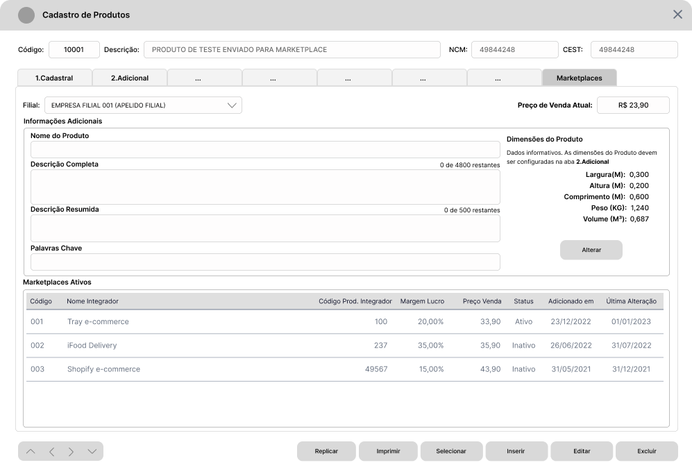

# Introdução :wave:

O presente documento objetiva descrever os requisitos básicos para implementação de Recursos para Gerenciamento de Produtos a enviar para Marketplaces. Inicialmente, o recurso atenderá a maioria das integrações e os requisitos são genéricos de preparação do Sistema Ganso.

# Roadmap :rocket:

1. Implementar [Parâmetros](#parâmetros-gear) Gerais e Específicos.
2. Implementar Alterações no [Cadastro de Produtos](#cadastro-de-produtos-label).
3. Criar uma [Tela Nova](#nova-tela---gerenciamentos-de-produtos-do-marketplace-package) para exibir os Produtos Vendidos em Marketplaces com funções de Gerenciamento.
4. Implementar recursos para gravação da [Lista de Produtos](#especificação-de-dados-por-integrador) conforme dados requeridos a sincronizar.
5. Implementar recursos de [Acesso Restrito](#acessos-restritos-passport_control), [Mensagens para Usuário](#mensagens-ao-usuário-incoming_envelope) e [Automatizações](#automatizações).

# Requisitos

## Parâmetros

Na Tela Principal de Parâmetros do Sistema Ganso, criar uma aba **Integrações** e uma sub-aba **Marketplaces** para organizar os Parâmetros iniciais descritos na tabela a seguir.

| Parâmetro                         | Descritivo                                                                                                                   | Regra de Negócio                                                                                                                                                                                                                                                                                                                                                         |
| :-------------------------------- | :--------------------------------------------------------------------------------------------------------------------------- | :----------------------------------------------------------------------------------------------------------------------------------------------------------------------------------------------------------------------------------------------------------------------------------------------------------------------------------------------------------------------- |
| Ativar Integração com Marketplace | Opção para Ativar Integração com Marketplace                                                                                 | Ativa a Integração, habilita a Aba **Marketplaces** do [Cadastro de Produtos](#cadastro-de-produtos-label) e a [Tela Nova de Gerenciamento de Produtos](#nova-tela---gerenciamentos-de-produtos-do-marketplace-package).                                                                                                                                                 |
| Margem de Lucro                   | Campo para definir o Percentual de Margem de Lucro padrão aplicável sobre o **Preço de Venda** do Produto no Marketplace.    | O Percentual deve ser aplicado ao Preço de Venda Normal e sobre o Preço de Promoção, se o Usuário optar por Enviar o Preço de Promoção do Produto. Este percentual deve ser gravado no Produto quando enviado para a Lista.                                                                                                                                              |
| Enviar Promoção                   | Opção para sinalizar se o **Preço de Promoção** será enviado, caso uma **Promoção Unitária estiver ativada para o Produto**. | Enviar o Preço da Promoção, se parâmetro ativo e o Produto possuir uma Promoção na Modalidade **"Unitário"** Ativa.                                                                                                                                                                                                                                                      |
| Estoque Padrão de Envio           | Campo para definir o Código do Estoque Padrão a considerar para envio das Quantidades ao Marketplace                         | Deve aceitar apenas códigos de estoque cadastrados em `Arquivos > Almoxarifados`, que correspondam à Filial configurada. Incluir consulta `<F2>`.                                                                                                                                                                                                                        |
| Tipo de Estoque                   | Campo para definir qual tipo de Estoque a considerar para envio das Quantidades ao Marketplace.                              | Deve ser permitido escolher uma opção entre **"Físico"** ou **"Presumido"**.    Se **"Físico"**, considerar a Quantidade Física Total do Produto.  Se **"Presumido"**, considerar o Cálculo (Estoque Físico - Estoque Reservado - Estoque A Retirar (se ativado parâmetro do Estoque à Retirar)). Sempre enviar o valor resultante, mesmo que zero ou negativo. |

### Parâmetros Específicos para Integrador Tray

| Parâmetro           | Pai                                   | Descritivo                                                                                                                                             | Regra de Negócio                                                                                                    |
| :------------------ | :------------------------------------ | :----------------------------------------------------------------------------------------------------------------------------------------------------- | :------------------------------------------------------------------------------------------------------------------ |
| Autenticação        | Aba Integrações / Marketplaces / Tray | Grupo de Parâmetros para autenticação e-commerce                                                                                                       | Informações requeridas pelo Integrador "Tray"                                                                       |
| URL de Autenticação | Grupo Autenticação                    | URL                                                                                                                                                    | Até 255 caracteres, inicialmente.                                                                                   |
| Consumer Key        | Grupo Autenticação                    | Chave de Acesso requerida para geração do Código do Aplicativo                                                                                         | Até 255 caracteres, inicialmente.                                                                                   |
| Consumer Secret     | Grupo Autenticação                    | Chave de Acesso requerida para geração do Código do Aplicativo                                                                                         | Até 255 caracteres, inicialmente.                                                                                   |
| Code                | Grupo Autenticação                    | Código de Acesso do Aplicativo gerado através da Plataforma Tray                                                                                       | Até 255 caracteres, inicialmente.                                                                                   |
| Categorias          | Aba Integrações / Marketplaces        | Grupo de Parâmetros específicos para definir as Categorias do e-commerce                                                                               | Informação requerida pelo Integrador "Tray"                                                                         |
| Definir Categorias  | Categorias                            | Parâmetro para Usuário definir um Cadastro do Sistema Ganso que deve alimentar o Cadastro de **"Categorias"** da Plataforma Tray \*                    | Permitir utilizar um dos Cadastros de **Ambiente de Utilização, Seção, Grupo ou Subgrupo**                          |
| Plano Contratado    | Aba Integrações / Marketplaces / Tray | Parâmetro para definir o Plano Contratado pelo Usuário na Plataforma Tray, correspondente ao Limite de Produtos que podem ser enviados ao Marketplace. | Utilizar uma Caixa de Combinação que lista os Planos obtidos diretamente na API da Tray, e armazenar em uma tabela. |

> :bulb: Nota: É estritamente importante relacionar o ID da Categoria Cadastrada na API de Categorias com o ID do Cadastro enviado como Categoria no Parâmetro definir Categorias. Este processo é importante para que o Produto tenha o ID correto durante o Envio Cadastral.

[Voltar ao Início](#introdução-wave)

## Cadastro de Produtos

Na Tela Principal do **Cadastro de Produtos**, criar uma Aba para organizar campos e informações de controle para **Marketplaces**. Estas informações deverão ser gravadas por **Filial** conforme estrutura de `PRODUTOS` e `PRODUTO_PARAMETROS` padronizada do Sistema Ganso.

| Elemento            | Pai                    | Nome                                  | Descritivo e Regra de Negócio                                                                                                                                                                                                                                                                                                                     |
| :------------------ | :--------------------- | :------------------------------------ | :------------------------------------------------------------------------------------------------------------------------------------------------------------------------------------------------------------------------------------------------------------------------------------------------------------------------------------------------ |
| Campo               | Aba 2.Adicional        | Comprimento do Produto                | Campo para informar o Comprimento do Produto em Metros. Informação importante para o cálculo do Frete.                                                                                                                                                                                                                                            |
| Campo               | Aba 2.Adicional        | Largura do Produto                    | Campo para informar a Largura do Produto em Metros. Informação importante para o cálculo do Frete.                                                                                                                                                                                                                                                |
| Campo               | Aba 2.Adicional        | Altura do Produto                     | Campo para informar a Altura do Produto em Metros. Informação importante para o cálculo do Frete.                                                                                                                                                                                                                                                 |
| Aba                 | Cadastro               | Marketplaces                          | Criar uma aba que concentra todas as Configurações de Marketplace do Produto. Deve exibir em quais Marketplaces o Produto está ativo, com informações de Código do Integrador, Nome, Código do Produto no Marketplace (quando for o caso), Margem de Lucro (quando for o caso), Preço de Venda no Marketplace e Status do Produto no Marketplace. |
| Caixa de Combinação | Aba Marketplaces       | Filtro de Filial                      | Campo para filtrar a Filial de exibição dos dados carregados na Aba de Marketplaces.                                                                                                                                                                                                                                                              |
| Campo               | Aba Marketplaces       | Preço de Venda Atual                  | Campo exibir como informativo o Preço de Venda Atual.                                                                                                                                                                                                                                                                                             |
| Grid                | Aba Marketplaces       | Marketplaces do Produto               | Grid para exibir em quais Marketplaces o Produto está incluído. É importante exibir as informações de Código da Integração, Nome do Integrador, Código do Produto no Integrador, Margem de Lucro, Preço de Venda, Status do Marketplace, Data de Adição do Produto e Data de Última Alteração.                                                    |
| Grupo               | Aba Marketplaces       | Informações Adicionais                | Grupo de Informações Adicionais do Produto para o Marketplace.                                                                                                                                                                                                                                                                                    |
| Campo               | Informações Adicionais | Descrição detalhada do Produto        | Campo para informar uma descrição detalhada do Produto, específica para Marketplaces                                                                                                                                                                                                                                                              |
| Campo               | Informações Adicionais | Descrição Resumida do Produto         | Campo para informar uma descrição Resumida do Produto, específica para Marketplaces                                                                                                                                                                                                                                                               |
| Campo               | Informações Adicionais | _Keywords_ ou Palavras Chave de Busca | Campo para definir quais são as palavras chave de busca para o Produto na plataforma do Marketplace. Verificar possibilidade de definir um padrão de preenchimento.                                                                                                                                                                               |
| Campo               | Informações Adicionais | Dimensões do Produto                  | Exibir como informativo, os campos de Largura, Altura, Comprimento, Peso e Volume, definidas na Aba **2.Adicional** do Cadastro de Produtos. Exibir um texto explicativo que a configuração deve ser realizada na Aba 2.Adicional e adicionar um "atalho" que leve o usuário até os campos.                                                       |
> **:bulb: Nota 1:** Consulte a tabela de [Dados Requeridos pela Tray](#dados-requeridos-pela-tray) para vincular as informações.
> **:bulb: Nota 2:** Como Regra de Negócio principal, a Aba Marketplaces só deve ser exibida e gerenciada se houver **Integração** ativada para qualquer **Marketplace**.

Abaixo um exemplo das implementações.

[Voltar ao Início](#introdução-wave) | [Ir para Dados Requeridos pela Tray](#dados-requeridos-pela-tray)

## Nova Tela - Gerenciamentos de Produtos do Marketplace

Para que o Usuário obtenha melhor experiência de controle dos Produtos que deseja vender em Marketplaces, é necessário a criação de uma Tela de Gerenciamento.
Esta Tela de Gerenciamento descrita herda recursos da **Tela de Agrupamento de Promoções Individuais** (`Arquivos > Produtos > Agrupamento de Promoções Individuais`), cuja principal função é compor uma **Lista de Produtos**, com possibilidade de utilização de Filtros.

### Recursos da Tela Principal :desktop_computer:

A Tela Principal deve exibir, inicialmente, a Lista de Produtos já enviados ao Marketplace para permitir que o Usuário faça a Gestão através de determinadas ações. Deve conter os elementos da Tabela a seguir.

| Elemento     | Descritivo                                                                                                                                                        |
| :----------- | :---------------------------------------------------------------------------------------------------------------------------------------------------------------- |
| Grid (1)     | Grid nomeada de **Produtos do Marketplace** para exibir os produtos que já estão contidos no Marketplace.                                                         |
| Campo (2)    | Campo para **Inserção Rápida** de Produto na Grid **Produtos do Marketplace**, posicionado acima e ao lado direito da Grid.                                       |
| Legendas (3) | Legendas para ações da Grid e demais informações relevantes.                                                                                                      |
| Grupo (4)    | Grupo de elementos para **Reprocessar Estoque e Preços**, agrupando campos para alterar o Estoque e Precisão de Preços, posicionado no rodapé à esquerda da Tela. |
| Botões (4)   | Botões de Ação padrão para **Editar/Gravar** e **Lançar Produtos**, posicionados no rodapé à direita da Tela.                                                     |

[Voltar ao Início](#introdução-wave)

### Detalhamento dos elementos da Tela Principal

1. Incluir uma _Grid_ nomeada de **Produtos do Marketplace** que deve exibir os Produtos já contidos na Lista com os seguintes dados:

| Campo                           | Descritivo                                                    | Regra de Negócio                                                                                                                                                                                                                   |
| :------------------------------ | :------------------------------------------------------------ | :--------------------------------------------------------------------------------------------------------------------------------------------------------------------------------------------------------------------------------- |
| Caixa de Seleção                | Caixa de Seleção do Item                                      | Selecionado, Não Selecionado                                                                                                                                                                                                       |
| Código Interno                  | Código Interno do Produto                                     | -                                                                                                                                                                                                                                  |
| Código de Barras                | Código de Barras Padrão do Produto                            | -                                                                                                                                                                                                                                  |
| Descrição                       | Descrição Completa do Produto                                 | -                                                                                                                                                                                                                                  |
| Preço Normal                    | Preço de Venda Normal                                         | Preço de Venda Normal do Produto.                                                                                                                                                                                                  |
| Margem de Lucro %               | Margem de Lucro do Produto                                    | Margem de Lucro enviada.  Permitir digitação na própria coluna, mediante [Chave de Acesso Restrito AR04](#acessos-restritos-passport_control).                                                                               |
| Preço Marketplace               | Preço de Venda para o Marketplace                             | Preço de Venda enviado conforme o calculado pela Margem de Lucro e que está atualmente na Plataforma.  Permitir digitação na própria coluna. Solicitar [Chave de Acesso Restrito AR04](#acessos-restritos-passport_control). |
| Desconto Percentual da Promoção | Percentual de Desconto da Promoção no Marketplace             | Percentual de Desconto de Promoção configurado no Marketplace, não o desconto da Promoção Ganso.                                                                                                                                   |
| Desconto Valor da Promoção      | Valor do Desconto da Promoção no Marketplace                  | Valor do Desconto de Promoção configurado no Marketplace, não o desconto da Promoção Ganso.                                                                                                                                        |
| Preço Promoção                  | Preço de Venda de Promoção                                    | Preço de Promoção enviado, se houve promoção durante o envio.                                                                                                                                                                      |
| Estoque Atual                   | Estoque Atual do Produto                                      | Quantidade em Estoque enviada.                                                                                                                                                                                                     |
| Status Marketplace              | Situação do Produto na Plataforma Marketplace (Ativo/Inativo) | Status Atual do Produto na Plataforma Marketplace.                                                                                                                                                                                 |
| Marca, Seção, Grupo, Subgrupo   | Segmentação do Produto                                        | Informações opcionais ao usuário.                                                                                                                                                                                                  |
| Local de Estoque                | Código e Descrição do Estoque definido para envio             | Estoque definido.                                                                                                                                                                                                                  |

1. Acima da _Grid_ anterior, incluir:
   1. Uma **Caixa de Combinação** para exibir os Marketplaces configurados e ativos para troca Rápida de Lista pelo Usuário.
   2. Uma Texto indicativo de Alerta, para quando houver problemas de Sincronização ou Inconsistências, onde o usuário possa clicar e visualizar um [Log de Eventos](#Log-de-Eventos).
   3. Um campo para **Inserção Rápida** de Produto com as funcionalidades de:
      1. Atalho de Teclado para ativar a Função, por exemplo: **`<F1>` - Inserção Rápida**.
      2. Digitação e adição do Produto ao teclar `<Enter>`.
      3. Opção de troca de filtro entre "Código" e "Código de Barras" através da tecla `<Espaço>`.
      4. Permitir utilização da Consulta `<F2>` padrão do Sistema.

> :bulb: Nota: No método de Inserção Rápida, o Produto digitado deve ser inserido na lista com as Configurações de Estoque e Margem de Lucro padrões dos Parâmetros.

[Voltar ao Início](#introdução-wave)

1. Abaixo da _Grid_, incluir legenda para as ações que podem ser executadas nos itens:

| Elemento                         | Descritivo da Ação                                        | Regra de Negócio                                                                                    |
| :------------------------------- | :-------------------------------------------------------- | :-------------------------------------------------------------------------------------------------- |
| Atalho `<F3>` - Pesquisar        | Acionar a Pesquisa na coluna focalizada                   | Exibir um diálogo com um campo para usuário digitar o critério de pesquisa.                         |
| Atalho `<F4>` - Selecionar Todos | Inverter a Seleção ou Selecionar todos os itens da Grid   | -                                                                                                   |
| Atalho `<F5>` - Limpar Seleção   | Limpar a Seleção da Grid                                  | -                                                                                                   |
| Atalho `<F6>` - Excluir          | Excluir os Itens Selecionados na Grid                     | Solicitar Confirmação e [Chave de Acesso Restrito AR01](#acessos-restritos-passport_control)        |
| Atalho `<F7>` - Ativar/Desativar | Ativar ou Desativar Itens Selecionados na Grid            | Solicitar Confirmação e [Chave de Acesso Restrito AR02](#acessos-restritos-passport_control)        |
| Texto                            | Exibição do Limite de Produtos contratados no Marketplace | Exibir no formato x de y registros. Ex.: Consumo: 10 de 100 produtos ou Limite: 10 de 100 produtos. |
| Texto                            | Exibição do Número de Itens selecionados do Total         | Exibir no formato x de y registros. Ex.: Selecionados: 10 de 18 registros.                          |

4. No rodapé da Tela, incluir um grupo de Funções Rápidas para **Reprocessar Estoque e Preços** dos Itens da Grid, e ações padrão que são:

| Elemento            | Descritivo                | Regra de Negócio                                                                                                                                                                                                                                                                                                                                                                                                         |
| :------------------ | :------------------------ | :----------------------------------------------------------------------------------------------------------------------------------------------------------------------------------------------------------------------------------------------------------------------------------------------------------------------------------------------------------------------------------------------------------------------- |
| Campo               | Estoque Padrão            | Campo para permitir alterar o Estoque aplicado aos itens                                                                                                                                                                                                                                                                                                                                                                 |
| Campo               | Margem de Lucro           | Campo para permitir alterar a Margem aplicada aos itens                                                                                                                                                                                                                                                                                                                                                                  |
| Caixa de Combinação | Precisão de Preço         | Opções para configurar a Precisão do Preço de Venda Marketplace, como por exemplo, arredondamento de casas decimais. Disponibilizar opções como:  Final 9 - Ex.: 4,77 > 4,79  Final 0 - Ex.: 4,77 > 4,70  Próx. Inteiro - Ex.: 4,77 > 5,00  Valor Inteiro - Ex.: 4,77 > 4,00   e outras opções de arredondamento como:   Arredondar acima - Ex.: 4,77 > 4,80   Arredondar abaixo - Ex.: 4,77 > 4,75 |
| Botão de Ação       | Aplicar                   | Botão para Aplicar as configurações de Estoque, Margem de Lucro e Precisão de Preço aos itens **selecionados** na Grid.                                                                                                                                                                                                                                                                                                  |
| Botão de Ação       | Editar/Gravar             | Botão para Editar e Gravar alterações efetuadas na Lista de Produtos.                                                                                                                                                                                                                                                                                                                                                    |
| Botão de Ação       | `<F10>` - Lançar Produtos | Botão para Acionar a Tela de Consulta e Lançamento de Produtos.                                                                                                                                                                                                                                                                                                                                                          |

Ao final da implementação dos recursos, o resultado deve assemelhar-se com a imagem abaixo:

[Voltar ao Início](#introdução-wave)

## Log de Eventos

A Tela de Log de Eventos deve ser exibida quando o Usuário clicar sobre a mensagem indicativa de Problemas na Sincronização, posicionada no topo da [Tela Principal](#detalhamento-dos-elementos-da-tela-principal).
Esta Tela deve conter Logs organizados por Categorias como nos exemplos abaixo.

| Categoria do Evento | Descritivo                                                                                                    |
| :------------------ | :------------------------------------------------------------------------------------------------------------ |
| Autenticação        | Exibe eventos quanto à Autenticação da Empresa na API do Integrador, como Loja Bloqueada, Loja Inativa e etc. |
| Produtos            | Exibe eventos relacionados ao Produto, como falha de Sincronização, Dados ausentes, e outros.                 |

Além dos recursos acima, o usuário deve conseguir selecionar um evento e marcá-lo como **Resolvido**.

### Recursos da Tela Secundária para Lançamento de Produtos :mag_right:

A Tela de Lançamento de Produtos deve ser ativada quando o Usuário clicar no Botão de Ação **`<F10>` - Lançar Produtos**. Esta tela deve funcionar como uma "Montagem de Lista" e deve conter os elementos abaixo:

| Elemento | Nome                                      | Descritivo                                                                                                                                                                                                                                                                                                                        |
| :------- | :---------------------------------------- | :-------------------------------------------------------------------------------------------------------------------------------------------------------------------------------------------------------------------------------------------------------------------------------------------------------------------------------- |
| Grid     | Grid1 - Resultados dos Filtros            | Uma _Grid_ chamada "**Resultado da Pesquisa**" (Grid1) que deve exibir o Resultado da Pesquisa.                                                                                                                                                                                                                                   |
| Painel   | Filtros da Tela                           | Os filtros devem ser exibidos quando o Usuário acessar a primeira vez a Tela ou quando acionar a função **`<Esc / F3>` - Filtrar**. Estes [Filtros](#resultado-dos-filtros-grid1-open_file_folder) devem ser exibidos como um Pop-up sobre a _Grid_ de **Resultados**.                                                            |
| Grupo    | Grupo de Funções - Configurações de Envio | Abaixo do **Resultado da Pesquisa** deve existir um grupo de funções chamado **Configurações de Envio** contendo os campos de **Margem de Lucro** e **Precisão de Preço**, funções básicas para **Adicionar e Remover** item da Lista, e um Botão Principal de Ação para acesso ao Pop-up de Filtro (**`<Esc / F3>` - Filtrar**). |
| Grid     | Grid2 - Adicionar à Lista                 | Abaixo de **Configurações de Envio** deve existir uma _Grid_ chamada **"Adicionar à Lista"** (Grid2) que deve exibir os Produtos que foram selecionados para compor a **Lista de Produtos Vendidos no Marketplace**.                                                                                                              |
| Ações    | Enviar para Lista                         | Deve existir uma ação de **"Enviar para Marketplace"** todos os Produtos selecionados na _Grid_ **Adicionar à Lista**.                                                                                                                                                                                                            |

Após implementações dos recursos, o resultado final deve deve assemelhar-se com a imagem abaixo (sem a ativação do Painel de Filtros).

### Função [Esc / F3] - Filtrar (Painel Pop-up) :mag:

Quando o usuário acessar a Tela de Lançamento pela primeira vez, os filtros devem ser exibidos sobre a Grid de Resultado (Painel de Filtros). Uma vez executado os filtros, o Painel deve ser ocultado e exibido somente se o Usuário acionar novamente a função **[Esc / F3] - Filtrar**. Neste painel os filtros necessários são:

| Filtro                                         | Descritivo                                                                               | Regras de Negócio                                                                                                                                                                                               |
| :--------------------------------------------- | :--------------------------------------------------------------------------------------- | :-------------------------------------------------------------------------------------------------------------------------------------------------------------------------------------------------------------- |
| Produto - Código / Código de Barras            | Filtro por Código Interno ou Código de Barras do Produto.                                | Disponibilizar a Consulta `<F2>` e a função de alterar o critério entre "Código" e "Código de Barras" através da tecla [Espaço]                                                                                 |
| Descrição do Produto                           | Filtro por Descrição do Produto com Critérios.                                           | Disponibilizar os Critérios Contém, Começa Com, Termina Com e Igual a.                                                                                                                                          |
| Status do Produto                              | Filtro por Status do Produto no Sistema.                                                 | Opções: Ativo ou Inativo                                                                                                                                                                                        |
| Segmentação (Vários)                           | Filtro por Segmentação dos Produtos.                                                     | Campos: Marca, Seção, Grupo, Subgrupo, Fornecedor Padrão, Estoque, Ambiente de Utilização, Agrupamento de Preços.                                                                                               |
| Referência do Fabricante e Referência Auxiliar | Filtro por Referências com Critérios.                                                    | Disponibilizar os Critérios Contém, Começa Com, Termina Com e Igual a.                                                                                                                                          |
| Localização                                    | Filtro por Localização com Critérios.                                                    | Disponibilizar os Critérios Contém, Começa Com, Termina Com e Igual a.                                                                                                                                          |
| Preços alterados entre                         | Filtro por Período de Alterações de Preços de Venda.                                     | Disponibilizar dois campos de Data para formar o período. Consultar alterações de Preço para a Filial Logada através do Log de Preços.                                                                          |
| Preços de Venda entre                          | Filtro por Faixa de Preços de Venda.                                                     | Disponibilizar dois campos de Data para formar a faixa.                                                                                                                                                         |
| Opção Listar Kit de Produtos                   | Opção para permitir Listar Produtos do Tipo "KIT".                                       | Caixa de Seleção.                                                                                                                                                                                               |
| Opção Somente com Estoque Positivo             | Opção para permitir Listar Produtos com Estoque Positivo                                 | Caixa de Seleção. Considerar Produtos com Estoque Padrão parametrizado para envio ou Estoque Informado no Filtro seja maior que zero.                                                                           |
| Opção Listar Contidos no Marketplace           | Opção para permitir Listar Produtos que ainda não estão contidos na lista do Marketplace | Caixa de Seleção. Se um Produto nesta condição for marcado e enviado para Lista, considerar que o mesmo agora pode ser enviado ao Marketplace, e desmarcar o parâmetro "Não vender no Marketplace" no Cadastro. |
| Botões de Ação Filtrar e Limpar Filtros        | Ações para acionar o Filtro e Limpar os Filtros                                          | **`<F3>` - Filtrar** - Aciona a Pesquisa envolvendo todos os filtros informados permitindo combinações.  **`<F12>` - Limpar Filtros** - Permite o reinício de uma pesquisa.                                  |

:bulb: **Nota:** Após usuário acionar a função **`<F3>` - Filtrar** o "Pop-up" de filtros deve ser ocultado, e somente deve ser exibido se o Usuário acionar novamente a função **`<Esc / F3>` - Filtrar** presente ao centro da Tela.

Após implementação dos Filtros do Painel, o resultado final deve assemelhar-se com a imagem abaixo.

[Voltar ao Início](#introdução-wave)

Na sequencia, o detalhamento dos elementos da Tela secundária.

### Resultado da Pesquisa (Grid1) :open_file_folder:

Após usuário acionar a função **`<F3>` - Filtrar**, o Painel de filtros deve ser ocultado e a _Grid_ de resultados (Grid1) deve exibir as seguintes informações dos Produtos:

| Campo             | Descritivo                                                         | Regra de Negócio                                                                                               |
| :---------------- | :----------------------------------------------------------------- | :------------------------------------------------------------------------------------------------------------- |
| Caixa de Seleção  | Caixa de Seleção do Item para indicar que o mesmo deve ser enviado | Selecionado, Não Selecionado                                                                                   |
| Código Interno    | Código Interno do Produto                                          | -                                                                                                              |
| Código de Barras  | Código de Barras Padrão do Produto                                 | -                                                                                                              |
| Descrição         | Descrição Completa do Produto                                      | -                                                                                                              |
| Preço Normal      | Preço de Venda Normal do Cadastro                                  | Preço de Venda Atual                                                                                           |
| Preço Promoção    | Preço de Venda na Promoção se ativa no momento                     | Considerar apenas Promoções da Modalidade Unitário. Se não existir promoção, exibir 0,00.                      |
| Margem de Lucro % | Margem de Lucro do Produto                                         | Exibir a Margem Padrão do Parâmetro                                                                            |
| Preço Marketplace | Preço de Venda para o Marketplace                                  | Preço calculado conforme a Margem de Lucro parametrizada em [Margem de Lucro nos Parâmetros](#parâmetros-gear) |
| Estoque Atual     | Estoque Atual do Produto a enviar                                  | Estoque Conforme parametrização do [Estoque Padrão e Tipo de Estoque](#parâmetros-gear) (Físico ou Presumido)  |
| Local de Estoque  | Código e Descrição do Estoque definido para envio                  | Estoque definido.                                                                                              |

Abaixo desta _Grid_ de Dados, incluir legenda para as ações que podem ser executadas para itens:

| Elemento                                   | Descritivo                                                                       | Regra de Negócio                                |
| :----------------------------------------- | :------------------------------------------------------------------------------- | :---------------------------------------------- |
| `<F4>` - Selecionar Todos/Inverter Seleção | Função para Selecionar todos os itens da _Grid_ de Dados                         | -                                               |
| `<F5>` - Limpar Seleção                    | Função para limpar a seleção da _Grid_ de Dados                                  | -                                               |
| Contagem de Produtos selecionados          | Texto informativo sobre a quantidade de Produtos selecionados do total na _Grid_ | Exibir uma Contagem [x] de [y] abaixo da _Grid_ |

[Voltar ao Início](#introdução-wave)

### Configurações de Envio

Após a _Grid_ dos itens resultantes dos filtros, incluir o grupo **Configurações de Envio** contendo funções para alterar a Margem de Lucro e Precisão de Preço, e botões de ação para Adicionar ou Remover Itens da Lista.
As configurações objetivam a alteração individual ou de uma seleção de produtos. Devem existir os elementos;

| Elemento                     | Descritivo                                                                                     | Regra de Negócio                                                                                                                                                                                                                                                                                    |
| :--------------------------- | :--------------------------------------------------------------------------------------------- | :-------------------------------------------------------------------------------------------------------------------------------------------------------------------------------------------------------------------------------------------------------------------------------------------------- |
| Campo                        | Margem de Lucro                                                                                | Margem de Lucro parametrizada com permissão de edição. Solicitar [Acesso Restrito AR04](#acessos-restritos)                                                                                                                                                                                         |
| Combo                        | Precisão de Preço. Método para determinar o "arredondamento" do Preço de Venda no Marketplace. | Disponibilizar opções como:  Final 9 - Ex.: 4,77 > 4,79  Final 0 - Ex.: 4,77 > 4,70  Próx. Inteiro - Ex.: 4,77 > 5,00  Valor Inteiro - Ex.: 4,77 > 4,00   e outras opções de arredondamento como:   Arredondar acima - Ex.: 4,77 > 4,80   Arredondar abaixo - Ex.: 4,77 > 4,75 |
| Botão Adicionar e Remover    | Adicionar ou Remover item da Lista de Adicionar à Lista                                        | -                                                                                                                                                                                                                                                                                                   |
| Botão `<Esc / F3>` - Filtrar | Acionar o Pop-up de Filtros                                                                    | -                                                                                                                                                                                                                                                                                                   |

[Voltar ao Início](#introdução-wave)

### Adicionar à Lista (Grid2):dart:

Incluir uma _Grid_ nomeada de **Adicionar à Lista** que deve exibir os Produtos adicionados na Lista Prévia com os seguintes dados:

| Campo             | Descritivo                                        | Regra de Negócio                                                                     |
| :---------------- | :------------------------------------------------ | :----------------------------------------------------------------------------------- |
| Caixa de Seleção  | Caixa de Seleção do Item                          | Selecionado, Não Selecionado                                                         |
| Código Interno    | Código Interno do Produto                         | -                                                                                    |
| Código de Barras  | Código de Barras Padrão do Produto                | -                                                                                    |
| Descrição         | Descrição Completa do Produto                     | -                                                                                    |
| Preço Normal      | Preço de Venda Normal                             | Preço de Venda Normal do Produto.                                                    |
| Preço Promoção    | Preço de Venda de Promoção                        | Preço de Promoção se parametrizado para envio e se houve promoção durante a seleção. |
| Margem de Lucro % | Margem de Lucro do Produto                        | Margem de Lucro definida.                                                            |
| Preço Marketplace | Preço de Venda para o Marketplace                 | Preço de Venda calculado pela Margem de Lucro configurada e com a precisão definida. |
| Estoque Atual     | Estoque Atual do Produto                          | Quantidade em Estoque do Estoque definido.                                           |
| Local de Estoque  | Código e Descrição do Estoque definido para envio | Estoque definido.                                                                    |

Abaixo desta _Grid_ de Dados, no rodapé da tela, incluir legenda para as ações que podem ser executadas para itens e ação final:

| Elemento                                   | Descritivo                                                                                                          | Regra de Negócio                                                                                                                                                                                                                              |
| :----------------------------------------- | :------------------------------------------------------------------------------------------------------------------ | :-------------------------------------------------------------------------------------------------------------------------------------------------------------------------------------------------------------------------------------------- |
| `<F4>` - Selecionar Todos/Inverter Seleção | Função para Selecionar todos os itens da _Grid_                                                                     | -                                                                                                                                                                                                                                             |
| `<F5>` - Limpar Seleção                    | Função para limpar a seleção da _Grid_                                                                              | -                                                                                                                                                                                                                                             |
| `<Del / F6>` - Remover                     | Função para remover itens selecionados na _Grid_                                                                    | -                                                                                                                                                                                                                                             |
| Contagem do Limite de Produtos contratados | Texto informativo sobre número restante de Produtos permitidos para inserção do total de contratados no Marketplace | Observar o [Parâmetro](#parâmetros-específicos-para-integrador-tray) "Plano Contratado". Exemplo: Consumo: 14 de 100 produtos ou Restam 16 de 100 produtos. Esta contagem deve levar em consideração os produtos já inseridos no Marketplace. |
| Contagem de Produtos selecionados          | Texto informativo sobre a quantidade de Produtos selecionados do total na _Grid_                                    | Exemplo: Selecionados 10 de 16 registros.                                                                                                                                                                                                     |
| Botão de Ação `<F10>` - Enviar para Lista  | Função para adicionar à Lista de Produtos Marketplace, todos os Itens selecionados na _Grid_ de Adicionar à Lista.  | Solicitar Confirmação como "Deseja incluir os x produtos na Lista do Marketplace ?".                                                                                                                                                          |

[Voltar ao Início](#introdução-wave)

### Regras de Negócio Geral :lock:

| Regra | Descrição                                                                                                                                                               | Tratativa                                                                                                                                                                                                                                                                                                                                                                                                                                                                         |
| :---- | :---------------------------------------------------------------------------------------------------------------------------------------------------------------------- | :-------------------------------------------------------------------------------------------------------------------------------------------------------------------------------------------------------------------------------------------------------------------------------------------------------------------------------------------------------------------------------------------------------------------------------------------------------------------------------- |
| RN01  | Não listar Produtos parametrizados como "Aplicação de Direta"                                                                                                           | Considerar o Parâmetro "Aplicação Direta" do Cadastro de Produtos                                                                                                                                                                                                                                                                                                                                                                                                                 |
| RN02  | Não listar Produtos do Tipo "Fracionável" ou "Matéria Prima"                                                                                                            | Considerar o campo "Tipo do Produto" do Cadastro de Produtos, e apenas os tipos "Próprio", "Terceiros", "Produzido", "Kit"\*                                                                                                                                                                                                                                                                                                                                                      |
| RN03  | Calcular Preço de Venda Total do Kit ao Listar Kit de Produtos para Envio.                                                                                              | Se usuário selecionar a Opção "Listar Kit de Produtos", calcular o Preço de Venda Total do Kit, utilizando as configurações e produtos incluídos no Kit.                                                                                                                                                                                                                                                                                                                          |
| RN04  | Aualizar Preço de Venda e Quantidade do Produto.                                                                                                                        | Se houver atualizações de Preço de Venda e Estoque do Produto, atualizar periódicamente a Lista.                                                                                                                                                                                                                                                                                                                                                                                  |
| RN05  | Não permitir ultrapassar o número de produtos configurado no [Parâmetro](#parâmetros-específicos-para-integrador-tray) "Plano Contratado".                              | Exibir uma mensagem informando ao usuário que o Limite Contratado de Consumo foi atingido, e solicitar que o mesmo revise a lista.                                                                                                                                                                                                                                                                                                                                                |
| RN06  | Efetuar Comparativo de Preços de Promoção quando o Parâmetro "Enviar Promoção" estiver marcado, e o Usuário criar uma Promoção para um Produto que está no Marketplace. | Ao Configurar Promoção no Ganso (seja individual ou agrupada), se o produto estiver no Marketplace, perguntar se usuário deseja enviar a promoção criara para o Marketplace, exibindo o Comparativo de Valores entre Ganso e Marketplace. Oferecer Opções para decidir se mantém a Promoção do Marketplace ou se envia a Promoção Ganso.   Se Promoção Agrupada, exibir item a item mensagem de Confirmação, com opções de "Sim", "Não", "Sim para Todos" ou "Não para Todos". |

[Voltar ao Início](#introdução-wave)

### Mensagens ao Usuário :incoming_envelope:

| Ação                                                                                        | Mensagem                                                                                                                       | Tratativa                                    |
| :------------------------------------------------------------------------------------------ | :----------------------------------------------------------------------------------------------------------------------------- | :------------------------------------------- |
| Clicar no Botão **Aplicar** do Grupo **"Reprocessar Estoque e Preços"** da Tela Principal   | Mensagem de Confirmação: "Aplicar novo Estoque e Preços ao itens selecionados/todos os itens ?"                                | Reprocessar os Produtos listados na _Grid_   |
| Utilizar a função **`<F7>` - Ativar / Desativar** para itens selecionados na Tela Principal | Mensagem de Confirmação: "Os Produtos Selecionados serão Ativados / Desativados no Marketplace. Deseja continuar ?"            | Atualizar o Status iFood dos Itens da Lista. |
| Clicar no Botão **`<F10>` - Enviar para Lista** na tela de Lançamento de Itens              | Mensagem de Confirmação: "Os Produtos Selecionados serão enviados para a Lista de Vendidos no Marketplace. Deseja continuar ?" | Enviar Produtos selecionados para Lista      |

[Voltar ao Início](#introdução-wave)

## Acessos Restritos :passport_control:

| #    | Grupo        | Descritivo                                                              | Regra de Negócio                                                               |
| :--- | :----------- | :---------------------------------------------------------------------- | :----------------------------------------------------------------------------- |
| AR01 | Marketplaces | Remover Item da Lista de Vendidos no Marketplace                        | Eliminar o Item da Lista                                                       |
| AR02 | Marketplaces | Ativar / Desativar Item selecionado na Lista de Vendidos no Marketplace | Manter o Item na Lista e alterar o Status                                      |
| AR03 | Marketplaces | Reprocessar Estoque e Preços da Lista de Vendidos no Marketplace        | Aplicar apenas aos itens selecionados conforme parâmetros definidos nos campos |
| AR04 | Marketplaces | Permitir alterar Margem de Lucro                                        | Permitir edição da coluna Margem de Lucro no Item da _Grid_                    |
| AR04 | Marketplaces | Permitir alterar Preço Marketplace                                      | Permitir edição da coluna Preço Marketplace no Item da _Grid_                  |

[Voltar ao Início](#introdução-wave)

# Automatizações

Durante análise da Integração possíveis automatismos foram levantandos para melhor Gestão do Recurso. Inicialmente, tem-se as seguintes automatizações.

| #   | Descritivo                                  | Condições                                                                                                                                                                                                                                                                                                                                                                                                                                                                                                      |
| :-- | :------------------------------------------ | :------------------------------------------------------------------------------------------------------------------------------------------------------------------------------------------------------------------------------------------------------------------------------------------------------------------------------------------------------------------------------------------------------------------------------------------------------------------------------------------------------------- |
| A01 | Inclusão de Produto na Lista do Marketplace | Se Usuário Cadastrar um Novo Produto e a Integração com Marketplace está ativada, sugerir inclusão do mesmo na Lista dos Marketplaces ativos através do Próprio Cadastro de Produtos. Sugerir apenas se houver um Preço de Venda maior que zero informado no Cadastro e se o Limite definido no [Parâmetro](#parâmetros-específicos-para-integrador-tray) "Plano Contrato" não foi ultrapassado.                                                                                                               |
| A02 | Atualização de Preço de Venda               | Se Usuário atualizar o Preço de Venda de um Produto que está contido na Lista do Marketplace, atualizar o Preço de Venda **obedecendo a Margem de Lucro aplicada ao Produto**. Se **Promoção Ativa** verificar o tipo de Preço:   - Se Fixo, manter o Preço considerando a margem de lucro.  - Se Percentual, recalular o Preço de Promoção obedecendo a Margem de Lucro e Percentual de Desconto definido na Promoção.   Avaliar [Regra de Negócio Geral RN04 e RN06](#regras-de-negócio-geral-lock) |
| A03 | Atualizar Estoque de Produtos da Lista      | Se Usuário atualizar o Estoque de um Produto que está contido na Lista do Marketplace. Atualizar o Estoque Atual **obedecendo Local de Estoque e Tipo de Estoque definidos** durante o Envio do Produto.                                                                                                                                                                                                                                                                                                       |
| A04 | Atualizar Categorias na API                 | Se Usuário cadastrar uma Nova Categoria (Amb. Utilização, Seção, Grupo ou Subgrupo), enviar a nova categoria automaticamente para API, capturar o ID criado e incluir no relacionamento de categorias.                                                                                                                                                                                                                                                                                                         |

# Especificação de Dados Requeridos por Integrador

Via de Regra, os Integradores requerem dados específicos para Cadastro de Produtos, contudo, para **controle da própria Aplicação Ganso**, é necessário que exista campos específicos, conforme descrito abaixo:

| Campo                           | Descritivo                                                      | Preenchimento                                                                                                                                               |
| :------------------------------ | :-------------------------------------------------------------- | :---------------------------------------------------------------------------------------------------------------------------------------------------------- |
| Código Filial                   | Código da Filial que enviou o Produto para lista do Marketplace | Código da Filial com a Integração Ativada que estava logada no momento da criação da lista.                                                                 |
| Código da Integração/Integrador | Código do Marketplace                                           | Código do Marketplace para identificar os itens na Tela caso houver mais de uma Integração ativada.                                                         |
| Código Estoque                  | Código do Estoque enviado do Produto                            | Código do Estoque definido em parâmetro ou definido no reprocessamento. A informação é importante para manter os dados atualizados do local correto.        |
| Margem Lucro                    | Margem de Lucro enviada do Produto                              | Margem de Lucro definida em parâmetro, no reprocessamento ou na digitação do item. A informação é importante para manter os dados atualizados corretamente. |
| Sincronizado                    | Sinalização de Sincronização                                    | Sim ou Não. Indica se o Produto está atualizado no Marketplace.                                                                                             |
| Data Hora Sincronismo           | Data e Hora da última Sincronização                             | Data e Hora da última sincronização ocorrida.                                                                                                               |

[Voltar ao Início](#introdução-wave)

## Dados Requeridos pela Tray

Segundo a [Documentação de Integração da Tray](https://developers.tray.com.br/), os campos da API de Produtos Requeridos, e conforme disponibilidade no Sistema Ganso, são:

| Campo               | Tipo e Tamanho | Descritivo                             | Preenchimento                                                                                                                                                                                                                                                                                                                                 |
| :------------------ | :------------- | :------------------------------------- | :-------------------------------------------------------------------------------------------------------------------------------------------------------------------------------------------------------------------------------------------------------------------------------------------------------------------------------------------- |
| `ean`               | Texto (120)    | Código de Barras do Produto (EAN)      | Utilizar o Código de Barras padrão do Produto.                                                                                                                                                                                                                                                                                                |
| `name`              | Texto (200)    | Nome do Produto                        | Utilizar a Descrição do Produto.                                                                                                                                                                                                                                                                                                              |
| `ncm`               | Texto (8)      | NCM do Produto                         | Utilizar o NCM do Produto.                                                                                                                                                                                                                                                                                                                    |
| `description`       | Texto (4800)   | Descrição detalhada do Produto         | Utilizado o novo campo "Descrição Completa" da Aba Marketplaces do [Produto](#cadastro-de-produtos-label)                                                                                                                                                                                                                                     |
| `description_small` | Texto (500)    | Descrição detalhada do Produto         | Utilizado o novo campo "Descrição Resumida" da Aba Marketplaces do [Produto](#cadastro-de-produtos-label).                                                                                                                                                                                                                                    |
| `price`             | Numérico (9)   | Preço de Venda do Produto              | Utilizar o Preço de Venda + Margem de Lucro (quando ocorrer).                                                                                                                                                                                                                                                                                 |
| `cost_price`        | Numérico (9)   | Preço de Custo do Produto              | Utilizar o Preço de Custo Padrão (PMZ/Médio/Reposição) + Margem de Lucro (quando ocorrer).                                                                                                                                                                                                                                                    |
| `promotional_price` | Numérico (9)   | Preço de Venda na Promoção do Produto  | Utilizar o Preço definido na Promoção Ativa da **Modalidade Unitária** + Margem de Lucro (quando ocorrer).   Observar se [Parâmetro](#parâmetros-gear) "Enviar Promoção" está ativo.                                                                                                                                                       |
| `start_promotion`   | Data           | Data de Início da Promoção do Produto  | Se Promoção Ativa da **Modalidade Unitária**, e Tipo diferente de **"Rotativo"**, enviar a Data de Início da Programação da Promoção.                                                                                                                                                                                                         |
| `end_promotion`     | Data           | Data de Término da Promoção do Produto | Se Promoção Ativa da **Modalidade Unitária**, e Tipo diferente de **"Rotativo"**, enviar a Data de Término da Programação da Promoção.                                                                                                                                                                                                        |
| `ipi_value`         | Numérico       | Alíquota de IPI do Produto             | Enviar Alíquota de IPI de Venda do Produto, se maior quer zero.                                                                                                                                                                                                                                                                               |
| `brand`             | Text (120)     | Marca do Produto                       | Utilizar a Descrição da Marca vinculada ao Produto. Se não definida, enviar vazio.                                                                                                                                                                                                                                                            |
| `model`             | Text (150)     | Modelo do Produto                      | Não necessário. Enviar Vazio.                                                                                                                                                                                                                                                                                                                 |
| `weight`            | Numérico (9)   | Peso do Produto                        | Utilizar o campo **"Medida/Peso"** informado em `Cadastro de Produtos > Aba 2. Adicional`.                                                                                                                                                                                                                                                    |
| `length`            | Numérico (9)   | Comprimento do Produto                 | Utilizado o novo campo "Comprimento" da Aba 2.Adicional do [Produto](#cadastro-de-produtos-label). Se vazio enviar 0.                                                                                                                                                                                                                         |
| `width`             | Numérico (9)   | Largura do Produto                     | Utilizado o novo campo "Largura" da Aba 2.Adicional do [Produto](#cadastro-de-produtos-label). Se vazio enviar 0.                                                                                                                                                                                                                             |
| `height`            | Numérico (9)   | Altura do Produto                      | Utilizado o novo campo "Altura" da Aba 2.Adicional do [Produto](#cadastro-de-produtos-label). Se vazio enviar 0.                                                                                                                                                                                                                              |
| `stock`             | Numérico (9)   | Estoque do Produto                     | Utilizar a Quantidade Total (Física ou Presumida) do Estoque Informado nos Parâmetros ou Definido nas Configurações de Envio. Ver [Parâmetros](#parâmetros-gear)                                                                                                                                                                              |
| `category_id`       | Inteiro        | Código da Categoria do Produto         | Utilizar o ID da Categoria vinculado à **Amb. de Utilização, Seção, Grupo ou Subgrupo** utilizado como Cadastro de Categorias nos Parâmetros do Sistema. Ver [Parâmetros Tray](#parâmetros-específicos-para-integrador-tray). Consultar [Consultar API de Categorias da Documentação Tray](https://developers.tray.com.br/#api-de-categorias) |
| `available`         | Inteiro        | Status do Produto                      | 0 - Produto Indisponível `\|` 1 - Produto Disponível                                                                                                                                                                                                                                                                                          |
| `availability`      | Texto          | Disponibilidade do Produto             | Não necessário.                                                                                                                                                                                                                                                                                                                               |
| `available_days`    | Inteiro        | Dias de Disponibilidade do Produto     | Não necessário.                                                                                                                                                                                                                                                                                                                               |
| `reference`         | Texto (120)    | Referência do Produto                  | Utilizar a Referência do Fabricante.                                                                                                                                                                                                                                                                                                          |
| `hot`               | Inteiro        | Produto em Destaque                    | 0 - Produto Normal `\|` 1 - Produto em Destaque                                                                                                                                                                                                                                                                                               |
| `release`           | Inteiro        | Produto em Lançamento                  | 0 - Produto já lançado `\|` 1 - Produto em lançamento                                                                                                                                                                                                                                                                                         |
| `additional_button` | Inteiro        | Produto em Lançamento                  | 0 - Produto já lançado `\|` 1 - Produto em lançamento                                                                                                                                                                                                                                                                                         |
| `metatag`           | Objeto         | Tags do Produto                        | Tag para envio das Palavras Chave do Produto.                                                                                                                                                                                                                                                                                                 |
| `type`              | Texto          | Tipo de _Metatag_                      | Enviar sempre "type=keywords".                                                                                                                                                                                                                                                                                                                |
| `content`           | Texto          | Palavras Chave do Produto              | Utilizar o novo campo "Palavras Chave" da Aba Marketplaces do [Produto](#cadastro-de-produtos-label)                                                                                                                                                                                                                                          |

[Voltar ao Início](#introdução-wave) | [Voltar ao Cadastro de Produtos](#cadastro-de-produtos) | [Voltar aos Parâmetros](#parâmetros-específicos-para-integrador-tray)

# Referências :key:

- [Tray Developers](https://developers.tray.com.br/)
- [Nota Técnica - NF-e](https://developermercado.ifood.com.br/page/nt-2020006)
- [Tiny ERP](https://ajuda.tiny.com.br/hc/pt-br/articles/8289956453268-Integra%C3%A7%C3%A3o-Tiny-com-o-iFood-Mercado)
- [Consumer ERP](https://ajuda.programaconsumer.com.br/como-integrar-o-programa-consumer-ao-ifood/)

[Voltar ao Início](#introdução-wave)
