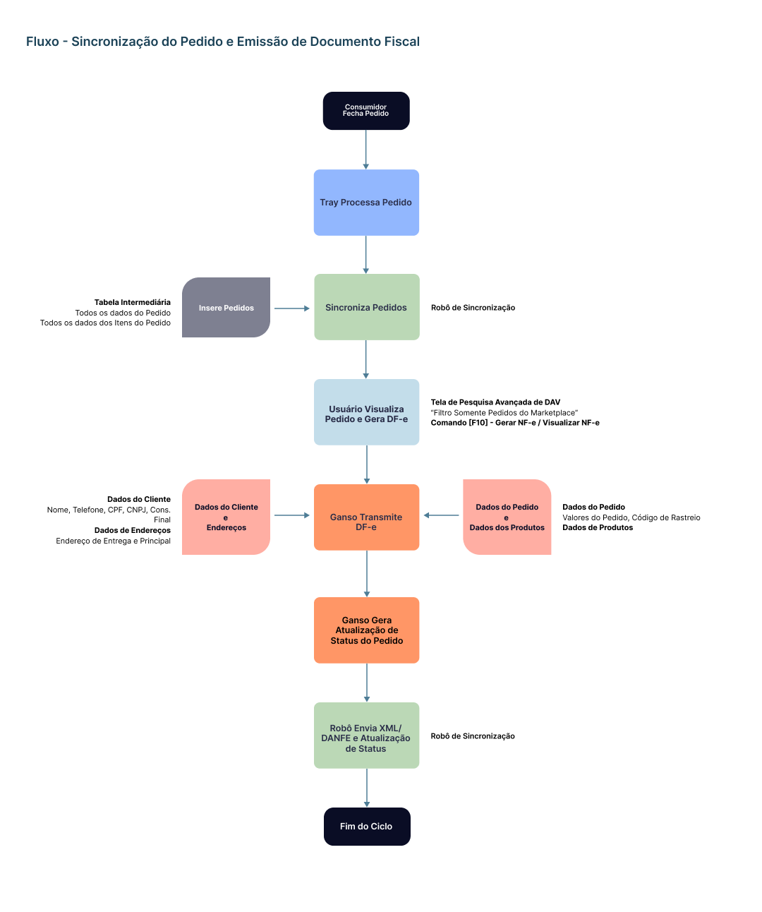

# Introdução

O presente documento é complementar à documentação de [Requisitos Iniciais](./Marketplaces.md), e descreve a **segunda etapa** do processo de Integração com a Plataforma Tray contendo os requisitos para importação das Vendas.

# Roadmap

1. Implementar [parâmetros](#parâmetros) de controle relacionados à Venda.
2. Implementar alterações na [Tela de Venda Retaguarda](#venda-retaguarda) e [Tela de Pesquisa Avançada de DAV](#consulta-de-vendas-do-marketplace) para comportar campos de controle e identificação de Vendas realizadas na Plataforma do Marketplace.
3. Implementar alterações em [Documentos Fiscais (DF-e)](#documentos-fiscais-df-e) para adequar a emissão da NF-e e inclusão na Plataforma.
4. Implementar alterações em [Relatórios Gerenciais](#relatórios-gerenciais) para incluir novos filtros para Marketplaces.

# Siglas Utilizadas

| Sigla | Descritivo                               |
| :---- | :--------------------------------------- |
| RNC   | Regra de Negócio para Clientes           |
| RNV   | Regra de Negócio para Vendas             |
| RND   | Regra de Negócio para Documentos Fiscais |

# Parâmetros

Para controle dos processos de Venda, foram levantados novos parâmetros conforme descritivo abaixo. Estes parâmetros são específicos para o Integrador Tray, e devem ser incluídos na Aba **Integrações/Marketplaces**.

| Elemento  | Nome                            | Posição                              | Descritivo                                                                                          | Regras de Negócio                                                                                                              |
| :-------- | :------------------------------ | :----------------------------------- | :-------------------------------------------------------------------------------------------------- | :----------------------------------------------------------------------------------------------------------------------------- |
| Campo     | CNPJ Intermediador da Transação | Integrações/Marketplaces/Tray/Vendas | Campo para definir o CNPJ do Intermediador/Marketplace responsável por processar a Venda.           | **Obrigatório** para emissão da NF-e conforme [NT2020.006](https://microsig.my.site.com/a0e4w00000KEmlf?btdid=a0g4w00000JDgsH) |
| Campo     | Finalizador Padrão              | Integrações/Marketplaces/Tray/Vendas | Campo para definir o Código do Finalizador Padrão para as Vendas realizadas no Marketplace          | **Obrigatório**. Permitir informar apenas Finalizador comum.                                                                   |
| Campo     | Caixa Padrão                    | Integrações/Marketplaces/Tray/Vendas | Campo para definir o Código do Caixa Padrão para as Vendas realizadas no Marketplace                | **Obrigatório**                                                                                                                |
| Campo     | Vendedor Padrão                 | Integrações/Marketplaces/Tray/Vendas | Campo para definir o Código do Colaborador/Vendedor Padrão para as Vendas realizadas no Marketplace | **Obrigatório**                                                                                                                |
| Campo     | Cliente Padrão                  | Integrações/Marketplaces/Tray/Vendas | Campo para definir o Código do Cliente Padrão para as Vendas realizadas no Marketplace              | **Obrigatório**                                                                                                                |
| Parâmetro | Importar Valor do Frete         | Integrações/Marketplaces/Tray/Vendas | Parâmetro para definir se o Valor do Frete deve ser importado para o Pedido.                        | **Obrigatório**                                                                                                                |

Os novos parâmetros descritos acima podem ser visualizados no exemplo a seguir:

# Venda Retaguarda

Todas as Vendas com **Pagamento concluído** geradas no Marketplace devem ser capturadas e inseridas no Sistema Ganso obedecendo os [parâmetros](#parâmetros) definidos para o Marketplace. Abaixo um descritivo de recursos novos e seus relacionamentos:

| Elemento | Nome                                        | Descritivo                                                              |        Campo do Retorno         | Regra de Negócio                                                                                                                                                                             |
| :------- | :------------------------------------------ | :---------------------------------------------------------------------- | :-----------------------------: | :------------------------------------------------------------------------------------------------------------------------------------------------------------------------------------------- |
| Flag     | Criado via Marketplace (nome do Integrador) | Informação Identificadora                                               |                -                | Visível ao Usuário. Utilizar o mesmo campo que sinaliza Venda "Mobile". Não permitir alterações.                                                                                             |
| Campo    | **Código do Marketplace**                   | Código do Marketplace Ativo                                             |                -                | Vincular o Código do Marketplace Ativo no Sistema Ganso.                                                                                                                                     |
| Campo    | **Código do Pedido no Marketplace**         | Código Identificador do Pedido no Marketplace                           |           `Order.id`            | Visível ao Usuário. Não permitir alterações.                                                                                                                                                 |
| Campo    | **Código do Cliente no Marketplace**        | Código Identificador do Cliente no Marketplace                          |       `Order.customer_id`       | Não permitir alterações.                                                                                                                                                                     |
| Campo    | Data/Hora do Pedido no Marketplace          | Data e Hora de Criação do Pedido no Marketplace                         |   `Order.date` e `Order.hour`   | Não permitir alterações. Converter o formato da Data e Hora.                                                                                                                                 |
| Campo    | Data/Hora do Pagamento no Marketplace       | Data e Hora do Pagamento do Pedido no Marketplace                       |    `Payment.Payment.created`    | Não permitir alterações. Converter o formato da Data e Hora.                                                                                                                                 |
| Campo    | Data Estimada para Entrega                  | Data estimada para entrega, quando ocorrer                              | `Order.estimated_delivery_date` | Visível ao Usuário. Não permitir alterações. Converter o formato da Data.                                                                                                                    |
| Campo    | Código de Rastreio/Envio                    | Código de Rastreio ou Envio gerado pelo Marketplace, quando disponível. |      `Order.sending_code`       | Permitir Alterações ou Inclusão manualmente pelo Usuário e enviar ao Pedido do Marketplace.                                                                                                  |
| Campo    | Nome de Usuário                             | Nome do Usuário ou Identificação do Perfil do Vendedor no Marketplace   |          `User.login`           | Informação obrigatória para NF-e (Campo **idCadIntTran**). Se vazio, preencher com texto padrão 'vendedor_mkpl'. Não permitir alterações. [Ver Requisito R03 da NT2020.006](./NT2020-006.md) |
| Função   | Atualizar Status do Pedido                  | Incluir função para atualizar o Status do Pedido no Marketplace         |                -                | Criar Método de Atualização do Pedido no Marketplace via aplicação Ganso. Ex.: "Alterar Status:" (NF-e Emitida, Aguardando Coleta do Transportador, Pedido Enviado ao Transportador e etc.)  |

## Consulta de Vendas do Marketplace

De modo a Simplificar a gestão dos Pedidos realizados no Marketplace sincronizados com o Sistema Ganso, é necessário incluir um filtro na **Tela de Pesquisa Avançada de DAV** que permite a listagem rápida de Pedidos nesta condição. Além disso, outros recursos são importantes que são:

| #   | Descritivo                                                                                        | Regra de Negócio                                                                                                                                               |
| :-- | :------------------------------------------------------------------------------------------------ | :------------------------------------------------------------------------------------------------------------------------------------------------------------- |
| R01 | Incluir filtro **"Somente Pedidos Realizados pelo Marketplace"**                                  | Listar apenas Pedidos gerados pela Sincronização com Marketplace. Utilizar coloração distinta para destaque das informações, como ocorre com as Vendas Mobile. |
| R02 | Incluir filtro **"Somente Pedidos sem Documento Fiscal"**                                         | Listar apenas Pedidos gerados pela Sincronização com Marketplace e que ainda não possuem documento fiscal vinculado.                                           |
| R03 | Incluir **Código do Pedido do Marketplace** em coluna nova ou no campo **Identificação da Venda** | Exibir a informação para que o Usuário possa identificar no Marketplace o Pedido Realizado.                                                                    |

## Relacionamento de Dados - Venda Retaguarda

Para as demais informações do Pedido, há campos no Sistema Ganso que devem ser utilizados (tanto para o Pedido quanto para os Itens do Pedido) conforme os relacionamentos abaixo.

| Ganso               | Tray                   | Tipo Retorno | Descritivo                                    | Regra de Negócio                                                                                        |
| :------------------ | :--------------------- | :----------: | :-------------------------------------------- | :------------------------------------------------------------------------------------------------------ |
| `desconto_valor`    | `Order.discount`       |  `decimal`   | Valor do Desconto do Pedido                   | Não permitir alterações.                                                                                |
| `valor_frete`       | `Order.shipment_value` |  `decimal`   | Valor do Frete quando contratado pelo Cliente | Não permitir alterações.                                                                                |
| `obs_nf`            | `Order.customer_note`  |   `string`   | Observação informada pelo Cliente             | Não permitir alterações.                                                                                |
| `orcamento_bruto`   | `Order.partial_total`  |  `decimal`   | Valor Bruto do Pedido                         | Não permitir alterações.                                                                                |
| `orcamento_liquido` | `Order.total`          |  `decimal`   | Valor Líquido do Pedido                       | Não permitir alterações.                                                                                |
| `identificacao`     | -                      |   `string`   | Identificação de Venda no Marketplace         | Utilizar para informar o Código do Pedido do Marketplace ou Texto Fixo 'MKPL'. Não permitir alterações. |

## Relacionamento de Dados - Itens da Venda Retaguarda

| Ganso                                                       | Tray                                                                     | Tipo Retorno | Descritivo                                                                                              | Regra de Negócio                                       |
| :---------------------------------------------------------- | :----------------------------------------------------------------------- | :----------: | :------------------------------------------------------------------------------------------------------ | :----------------------------------------------------- |
| `codigo_produto` relativo a `mkpl_produtos.id_produto_mkpl` | `ProductsSold.ProductsSold.product_id`                                   |   `number`   | Código do Produto vinculado ao ID do Produto do Marketplace da tabela de relacionamento `mkpl_produtos` | -                                                      |
| `quantidade`                                                | `ProductsSold.ProductsSold.quantity`                                     |  `decimal`   | Quantidade Vendida no Marketplace                                                                       | -                                                      |
| `preco_unitario`                                            | `ProductsSold.ProductsSold.price`                                        |  `decimal`   | Preço Unitário do Produto no Marketplace                                                                | -                                                      |
| `valor_total`                                               | `ProductsSold.ProductsSold.price` x `ProductsSold.ProductsSold.quantity` |  `decimal`   | Valor Total do Produto no Marketplace                                                                   | -                                                      |
| `situacao_entrega`                                          | -                                                                        |      -       | Situação de Entrega no Sistema Ganso                                                                    | Definir como 'EL'                                      |
| `custo_reposicao`                                           | `ProductsSold.ProductsSold.cost_price`                                   |  `decimal`   | Preço de Custo do Produto no Marketplace                                                                | -                                                      |
| `pmz`                                                       | `ProductsSold.ProductsSold.cost_price`                                   |  `decimal`   | Preço de Custo PMZ do Produto no Marketplace                                                            | Utilizar a mesma informação gravada no Custo Reposição |
| `codigo_estoque`                                            | -                                                                        |   `number`   | Código do Estoque informado no Produto do Marketplace durante envio                                     | -                                                      |

## Regras de Negócio - Venda Retaguarda

| #     | Descritivo                                                                                                                                                                       | Tratativas                                                                                                                                                                                           |
| :---- | :------------------------------------------------------------------------------------------------------------------------------------------------------------------------------- | :--------------------------------------------------------------------------------------------------------------------------------------------------------------------------------------------------- |
| RNV01 | Sempre Gerar DAV-Pedido Fechado para Vendas Sincronizadas do Marketplace                                                                                                         | Por Padrão, para todas as Vendas geradas através do Marketplace gerar o Tipo DAV-Pedido com Status Fechado.                                                                                          |
| RNV02 | Sempre Gravar Código do Vendedor Padrão em Vendas do Marketplace                                                                                                                 | Utilizar o Código de Vendedor Padrão informado nos [parâmetros](#parâmetros) de vendas do Marketplace.                                                                                               |
| RNV03 | Gravar Código do Finalizador Padrão em Vendas do Marketplace                                                                                                                     | Utilizar o Código do Finalizador Padrão informado nos [parâmetros](#parâmetros) de vendas do Marketplace.                                                                                            |
| RNV04 | Gravar Código do Cliente Padrão em Vendas do Marketplace                                                                                                                         | Utilizar o Código do Cliente Padrão informado nos [parâmetros](#parâmetros) de vendas do Marketplace.                                                                                                |
| RNV05 | Incluir na Rotina `<F10> - Preparar NF` ou `<F10> - Carregar dados da NF` leitura das informações do Cliente e Endereço da **Tabela de Relacionamento do Pedido** no Marketplace | Ao gerar a NF, as informações do Cliente e Endereço de Entrega deverão ser **obrigatoriamente** carregadas da tabela onde estão armazenadas as informações do Pedido Sincronizado com o Marketplace. |
| RNV06 | Enviar o Código de Rastreio, XML da NF-e e DANFE da NF-e ao Marketplace                                                                                                          | Quando usuário incluir um Código de Rastreio no Pedido, enviar a informação junto com o XML e DANFE da NF-e.                                                                                         |

# Informações do Cliente do Pedido

A API Tray retorna os dados principais do Cliente no detalhamento do Pedido Completo nos Objetos `Customer` e `CustomerAddresses`. Abaixo o relacionamento de informações comparando-as com campos da Tabela Cliente do Sistema Ganso.

| Ganso           | Tray                         | Tipo Retorno | Descritivo                  | Regra de Negócio                                                                                                                    |
| :-------------- | :--------------------------- | :----------: | :-------------------------- | :---------------------------------------------------------------------------------------------------------------------------------- |
| `nome`          | `Customer.name`              |   `string`   | Nome                        | Observar limite de tamanho no Sistema Ganso: 50 caracteres. Se maior, truncar a informação.                                         |
| `rg`            | `Customer.rg`                |   `string`   | RG                          | Observar limite de tamanho no Sistema Ganso: 15 caracteres. Se maior, truncar a informação. Eliminar a máscara do campo de retorno. |
| `cpf`           | `Customer.cpf`               |   `string`   | CPF                         | Tamanho 11 caracteres, sem máscara no retorno.                                                                                      |
| `telefone`      | `Customer.phone`             |   `string`   | Telefone Fixo               | Observar limite de tamanho no Sistema Ganso: 13 caracteres. Se maior, truncar a informação.                                         |
| `celular`       | `Customer.cellphone`         |   `string`   | Telefone Celular            | Observar limite de tamanho no Sistema Ganso: 13 caracteres. Se maior, truncar a informação.                                         |
| `nascimento`    | `Customer.birth_date`        |    `date`    | Data de Aniversário         | Converter o Formato para 'DDMMAAAA'. A API retorna no Formato 'AAAADDMM'.                                                           |
| `sexo`          | `Customer.gender`            |   `number`   | Gênero/Sexo                 | Se 0 = 'Masculino'. Se 1 = 'Feminino'.                                                                                              |
| `email`         | `Customer.email`             |   `string`   | E-mail                      | Observar limite de tamanho no Sistema Ganso: 350 caracteres. Se maior, truncar a informação.                                        |
| `apelido`       | `Customer.nickname`          |   `string`   | Apelido                     | Observar limite de tamanho no Sistema Ganso: 60 caracteres. Se maior, truncar a informação.                                         |
| `observacao`    | `Customer.observation`       |   `string`   | Observações sobre o Cliente | Observar limite de tamanho no Sistema Ganso: 100 caracteres. Se maior, truncar a informação.                                        |
| `pessoa`        | `Customer.type`              |   `number`   | Tipo de Cliente             | Se 0 = 'Física'. Se 1 = 'Jurídica'                                                                                                  |
| `cnpj`          | `Customer.cnpj`              |   `string`   | CNPJ                        | Remover a máscara do retorno.                                                                                                       |
| `razao_social`  | `Customer.company_name`      |   `string`   | Razão Social                | Observar limite de tamanho no Sistema Ganso: 60 caracteres. Se maior, truncar a informação.                                         |
| `insc_estadual` | `Customer.state_inscription` |   `string`   | Inscrição Estadual          | Observar limite de tamanho no Sistema Ganso: 20 caracteres. Se maior, truncar a informação.                                         |
| `endereco`      | `Customer.address`           |   `string`   | Endereço Principal          | Observar limite de tamanho no Sistema Ganso: 45 caracteres.                                                                         |
| `cep`           | `Customer.zip_code`          |   `string`   | CEP Principal               | Remover a máscara do retorno.                                                                                                       |
| `numero`        | `Customer.number`            |   `number`   | Número Principal            | Observar limite de tamanho no Sistema Ganso: 6 caracteres.                                                                          |
| `complemento`   | `Customer.complement`        |   `string`   | Complemento Principal       | Observar limite de tamanho no Sistema Ganso: 60 caracteres.                                                                         |
| `bairro`        | `Customer.neighborhood`      |   `string`   | Bairro Principal            | Observar limite de tamanho no Sistema Ganso: 25 caracteres.                                                                         |
| `cidade`        | `Customer.city`              |   `string`   | Cidade Princial             | Nome da Cidade informada.                                                                                                           |
| `uf`            | `Customer.state`             |   `string`   | Sigla do Estado             | UF da Cidade.                                                                                                                       |
| `pais`          | `Customer.country`           |   `string`   | País                        | Sigla do País ou Nome do País                                                                                                       |

# Documentos Fiscais (DF-e)

**Requisito Obrigatório:** Implementar Requisitos da [NT2020.006](./NT2020-006.md) para disponibilizar os campos necessários para informar o **Intermediador/Marketplace**.

## Regras de Negócio - DF-e

| #     | Descritivo                                                | Tratativas                                                                                                                                                                                                                                                                                                      |
| :---- | :-------------------------------------------------------- | :-------------------------------------------------------------------------------------------------------------------------------------------------------------------------------------------------------------------------------------------------------------------------------------------------------------- |
| RND01 | Definir Tipo de Atendimento (Indicativo de Presença)      | Se venda por Marketplace, definir Indicativo de Presença como 2 = Operação não presencial, pela Internet.                                                                                                                                                                                                       |
| RND02 | Definir Consumidor Final                                  | Se `Customer.type=0` (Pessoa Física) definir como **"Sim"**. Se `Customer.type=1` (Pessoa Jurídica) definir como **"Não"**.                                                                                                                                                                                     |
| RND03 | Definir Contribuinte ICMS                                 | Se `Customer.type=0` (Pessoa Física) definir como **"Não"**. Se `Customer.type=1` e `Customer.state_inscription<>'ISENTO'` (Pessoa Jurídica não Contribuinte) definir como **"Sim"**. Se `Customer.type=1` e `Customer.state_inscription='ISENTO'` (Pessoa Jurídica não Contribuinte) definir como **"Isento"** |
| RND04 | Definir Dados de Endereço e Local de Entrega do Cliente   | Preencher os campos do **Endereço** e **Endereço de Entrega** da aba **Local de Retirada/Entrega** com os dados de Endereço do Pedido.                                                                                                                                                                          |
| RND05 | Relacionar o XML da NF-e e enviar para API do Marketplace | Após transmissão com sucesso da NF-e (NF-e Autorizada na SEFAZ), vincular ao Pedido o Arquivo XML, Chave de Acesso e demais informações relacionadas e enviar à Plataforma do Marketplace.                                                                                                                      |

# Fluxo Geral da Integração

# Relatórios Gerenciais

Além das alterações nas rotinas de Vendas, é necessário incluir novos filtros nos **Relatórios** de Gestão do Sistema para melhorar a experiência do Usuário. A tabela a seguir descreve os relatórios e recursos necessários.

| Relatório                                                                                                                                                                   | Novos Filtros                                                                                                                    | Regras de Negócio                                                                              |
| :-------------------------------------------------------------------------------------------------------------------------------------------------------------------------- | :------------------------------------------------------------------------------------------------------------------------------- | :--------------------------------------------------------------------------------------------- |
| **Vendas Geral** **Vendas Geral por Produto** **Vendas Geral por Marca** **Vendas Geral por Seção** **Vendas Geral por Grupo** **Vendas Geral por Vendedor** | Opções:  [ ] Apenas Vendas de Marketplaces [ ] Agrupar Vendas por Marketplace [ ] Não exibir Vendas de Marketplaces  | Estas opções só deverão ser exibidas se houver pelo menos 1 (um) Marketplace Ativo no Sistema. |
| **Documentos Fiscais**                                                                                                                                                      | Opções:  [ ] Apenas DF-e de Marketplaces [ ] Agrupar DF-e por Marketplace [ ] Não exibir DF-e de Marketplaces        | Estas opções só deverão ser exibidas se houver pelo menos 1 (um) Marketplace Ativo no Sistema. |

# Intercorrências

| #   | Descritivo                                                                                                                  | Tratativa                                                                              |
| :-- | :-------------------------------------------------------------------------------------------------------------------------- | :------------------------------------------------------------------------------------- |
| I01 | Usuário Ganso remover um Produto do Marketplace que possui Pedido com Pagamento efetuado não Sincronizado no Sistema Ganso. | Efetuar uma verificação na API de Pedidos antes de permitir a Exclusão do Produto.     |
| I02 | Cliente do Marketplace **cancelar** um Pedido com Pagamento efetuado, Sincronizado, com NF-e Emitida e não Enviado.         | Usuário deve proceder com a Rotina de Devolução de Vendas e emitir a NF-e de Devolução |
| I03 | Cliente do Marketplace **cancelar** um Pedido com Pagamento efetuado, Sincronizado, **sem** NF-e Emitida.                   | Efetuar o Cancelamento Automatizado do DAV-Pedido gerado                               |

# Referências

- [Tray Developers](https://developers.tray.com.br/)
- [Nota Técnica - NF-e](https://developermercado.ifood.com.br/page/nt-2020006)
- [Tiny ERP](https://ajuda.tiny.com.br/hc/pt-br/articles/4415632516372-Integra%C3%A7%C3%A3o-Tiny-com-a-Tray?_ga=2.46873831.1171586371.1677500749-1566933678.1677500749)
