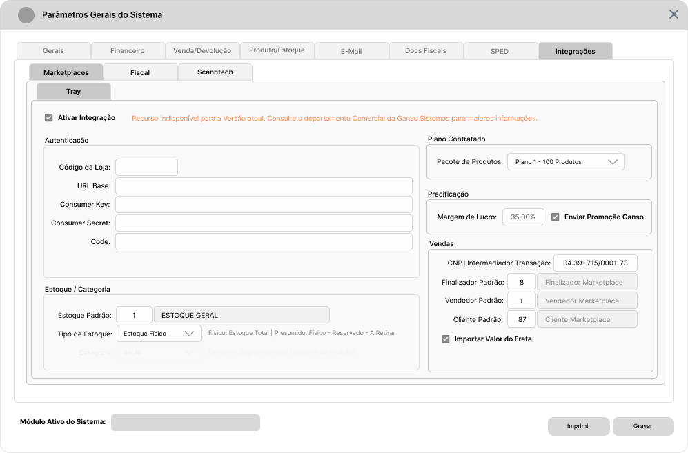
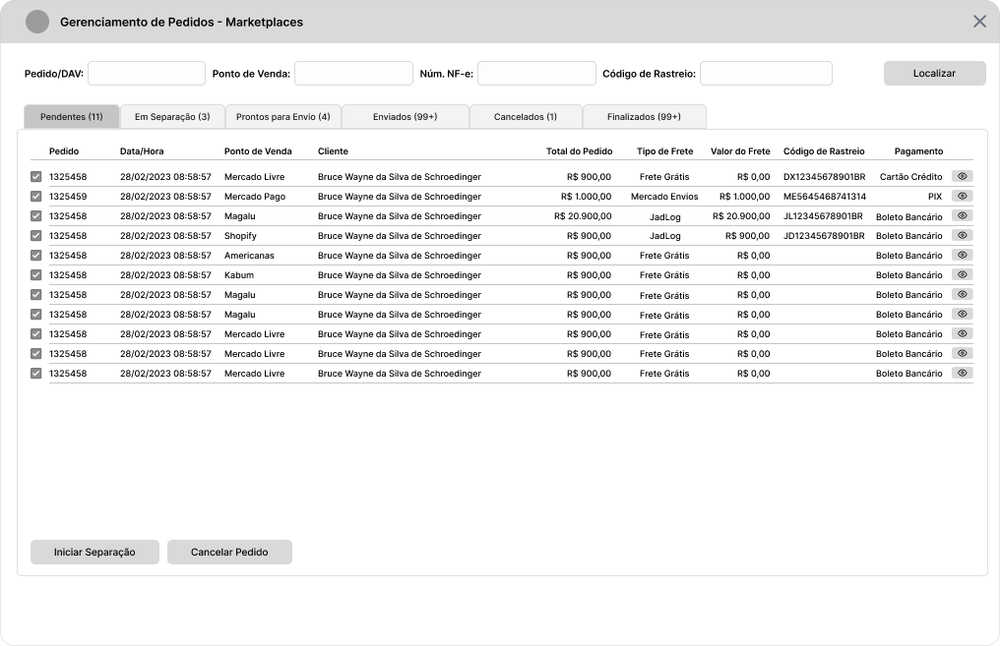
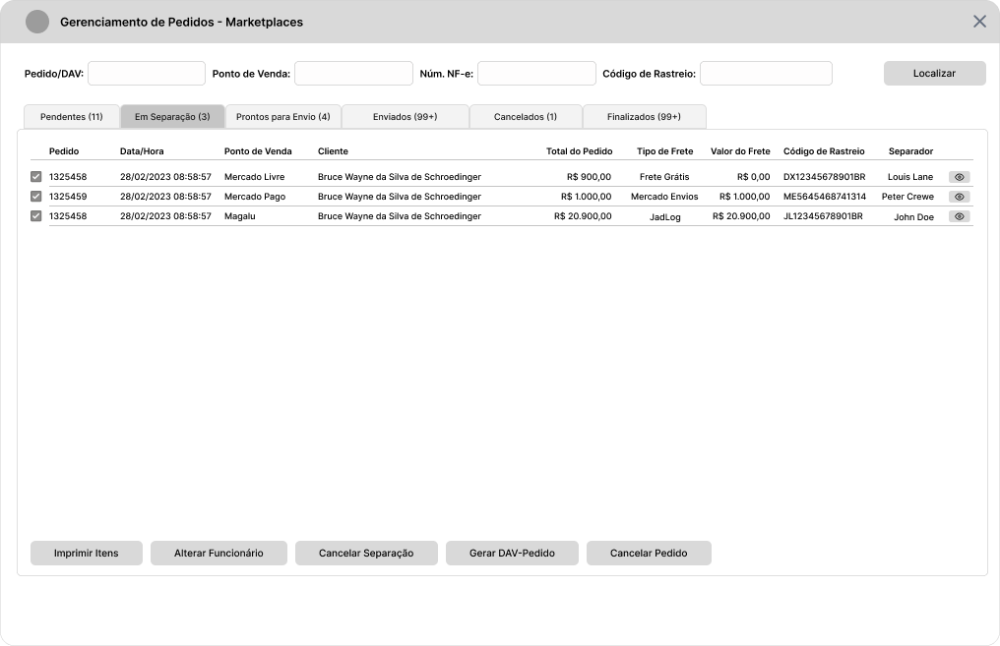
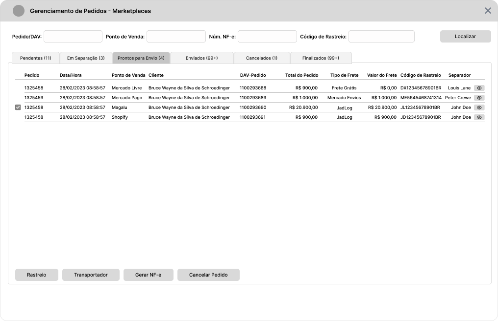
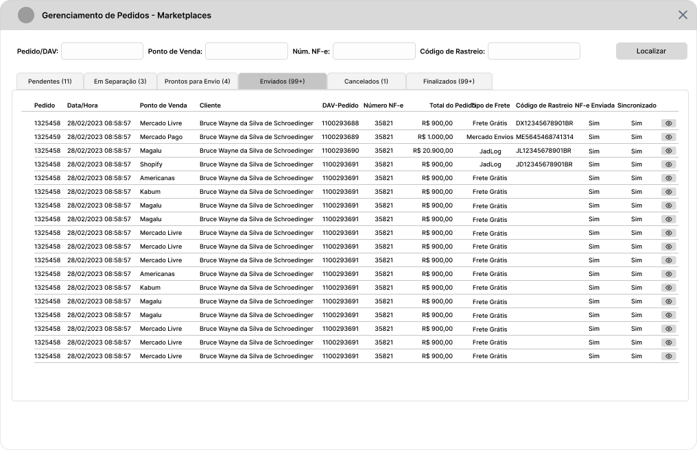
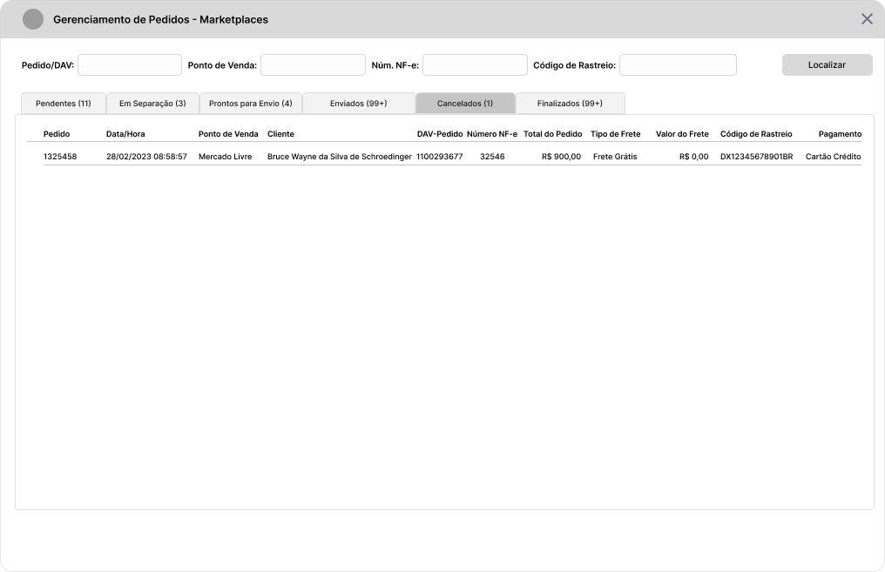
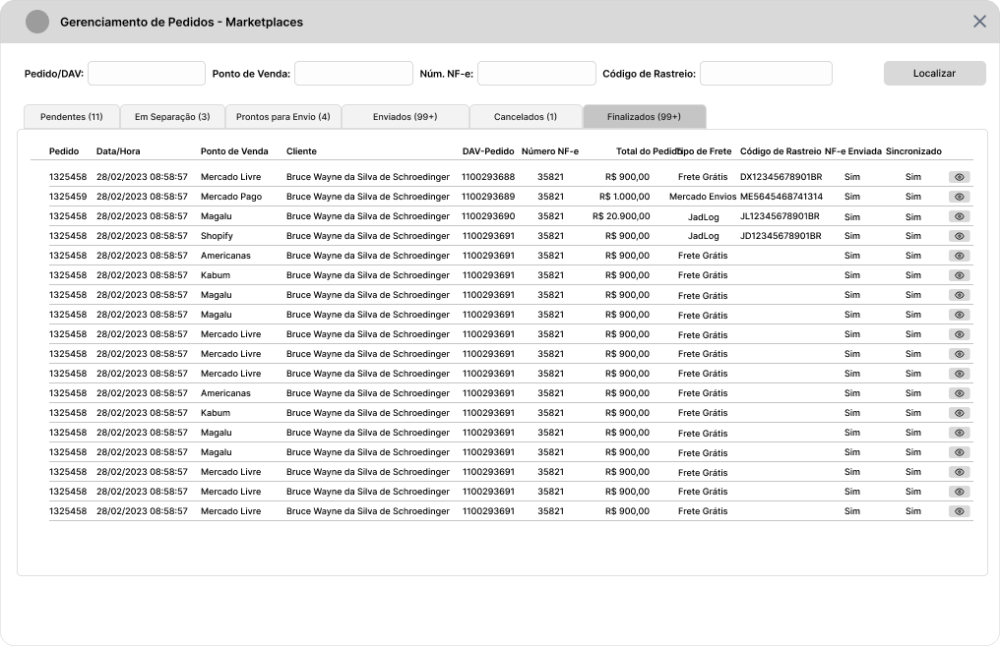
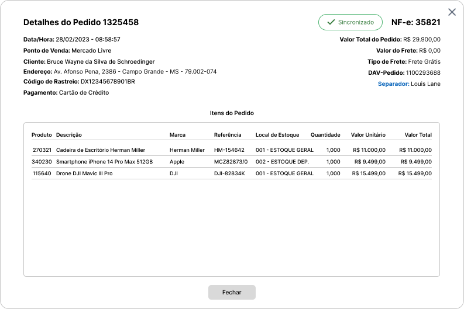
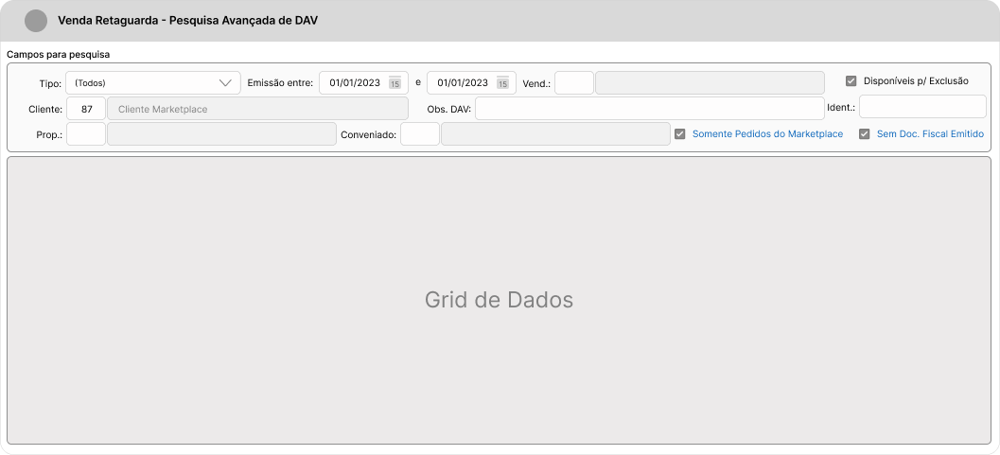

# Introdução

O presente documento é complementar à documentação de [Requisitos Iniciais](./Marketplaces.md), e descreve a **segunda etapa** do processo de Integração com a Plataforma Tray contendo os requisitos para importação das Vendas.

# Roadmap

1. Implementar [parâmetros](#parâmetros) de controle relacionados à Venda.
2. Implementar alterações na [Tela de Venda Retaguarda](#venda-retaguarda) e [Tela de Pesquisa Avançada de DAV](#consulta-de-vendas-do-marketplace) para comportar campos de controle e identificação de Vendas realizadas na Plataforma do Marketplace.
3. Implementar alterações em [Documentos Fiscais (DF-e)](#documentos-fiscais-df-e) para adequar a emissão da NF-e e inclusão na Plataforma.
4. Implementar alterações em [Relatórios Gerenciais](#relatórios-gerenciais) para incluir novos filtros para Marketplaces.

# Siglas Utilizadas

| Sigla | Descritivo                               |
| :---- | :--------------------------------------- |
| RNC   | Regra de Negócio para Clientes           |
| RNV   | Regra de Negócio para Vendas             |
| RND   | Regra de Negócio para Documentos Fiscais |

# Parâmetros

Para controle dos processos de Venda, foram levantados novos parâmetros conforme descritivo abaixo. Estes parâmetros são específicos para o Integrador Tray, e devem ser incluídos na Guia **Integrações/Marketplaces** em um grupo para **Vendas**.

| Elemento  | Nome                            | Posição                              | Descritivo                                                                                          | Regras de Negócio                                                                                                              |
| :-------- | :------------------------------ | :----------------------------------- | :-------------------------------------------------------------------------------------------------- | :----------------------------------------------------------------------------------------------------------------------------- |
| Campo     | CNPJ Intermediador da Transação | Integrações/Marketplaces/Tray/Vendas | Campo para definir o CNPJ do Intermediador/Marketplace responsável por processar a Venda.           | **Obrigatório** para emissão da NF-e conforme [NT2020.006](https://microsig.my.site.com/a0e4w00000KEmlf?btdid=a0g4w00000JDgsH) |
| Campo     | Finalizador Padrão              | Integrações/Marketplaces/Tray/Vendas | Campo para definir o Código do Finalizador Padrão para as Vendas realizadas no Marketplace          | **Obrigatório**. Permitir informar apenas Finalizador comum.                                                                   |
| Campo     | Vendedor Padrão                 | Integrações/Marketplaces/Tray/Vendas | Campo para definir o Código do Colaborador/Vendedor Padrão para as Vendas realizadas no Marketplace | **Obrigatório**                                                                                                                |
| Campo     | Cliente Padrão                  | Integrações/Marketplaces/Tray/Vendas | Campo para definir o Código do Cliente Padrão para as Vendas realizadas no Marketplace              | **Obrigatório**                                                                                                                |
| Parâmetro | Importar Valor do Frete         | Integrações/Marketplaces/Tray/Vendas | Parâmetro para definir se o Valor do Frete deve ser importado para o Pedido.                        | **Não Obrigatório**                                                                                                            |

Os novos parâmetros descritos acima podem ser visualizados no exemplo a seguir:

# Gestão dos Pedidos do Marketplace (Nova Tela)

Para **Gerenciamento dos Pedidos do Marketplace** é importante a criação de uma Tela Nova para concentrar os Pedidos Sincronizados, de modo a organizá-los por Etapa do Processo Logístico. Detalhadamente esta nova tela deve contar com os elementos e ações descritos a seguir:

| Elemento | Nome                                            | Descritivo                                                                                                                                                                         | Regra de Negócio                                                                                                                                                        |
| :------- | :---------------------------------------------- | :--------------------------------------------------------------------------------------------------------------------------------------------------------------------------------- | :---------------------------------------------------------------------------------------------------------------------------------------------------------------------- |
| Filtro   | Filtro para o Número do Pedido ou Número do DAV | Filtro para usuário informar o Código do Pedido do Marketplace ou o Número do DAV-Pedido do Sistema Ganso para localizar rapidamente um Pedido independente da Etapa de Logística. | Pesquisar o Código do Pedido/Código do DAV em todas as Guias. Permitir digitar apenas números inteiros. Ao executar a pesquisa, trazer selecionado o pedido encontrado. |
| Filtro   | Filtro Ponto de Venda                           | Filtro para usuário selecionar de qual Ponto de Venda deseja visualizar as informações.                                                                                            | Exibir as opções em uma Caixa de Combinação ou outro Método contendo todos os Pontos de Vendas identificados nos Pedidos.                                               |
| Filtro   | Filtro Número da NF-e                           | Filtro para usuário informar um Número de NF-e para localizar um Pedido na Fase **Prontos para Envio**.                                                                            | Permitir digitar apenas números inteiros.                                                                                                                               |
| Filtro   | Filtro Código de Rastreio                       | Filtro para usuário informar um Código de Rastreio para localizar um Pedido.                                                                                                       | -                                                                                                                                                                       |
| Botão    | Localizar                                       | Botão para executar pesquisa com os filtros informados nos campos anteriores.                                                                                                      | -                                                                                                                                                                       |

## Guias de Navegação

| Guia               | Descritivo                                                                                                                                             | Dados da Grid                                                                                                                                                                                                                                                                             |                        Preview                         |
| :----------------- | :----------------------------------------------------------------------------------------------------------------------------------------------------- | :---------------------------------------------------------------------------------------------------------------------------------------------------------------------------------------------------------------------------------------------------------------------------------------- | :----------------------------------------------------: |
| Pendentes          | Na Guia **Pendentes** exibir: Os Pedidos recém Sincronizados (**Status = 'A ENVIAR'**) com o Marketplace. Permitir selecionar mais de um Pedido.       | **Guia Pendentes:** Código do Pedido no Marketplace, Data/Hora do Pedido, Ponto de Venda, Nome do Cliente, Valor Total do Pedido, Tipo de Frete, Valor do Frete, Código de Rastreio, Forma de Pagamento do Pedido e um Botão para Visualizar Dados do Pedido.                             |        |
| Em Separação       | Na guia **Em Separação** exibir: Os Pedidos enviados para Separação pelo Usuário (**Status = 'EM SEPARACAO'**). Permitir selecionar mais de um Pedido. | **Guia Em Separação:** Código do Pedido no Marketplace, Data/Hora do Pedido, Ponto de Venda, Nome do Cliente, Valor Total do Pedido, Tipo de Frete, Valor do Frete, Código de Rastreio, Nome do Separador e um Botão para Visualizar Dados do Pedido.                                     |   |
| Prontos para Envio | Na guia **Prontos para Envio** exibir: Os Pedidos com Separação Concluída e com DAV-Pedido gerado. **Não Permitir** selecionar mais de um Pedido.      | **Guia Prontos para Envio:** Código do Pedido no Marketplace, Data/Hora do Pedido, Ponto de Venda, Nome do Cliente, Número do DAV-Pedido, Valor Total do Pedido, Tipo de Frete, Valor do Frete, Código de Rastreio, Nome do Separador e um Botão para Visualizar Dados do Pedido.         |  |
| Enviados           | Na guia **Enviados** exibir: Os Pedidos que possuírem **NF-e Emitida**. Apenas dados informativos.                                                     | **Guia Enviados:** Código do Pedido no Marketplace, Data/Hora do Pedido, Ponto de Venda, Nome do Cliente, Número do DAV-Pedido, Número da NF-e, Valor Total do Pedido, Tipo de Frete, Código de Rastreio, NF-e Enviada, Sincronizado e um Botão para Visualizar Dados do Pedido.          |             |
| Cancelados         | Na guia **Cancelados** exibir: Pedidos Cancelados. Apenas dados informativos.                                                                          | **Guia Cancelados:** Código do Pedido no Marketplace, Data/Hora do Pedido, Ponto de Venda, Nome do Cliente, Número do DAV-Pedido, Número da NF-e, Valor Total do Pedido, Tipo de Frete, Valor do Frete, Código de Rastreio, Tipo de Pagamento e um Botão para Visualizar Dados do Pedido. |       |
| Finalizados        | Na guia **Finalizados** exibir: Os Pedidos entregues ao Destinatário. Apenas dados informativos.                                                       | **Guia Finalizados:** Código do Pedido no Marketplace, Data/Hora do Pedido, Ponto de Venda, Nome do Cliente, Número do DAV-Pedido, Número da NF-e, Valor Total do Pedido, Tipo de Frete, Código de Rastreio, NF-e Enviada, Sincronizado e um Botão para Visualizar Dados do Pedido.       |     |

## Ações por Guia

| Guia                    | Ação                | Descritivo                                                          | Regra de Negócio                                                                                                                                                                                                                                                                                                                                                                                                            |
| :---------------------- | :------------------ | :------------------------------------------------------------------ | :-------------------------------------------------------------------------------------------------------------------------------------------------------------------------------------------------------------------------------------------------------------------------------------------------------------------------------------------------------------------------------------------------------------------------- |
| Pendentes               | Iniciar Separação   | Função para mudança de Status para "Em Separação".                  | Deve solicitar o Código e Nome do Funcionário Separador dos Itens. Definir apenas (um) Separador por Pedido. Após definir um Separador, sugerir a Impressão da Lista de Produtos.                                                                                                                                                                                                                                           |
| Pendentes               | Cancelar Pedido     | Função para Cancelar o Pedido no Marketplace.                       | Ao executar a função, alterar o Status do Pedido para "Cancelado". Solicitar preenchimento do Motivo de Cancelamento e permitir cancelar um Pedido. Solicitar Chave de [Acesso Restrito - AR01](#Acessos-Restritos).                                                                                                                                                                                                        |
| Em Separação            | Imprimir Itens      | Função para Gerar a Impressão dos Itens para Separação.             | Gerar um "Romaneio de Separação" para cada Pedido selecionado.                                                                                                                                                                                                                                                                                                                                                              |
| Em Separação            | Alterar Funcionário | Função para alterar o funcionário Separador.                        | Solicitar o Código e Nome do Funcionário. O Funcionário precisa estar cadastrado no Sistema Ganso no Cadastro de Colaboradores. Incluir a função `<F2>` para consulta de Colaboradores cadastrados em um campo de Código.                                                                                                                                                                                                   |
| Em Separação            | Cancelar Separação  | Função para Cancelar a Separação.                                   | Ao executar a função, o Sistema deve solicitar confirmação do Usuário, e se positiva, deve limpar o Código e Nome do Separador definido na Etapa anterior e alterar o Status do Pedido para "Pendente". Solicitar Chave de [Acesso Restrito - AR02](#acessos-restritos)                                                                                                                                                     |
| Em Separação            | Gerar DAV-Pedido    | Função para Gerar o DAV-Pedido no Sistema Ganso (Venda Retaguarda). | Ao executar a função, o Sistema deve solicitar confirmação do Usuário, e se positiva, deve criar um DAV-Pedido conforme os Parâmetros definidos em [Parâmetros/Integrações/Marketplace/Tray/Vendas](#parâmetros).                                                                                                                                                                                                           |
| Em Separação            | Cancelar Pedido     | Função para Cancelar o Pedido no Marketplace.                       | Ao executar a função, alterar o Status do Pedido para "Cancelado". Solicitar preenchimento do Motivo de Cancelamento e permitir cancelar um Pedido.. Solicitar Chave de [Acesso Restrito - AR01](#Acessos-Restritos).                                                                                                                                                                                                       |
| Prontos para Envio      | Rastreio            | Função para Incluir o Código de Rastreio no Pedido.                 | Ao executar a função, solicitar a digitação do Código de Rastreio e Gravar a informação no Pedido do Marketplace. Se rastreio já informado, trazer preenchido no campo e permitir alteração. Soliciar confirmação para alteração do Código de Rastreio.                                                                                                                                                                     |
| Prontos para Envio      | Transportador       | Função para Incluir Transportador no Pedido.                        | Ao executar a função, solicitar a digitação do Código de Transportadora cadastrada no Sistema Ganso ou se não houver cadastro, liberar a digitação livre do Usuário. Gravar a Informação no Pedido do Marketplace. Se transportador já informado, trazer preenchido nos campos e permitir alteração. Solicitar confirmação para alteração do transportador. Não permitir informar um Transportador se a NF-e já foi gerada. |
| Prontos para Envio      | Gerar NF-e          | Função para Gerar a Nota Fiscal Eletrônica do DAV-Pedido vinculado. | Ao executar a função, solicitar a confirmação do Usuário e se positiva, processar a função para gerar o Documento Fiscal chamando a Tela de Documentos Fiscais com o Pedido carregado e pronto para Transmissão. Gravar o Código do Documento Fiscal no Pedido do Marketplace.                                                                                                                                              |
| Prontos para Envio      | Cancelar Pedido     | Função para Cancelar o Pedido no Marketplace.                       | Ao executar a função, alterar o Status do Pedido para "Cancelado". Solicitar preenchimento do Motivo de Cancelamento e permitir cancelar um Pedido.. Solicitar Chave de [Acesso Restrito - AR01](#Acessos-Restritos).                                                                                                                                                                                                       |
| Todas Exceto Cancelados | Visualizar Pedido   | Função para Visualizar os detalhes do Pedido do Marketplace.        | Incluir uma função de Visualização de Detalhes do Pedido na Grid para cada Registro. O acesso aos detalhes deve ser de modo individual por pedido.                                                                                                                                                                                                                                                                          |

### Tela de Detalhes do Pedido

Quando o usuário acionar a função de visualização de pedido em um Pedido na Grid, apresentar a tela abaixo com os Detalhes do Pedido contendo:

| Posição         | Dados                                                                                                                                                                                                                                                                                                                                                                     |
| :-------------- | :------------------------------------------------------------------------------------------------------------------------------------------------------------------------------------------------------------------------------------------------------------------------------------------------------------------------------------------------------------------------ |
| Cabeçalho       | Informações gerais do Pedido: Número do Pedido no Marketplace, Número da NF-e (quando houver), Data/Hora, Ponto de Venda, Valor Total do Pedido, Valor do Frete, Tipo de Frete, Cliente, Endereço, Código de Rastreio, Tipo de Pagamento, Número do DAV-Pedido (quando gerado) e Nome do Separador do Pedido (Quando definido).   Exibir o Status de Sincronização. |
| Itens do Pedido | Informações dos Produtos do Pedido: Código do Produto Ganso, Descrição do Produto, Marca, Referência Fabricante, Local de Estoque (Código e Descrição do Estoque definido), Quantidade, Valor Unitário e Valor Total.                                                                                                                                                     |

Abaixo um exemplo das implementações acima.

.

> :bulb: **Nota:** As Guias **Enviados, Cancelados e Finalizados** não possuem ações e os dados são apenas para visualização do Usuário.

**Link do Protótipo:** **https://www.figma.com/proto/zU7d6UWxl3i1aHlntlmsV7/Roadmap---integration?page-id=0%3A1&node-id=1004%3A8856&viewport=-2936%2C648%2C0.2&scaling=min-zoom&starting-point-node-id=986%3A8098**

# Dados do Pedido do Marketplace

Todas os Pedidos geradas no Marketplace com Status igual a **"A ENVIAR"** ou **"A ENVIAR VINDI"** devem ser capturadas e inseridos no Sistema Ganso obedecendo os [parâmetros](#parâmetros) definidos para o Marketplace na **Tabela de Pedidos do Marketplace**. Abaixo o relacionamento de Dados do Retorno e Tabela de Pedidos.

| Tabela Marketplace Pedidos | Nome                                                  | Descritivo                                                                           |        Retorno Tray         | Regra de Negócio                                                                                                                                                                             |
| :------------------------- | :---------------------------------------------------- | :----------------------------------------------------------------------------------- | :-------------------------: | :------------------------------------------------------------------------------------------------------------------------------------------------------------------------------------------- |
| `codigo_filial`            | Código da Filial                                      | Código da Filial do Marketplace Ativo                                                |              -              | -                                                                                                                                                                                            |
| `codigo_mkpl`              | **Código do Marketplace**                             | Código do Marketplace Ativo                                                          |              -              | Vincular o Código do Marketplace Ativo no Sistema Ganso.                                                                                                                                     |
| `codigo_mkpl_status`       | **Código do Status do Pedido no Marketplace**         | Código de Status da Tabela de Relacionamento de Status                               |              -              | Utilizar o campo `ID_MKPL_STATUS` da Tabela `MKPL_STATUS`.                                                                                                                                   |
| `id_pedido_mkpl`           | **Código do Pedido no Marketplace**                   | Código Identificador do Pedido no Marketplace                                        |         `Order.id`          | Visível ao Usuário. Não permitir alterações.                                                                                                                                                 |
| `cliente_id_ecommerce`     | **Código do Cliente no Marketplace**                  | Código Identificador do Cliente no Marketplace                                       |     `Order.customer_id`     | Não permitir alterações.                                                                                                                                                                     |
| `dh_criacao`               | Data/Hora do Pedido no Marketplace                    | Data e Hora de Criação do Pedido no Marketplace                                      | `Order.date` e `Order.hour` | Não permitir alterações. Converter o formato da Data e Hora.                                                                                                                                 |
| `dh_separacao`             | Data/Hora do Envio do Pedido para Separação           | Data e Hora de Envio do Pedido para Separação.                                       |              -              | Informação interna, não exibir em tela.                                                                                                                                                      |
| `dh_geracao_dav`           | Data/Hora de Geração do DAV                           | Data e Hora da Inserção do DAV-Pedido através da função de Gerar DAV.                |              -              | Informação interna, não exibir em tela.                                                                                                                                                      |
| `dh_cancelamento`          | Data/Hora de Cancelamento do Pedido do Marketplace    | Data e Hora do acionamento da função de Cancelamento do Pedido no Marketplace        |              -              | Informação interna, não exibir em tela.                                                                                                                                                      |
| `dh_envio`                 | Data/Hora de Envio da NF-e do Pedido para Marketplace | Data e Hora da Emissão da NF-e através função de Gerar NF-e do Pedido no Marketplace |              -              | Informação interna, não exibir em tela.                                                                                                                                                      |
| `dh_entrega`               | Data de Entrega                                       | Data de Entrega ocorrida no Marketplace                                              |      `Order.delivered`      | Informação interna, não exibir em tela.                                                                                                                                                      |
| `ponto_venda`              | Ponto de Venda                                        | Nome do Ponto de Venda no Marketplace                                                |     `Order.point_sale`      | Informativo para o Usuário.                                                                                                                                                                  |
| `total_bruto`              | Valor Total Bruto do Pedido                           | Valor Total Parcial do Pedido no Marketplace                                         |    `Order.partial_total`    | -                                                                                                                                                                                            |
| `total_liquido`            | Valor Total Líquido do Pedido                         | Valor Total do Pedido no Marketplace                                                 |        `Order.total`        | -                                                                                                                                                                                            |
| `desconto`                 | Valor do Desconto do Pedido                           | Valor do Desconto informado no Pedido no Marketplace                                 |      `Order.discount`       | -                                                                                                                                                                                            |
| `frete_valor`              | Valor do Frete do Pedido                              | Valor do Desconto informado no Pedido no Marketplace                                 |   `Order.shipment_value`    | Verificar o Parâmetro **Importar Valor do Frete**.                                                                                                                                           |
| `frete_envio`              | Tipo do Frete do Pedido                               | Tipo do Frete do Pedido no Marketplace                                               |      `Order.shipment`       | -                                                                                                                                                                                            |
| `codigo_rastreio`          | Código de Rastreio/Envio                              | Código de Rastreio ou Envio gerado pelo Marketplace, quando disponível.              |    `Order.sending_code`     | Permitir Alterações ou Inclusão manualmente pelo Usuário e enviar ao Pedido do Marketplace.                                                                                                  |
| `nf_enviada`               | NF-e Enviada                                          | Campo de Controle para Envio do XML da NF-e.                                         |              -              | -                                                                                                                                                                                            |
| `sincronizado`             | Pedido Sincronizado                                   | Campo de Controle para Sincronização do Pedido com Marketplace.                      |              -              | -                                                                                                                                                                                            |
| `observacao`               | Observação do Pedido do Marketplace                   | Observação que o Cliente informa no Pedido com Marketplace.                          |    `Order.customer_note`    | -                                                                                                                                                                                            |
| `motivo_cancelamento`      | Motivo do Cancelamento do Pedido no Marketplace       | Motivo do Cancelamento informado pelo Usuário na tela de Gerenciamento de Pedidos.   |              -              | -                                                                                                                                                                                            |
| `forma_pagameto`           | Método de Pagamento do Pedido                         | Método de Pagamento informado no Pedido do Marketplace.                              |   `Order.payment_method`    | -                                                                                                                                                                                            |
| `mkpl_usuario_login`       | Nome de Usuário                                       | Nome do Usuário ou Identificação do Perfil de Vendedor no Marketplace                |        `User.login`         | Informação obrigatória para NF-e (Campo **idCadIntTran**). Se vazio, preencher com texto padrão 'vendedor_mkpl'. Não permitir alterações. [Ver Requisito R03 da NT2020.006](./NT2020-006.md) |
| `mkpl_usuario_email`       | E-mail do Usuário                                     | E-mail do Usuário do Perfil de Vendedor no Marketplace                               |        `User.email`         | -                                                                                                                                                                                            |

## Consulta de Pedidos do Marketplace na Tela de Venda Retaguarda

Incluir filtros na **Tela de Pesquisa Avançada de DAV** que permita a listagem rápida de Pedidos nesta condição que são:

| #   | Descritivo                                                                                        | Regra de Negócio                                                                                                                                               |
| :-- | :------------------------------------------------------------------------------------------------ | :------------------------------------------------------------------------------------------------------------------------------------------------------------- |
| R01 | Incluir filtro **"Somente Pedidos do Marketplace"**                                               | Listar apenas Pedidos gerados pela Sincronização com Marketplace. Utilizar coloração distinta para destaque das informações, como ocorre com as Vendas Mobile. |
| R02 | Incluir filtro **"Sem Doc. Fiscal Emitido"**                                                      | Listar apenas Pedidos gerados pela Sincronização com Marketplace e que ainda não possuem documento fiscal vinculado.                                           |
| R03 | Incluir **Código do Pedido do Marketplace** em coluna nova ou no campo **Identificação da Venda** | Exibir a informação para que o Usuário possa identificar no Marketplace o Pedido Realizado.                                                                    |

Os novos filtros podem ser visualizados no Exemplo abaixo:

## Geração do DAV-Pedido - Relacionamento de Informações do Pedido

| Tabela Orçamento    | Tabela Marketplace Pedidos | Retorno Tray           | Descritivo                                    | Regra de Negócio                                                                                        |
| :------------------ | :------------------------- | :--------------------- | :-------------------------------------------- | :------------------------------------------------------------------------------------------------------ |
| `codigo_filial`     | `codigo_filial`            | -                      | Valor do Desconto do Pedido                   | Não permitir alterações.                                                                                |
| `desconto_valor`    | `desconto_valor`           | `Order.discount`       | Valor do Desconto do Pedido                   | Não permitir alterações.                                                                                |
| `valor_frete`       | `frete_valor`              | `Order.shipment_value` | Valor do Frete quando contratado pelo Cliente | Não permitir alterações.                                                                                |
| `obs_nf`            | `observacao`               | `Order.customer_note`  | Observação informada pelo Cliente             | Não permitir alterações.                                                                                |
| `orcamento_bruto`   | `total_bruto`              | `Order.partial_total`  | Valor Bruto do Pedido                         | Não permitir alterações.                                                                                |
| `orcamento_liquido` | `total_liquido`            | `Order.total`          | Valor Líquido do Pedido                       | Não permitir alterações.                                                                                |
| `identificacao`     | `id_pedido_mkpl`           | -                      | Identificação de Venda no Marketplace         | Utilizar para informar o Código do Pedido do Marketplace ou Texto Fixo 'MKPL'. Não permitir alterações. |

### Itens do DAV-Pedido

| Tabela Orçamento Item | Tabela Marketplace Pedidos Itens | Tray                                                                     | Descritivo                                                                                              | Regra de Negócio                                                                                                  |
| :-------------------- | :------------------------------- | :----------------------------------------------------------------------- | :------------------------------------------------------------------------------------------------------ | :---------------------------------------------------------------------------------------------------------------- |
| `codigo_produto`      | `codigo_produto_ganso`           | `ProductsSold.ProductsSold.product_id`                                   | Código do Produto vinculado ao ID do Produto do Marketplace da tabela de relacionamento `mkpl_produtos` | -                                                                                                                 |
| `quantidade`          | `quantidade`                     | `ProductsSold.ProductsSold.quantity`                                     | Quantidade Vendida no Marketplace                                                                       | -                                                                                                                 |
| `preco_unitario`      | `preco_venda`                    | `ProductsSold.ProductsSold.price`                                        | Preço Unitário do Produto no Marketplace                                                                | -                                                                                                                 |
| `valor_total`         | `valor_total`                    | `ProductsSold.ProductsSold.price` x `ProductsSold.ProductsSold.quantity` | Valor Total do Produto no Marketplace                                                                   | -                                                                                                                 |
| `situacao_entrega`    | -                                | -                                                                        | Situação de Entrega no Sistema Ganso                                                                    | Definir como 'EL'                                                                                                 |
| `custo_reposicao`     | `preco_custo`                    | `ProductsSold.ProductsSold.cost_price`                                   | Preço de Custo do Produto no Marketplace                                                                | Informação necessária para os Relatórios de Lucratividade.                                                        |
| `pmz`                 | `preco_custo`                    | `ProductsSold.ProductsSold.cost_price`                                   | Preço de Custo PMZ do Produto no Marketplace                                                            | Informação necessária para os Relatórios de Lucratividade. Utilizar a mesma informação gravada no Custo Reposição |
| `codigo_estoque`      | `codigo_estoque`                 | -                                                                        | Código do Estoque informado no Produto do Marketplace durante envio                                     | -                                                                                                                 |

## Regras de Negócio - Geração do DAV-Pedido

| #     | Descritivo                                                                                                                                                                       | Tratativas                                                                                                                                                                                           |
| :---- | :------------------------------------------------------------------------------------------------------------------------------------------------------------------------------- | :--------------------------------------------------------------------------------------------------------------------------------------------------------------------------------------------------- |
| RNV01 | Sempre Gerar DAV-Pedido Fechado para Vendas Sincronizadas do Marketplace                                                                                                         | Por Padrão, para todos os Pedidos Sincronizados do Marketplace gerar o **Tipo DAV-Pedido com Status Fechado.**                                                                                       |
| RNV02 | Sempre Gravar Código do Vendedor Padrão em Vendas do Marketplace                                                                                                                 | Utilizar o Código de Vendedor Padrão informado nos [parâmetros](#parâmetros) de vendas do Marketplace.                                                                                               |
| RNV03 | Sempre Gravar Código do Finalizador Padrão em Vendas do Marketplace                                                                                                              | Utilizar o Código do Finalizador Padrão informado nos [parâmetros](#parâmetros) de vendas do Marketplace.                                                                                            |
| RNV04 | Sempre Gravar Código do Cliente Padrão em Vendas do Marketplace                                                                                                                  | Utilizar o Código do Cliente Padrão informado nos [parâmetros](#parâmetros) de vendas do Marketplace.                                                                                                |
| RNV05 | Incluir na Rotina `<F10> - Preparar NF` ou `<F10> - Carregar dados da NF` leitura das informações do Cliente e Endereço da **Tabela de Relacionamento do Pedido** no Marketplace | Ao gerar a NF, as informações do Cliente e Endereço de Entrega deverão ser **obrigatoriamente** carregadas da tabela onde estão armazenadas as informações do Pedido Sincronizado com o Marketplace. |
| RNV06 | Enviar o Código de Rastreio, XML da NF-e e DANFE da NF-e ao Marketplace                                                                                                          | Quando usuário incluir um Código de Rastreio no Pedido, enviar a informação junto com o XML e DANFE da NF-e.                                                                                         |
| RNV07 | Não permitir Mesclar, Desistir ou Reabrir DAV-Pedido gerado pelo Marketplace                                                                                                     | Desabilitar as funções de Mesclar, Reabrir ou Desistir do DAV.                                                                                                                                       |

# Informações do Cliente do Pedido

A API Tray retorna os dados principais do Cliente no detalhamento do Pedido Completo nos Objetos `Customer` e `CustomerAddresses`. Abaixo o relacionamento de informações comparando-as com campos da Tabela Cliente do Sistema Ganso.

| Tabela Marketplace Pedidos | Tray                         | Descritivo                  | Regra de Negócio                                                                                                                    |
| :------------------------- | :--------------------------- | :-------------------------- | :---------------------------------------------------------------------------------------------------------------------------------- |
| `cliente_nome`             | `Customer.name`              | Nome                        | Observar limite de tamanho no Sistema Ganso: 50 caracteres. Se maior, truncar a informação.                                         |
| `cliente_rg`               | `Customer.rg`                | RG                          | Observar limite de tamanho no Sistema Ganso: 15 caracteres. Se maior, truncar a informação. Eliminar a máscara do campo de retorno. |
| `cliente_cpf`              | `Customer.cpf`               | CPF                         | Tamanho 11 caracteres, sem máscara no retorno.                                                                                      |
| `cliente_telefone`         | `Customer.phone`             | Telefone Fixo               | Observar limite de tamanho no Sistema Ganso: 13 caracteres. Se maior, truncar a informação.                                         |
| `cliente_celular`          | `Customer.cellphone`         | Telefone Celular            | Observar limite de tamanho no Sistema Ganso: 13 caracteres. Se maior, truncar a informação.                                         |
| `cliente_nascimento`       | `Customer.birth_date`        | Data de Aniversário         | Converter o Formato para 'DDMMAAAA'. A API retorna no Formato 'AAAADDMM'.                                                           |
| `cliente_sexo`             | `Customer.gender`            | Gênero/Sexo                 | Se 0 = 'Masculino'. Se 1 = 'Feminino'.                                                                                              |
| `cliente_email`            | `Customer.email`             | E-mail                      | Observar limite de tamanho no Sistema Ganso: 350 caracteres. Se maior, truncar a informação.                                        |
| `cliente_apelido`          | `Customer.nickname`          | Apelido                     | Observar limite de tamanho no Sistema Ganso: 60 caracteres. Se maior, truncar a informação.                                         |
| `cliente_observacao`       | `Customer.observation`       | Observações sobre o Cliente | Observar limite de tamanho no Sistema Ganso: 100 caracteres. Se maior, truncar a informação.                                        |
| `cliente_pessoa`           | `Customer.type`              | Tipo de Cliente             | Se 0 = 'Física'. Se 1 = 'Jurídica'                                                                                                  |
| `cliente_cnpj`             | `Customer.cnpj`              | CNPJ                        | Remover a máscara do retorno.                                                                                                       |
| `cliente_razao_social`     | `Customer.company_name`      | Razão Social                | Observar limite de tamanho no Sistema Ganso: 60 caracteres. Se maior, truncar a informação.                                         |
| `cliente_insc_estadual`    | `Customer.state_inscription` | Inscrição Estadual          | Observar limite de tamanho no Sistema Ganso: 20 caracteres. Se maior, truncar a informação.                                         |
| `cliente_endereco`         | `Customer.address`           | Endereço Principal          | Observar limite de tamanho no Sistema Ganso: 45 caracteres.                                                                         |
| `cliente_cep`              | `Customer.zip_code`          | CEP Principal               | Remover a máscara do retorno.                                                                                                       |
| `cliente_numero`           | `Customer.number`            | Número Principal            | Observar limite de tamanho no Sistema Ganso: 6 caracteres.                                                                          |
| `cliente_complemento`      | `Customer.complement`        | Complemento Principal       | Observar limite de tamanho no Sistema Ganso: 60 caracteres.                                                                         |
| `cliente_bairro`           | `Customer.neighborhood`      | Bairro Principal            | Observar limite de tamanho no Sistema Ganso: 25 caracteres.                                                                         |
| `cliente_cidade`           | `Customer.city`              | Cidade Princial             | Nome da Cidade informada.                                                                                                           |
| `cliente_uf`               | `Customer.state`             | Sigla do Estado             | UF da Cidade.                                                                                                                       |
| `cliente_pais`             | `Customer.country`           | País                        | Sigla do País ou Nome do País                                                                                                       |

# Documentos Fiscais (DF-e)

1. **Requisito Obrigatório:** Implementar Requisitos da [NT2020.006](./NT2020-006.md) para disponibilizar os campos necessários para informar o **Intermediador/Marketplace**.
2. Implementar as Regras de Negócio para emissão da NF-e de DAV-Pedido do Marketplace.

## Regras de Negócio - DF-e

Para todos os Pedidos provenientes de Marketplaces, devem ser aplicadas as Regras de Negócio abaixo:

| #     | Descritivo                                                | Padronizações                                                                                                                                                                                                                                                                                                          |
| :---- | :-------------------------------------------------------- | :--------------------------------------------------------------------------------------------------------------------------------------------------------------------------------------------------------------------------------------------------------------------------------------------------------------------- |
| RND01 | Definir Tipo de Atendimento (Indicativo de Presença)      | Se venda por Marketplace, definir Indicativo de Presença como 2 = Operação não presencial, pela Internet.                                                                                                                                                                                                              |
| RND02 | Definir Consumidor Final                                  | Se destinatário Pessoa Física definir como **"Sim"**. Se destinatário Pessoa Jurídica definir como **"Não"**.                                                                                                                                                                                                          |
| RND03 | Definir Contribuinte ICMS                                 | Se destinatário Pessoa Física definir como **"Não"**. Se destinatário Pessoa Jurídica e Inscrição Estadual diferente de Isento (Pessoa Jurídica Contribuinte) definir como **"Sim"**. Se destinatário Pessoa Jurídica e Inscrição Estadual igual a Isento (Pessoa Jurídica não Contribuinte) definir como **"Isento"** |
| RND04 | Definir Dados de Endereço do Cliente                      | Preencher os campos do **Endereço** com os dados de Endereço do Pedido.                                                                                                                                                                                                                                                |
| RND05 | Definir Modalidade do Transporte                          | Definir Modalidade do Frete como **Contratação por Conta do Destinatário (FOB)** se [Parâmetro Importar Valor do Frete](#parâmetros) estiver selecionado e campo **Valor do Frete** for maior que zero.                                                                                                                |
| RND06 | Definir Cálculo do ICMS Interestadual (DIFAL)             | Se destinatário é Pessoa Física e Produto Tributado Normalmente e Operação **Interestadual**, calcular o DIFAL e preencher os respectivos campos da Guia **ICMS em Operações Interestaduais** do Produto da NF-e. Se destinatário Pessoa Jurídica e Operação Interestadual não calcular DIFAL.                         |
| RND07 | Definir CFOP dos Itens                                    | Se destinatário Pessoa Física definir 5108 (Operação Interna) ou 6108 (Operação Interestadual). Se destinatário Pessoa Jurídica definir CFOP de Venda padrão para a Operação ou definido para no Cadastro do Produto (campo `produto_parametros.codigo_cfop_nfc`).                                                     |
| RND08 | Definir Informações Complementares da NF-e                | Informar o Nome do Usuário do Marketplace (campo `MKPL_USUARIO`) seguido do Código do Pedido do Marketplace e Código de Rastreio quando houver.                                                                                                                                                                                     |
| RND09 | Relacionar o XML da NF-e e enviar para API do Marketplace | Após transmissão com sucesso da NF-e (NF-e Autorizada na SEFAZ), vincular ao Pedido o Arquivo XML, Chave de Acesso e demais informações relacionadas e enviar à Plataforma do Marketplace.                                                                                                                             |

# Devoluções de Vendas

Na hipótese de ocorrer a desistência da Venda por parte do Consumidor do Marketplace, o Usuário Ganso precisará proceder com a Devolução da Venda e Emissão da NF-e de Devolução de Vendas. Para facilitar a localização dos respectivos pedidos, é importante que a Tela de Devolução de Vendas possuam 2 novos filtros que são:

| #   | Descritivo                                           | Regra de Negócio                                                                                                                                                                  |
| :-- | :--------------------------------------------------- | :-------------------------------------------------------------------------------------------------------------------------------------------------------------------------------- |
| R01 | Incluir filtro **"Somente Pedidos do Marketplace"**  | Listar apenas DAV-Pedidos/Vendas finalizadas com Marketplace, para facilitar a localização de vendas nestas condições. Utilizar coloração distinta para destaque das informações. |
| R02 | Incluir filtro **"Código do Pedido do Marketplace"** | Campo para informar o Código do Pedido gerado pelo Marketplace e Sincronizado com o Sistema Ganso durante a geração do DAV-Pedido.                                                |

# Acessos Restritos

| #    | Descritivo                        | Regra de Negócio                                                                                                                                                          |
| :--- | :-------------------------------- | :------------------------------------------------------------------------------------------------------------------------------------------------------------------------ |
| AR01 | Cancelar um Pedido do Marketplace | Solicitar esta Chave quando o Usuário tentar cancelar um Pedido do Marketplace através da Tela de Gestão de Pedidos em qualquer uma das Fases que permita o Cancelamento. |
| AR02 | Cancelar Separação                | Solicitar esta Chave quando o Usuário tentar cancelar a Separação de um Pedido do Marketplace através da Tela de Gestão de Pedidos na guia Em Separação.                  |

# Relatórios Gerenciais

Além das alterações nas rotinas de Vendas, é necessário incluir novos filtros nos **Relatórios** de Gestão do Sistema para melhorar a experiência do Usuário. A tabela a seguir descreve os relatórios e recursos necessários.

| Relatório                                                                                                                                                                                                                                                                                                                                                                                                                                                                               | Novos Filtros                                                                                                                                            | Regras de Negócio                                                                                                                                                                  |
| :-------------------------------------------------------------------------------------------------------------------------------------------------------------------------------------------------------------------------------------------------------------------------------------------------------------------------------------------------------------------------------------------------------------------------------------------------------------------------------------- | :------------------------------------------------------------------------------------------------------------------------------------------------------- | :--------------------------------------------------------------------------------------------------------------------------------------------------------------------------------- |
| **Vendas Geral**  **Vendas Geral por Produto**  **Vendas Geral por Marca**  **Vendas Geral por Seção**  **Vendas Geral por Grupo**  **Vendas Geral por Vendedor**  **Lucratividade Bruta Diária**  **Lucratividade Bruta Geral**  **Lucrativiade Bruta por Marca**  **Lucrativiade Bruta por Seção**  **Lucrativiade Bruta por Grupo**  **Lucrativiade Bruta por Vendedor**  **Lucrativiade Bruta por Produto** | Opções:  [ ] Apenas Vendas de Marketplaces [ ] Agrupar Vendas por Marketplace [ ] Não exibir Vendas de Marketplaces  Filtro:  Marketplace | Estas opções só deverão ser exibidas se houver pelo menos 1 (um) Marketplace Ativo no Sistema. O filtro Marketplace deve exibir em uma Caixa de Combinação os Marketplaces Ativos. |
| **Documentos Fiscais**                                                                                                                                                                                                                                                                                                                                                                                                                                                                  | Opções:  [ ] Apenas DF-e de Marketplaces [ ] Agrupar DF-e por Marketplace [ ] Não exibir DF-e de Marketplaces  Filtro:  Marketplace       | Estas opções só deverão ser exibidas se houver pelo menos 1 (um) Marketplace Ativo no Sistema. O filtro Marketplace deve exibir em uma Caixa de Combinação os Marketplaces Ativos. |

# Intercorrências

| #   | Descritivo                                                                                                                  | Tratativa                                                                              |
| :-- | :-------------------------------------------------------------------------------------------------------------------------- | :------------------------------------------------------------------------------------- |
| I01 | Usuário Ganso remover um Produto do Marketplace que possui Pedido com Pagamento efetuado não Sincronizado no Sistema Ganso. | Efetuar uma verificação na API de Pedidos antes de permitir a Exclusão do Produto.     |
| I02 | Cliente do Marketplace **cancelar** um Pedido com Pagamento efetuado, Sincronizado, com NF-e Emitida e não Enviado.         | Usuário deve proceder com a Rotina de Devolução de Vendas e emitir a NF-e de Devolução |
| I03 | Cliente do Marketplace **cancelar** um Pedido com Pagamento efetuado, Sincronizado, **sem** NF-e Emitida.                   | Efetuar o Cancelamento Automatizado do DAV-Pedido gerado                               |

# Referências

- [Tray Developers](https://developers.tray.com.br/)
- [Nota Técnica - NF-e](https://developermercado.ifood.com.br/page/nt-2020006)
- [Tiny ERP](https://ajuda.tiny.com.br/hc/pt-br/articles/4415632516372-Integra%C3%A7%C3%A3o-Tiny-com-a-Tray?_ga=2.46873831.1171586371.1677500749-1566933678.1677500749)
